#### 语言

##### c && c++区别

包括但不限于：

- C是**面向过程**的语言，C++是**面向对象**的语言，C++有“封装，继承和多态”的特性。封装隐藏了实现细节，使得代码模块化。继承通过子类继承父类的方法和属性，实现了代码重用。多态则是“一个接口，多个实现”，通过子类重写父类的虚函数，实现了接口重用。
- C和C++**内存管理**的方法不一样，C使用malloc/free，C++除此之外还用new/delete
- C++中还有**函数重载和引用**等概念，C中没有
- 标准C++中的**字符串类**取代了标准C函数库头文件中的字符数组处理函数（C中没有字符串类型）。
- C++中用来做控制态输入输出的**iostream类库**替代了标准C中的stdio函数库。
- C++中的**try/catch/throw异常处理**机制取代了标准C中的setjmp()和longjmp()函数。
- C++语言中，**允许变量定义语句在程序中的任何地方**，只要在是使用它之前就可以；而C语言中，必须要在函数开头部分。而且C++不允许重复定义变量，C语言也是做不到这一点的
- 在C++中，除了值和指针之外，新增了**引用**。引用型变量是其他变量的一个别名，我们可以认为他们只是名字不相同，其他都是相同的。
- C++相对与C增加了一些**关键字**，如：bool、using、dynamic_cast、namespace等等

##### c++11新特性

###### 1、nullptr代替NULL

首先，NULL在C和C++中的定义不同，**C中NULL为（void \* )0，而C++中NULL为整数0**。因为**C语言中任何类型的指针都可以(隐式地)转换为void\* 型，反过来也行；而C++中void\* 型不能隐式地转换为别的类型指针**(例如：int* p = (void*)0，使用C++编译器编译会报错)。也就是说，在c++中写入 `int *p = NULL;` 实际表示将指针p的值赋为0，而C++中当一个指针的值为0时，认为指针为空指针。但是在**重载整形**的情况下，会出现二义性问题，如下面代码所示。

```cpp
#include <iostream>
using namespace std;

void isnull(void *c){
    cout << "void*c" << endl;
}
void isnull(int n){
    cout << "int n" << endl;
}
int main() {
    isnull(0);
    isnull(NULL);
    return 0;
}
```

**C++中的nullptr**是为解决NULL代指空指针存在的二义性问题引入的，可以保证在任何情况下都代表空指针，而不会出现上述的情况。具体来说，nullptr是一个**编译期常量**，其类型为nullptr_t。它既不是整型类型，也不是指针类型，称为**空指针常数**，可以**隐式地转换为任意类型的指针类型**。https://blog.csdn.net/qq_38410730/article/details/105183769

###### 2、引入了 auto 和 decltype 这两个关键字实现了类型推导

- 自动类型推导**auto**：auto的自动类型推导用于从初始化表达式中推断出变量的数据类型。通过auto的自动类型推导，可以大大简化我们的编程工作。

  - 工作原理：
    - 编译器看到auto,**会查看初始化表达式的类型**,并将该类型作为auto变量的类型。
    - 如果初始化表达式的类型可以确定,则使用该类型。如果初始化表达式包含了多个类型,则使用与初始化表达式**兼容**的共同类型。
    - 如果无法确定类型,则报错。

- decltype

  auto 并不适用于所有的自动类型推导场景，在某些特殊情况下 auto 用起来非常不方便，甚至压根无法使用，所以 decltype 关键字也被引入到 C++11 中。

  auto 根据`=`**右边的初始值 value 推导**出变量的类型，而 decltype **根据 exp 表达式推导**出变量的类型，跟`=`右边的 value 没有关系。

  ```cpp
  int a = 0;
  decltype(a) b = 1;  //b 被推导成了 int
  decltype(10.8) x = 5.5;  //x 被推导成了 double
  decltype(x + 100) y;  //y 被推导成了 double
  ```

###### 3、基于范围的 for 循环for(auto& i : res){}

###### 4、类和结构体的中初始化列表

【初始化列表是发生在构造函数之前的】

- 有些情况必须用：https://blog.csdn.net/u012611878/article/details/79200544

  1、需要初始化的数据成员是对象的情况(这里包含了继承情况下，通过显示调用父类的构造函数对父类数据成员进行初始化)；【如果成员类对象是没有默认无参构造，不用初始化列表会报错，需要在初始化列表中调用这个类成员的带参数的构造函数】
  2、需要初始化const修饰的类成员；
  3、需要初始化引用成员数据；

  【2和3中，这两种对象要在声明后马上初始化，而在构造函数中，做的是对他们的赋值，这样是不被允许的】

- 效率高

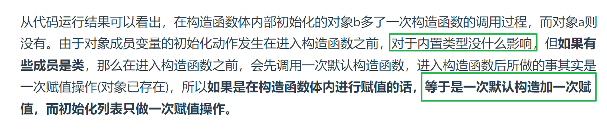

###### 5、Lambda 表达式（匿名函数）

**用法**：https://www.jianshu.com/p/d0153852d08a

**lambda**表达式：

- 一个可能为空的**捕获列表**，指明定义环境中的哪些变量名字能被用在lambda表达式内，以及这些名字的访问形式拷贝还是引用，捕获列表位于 [] 内。

  所谓捕获列表，可以理解为**参数的一种类型**，lambda 表达式内部函数体在默认情况下是不能够使用函数体外部的变量的， 这时候捕获列表可以**起到传递外部数据**的作用。

  其中，**值捕获**的前提是变量可以拷贝，不同之处则在于，被捕获的变量在 lambda 表达式被创建时拷贝， 而非调用时才拷贝；而**引用捕获**与引用传参类似，引用捕获保存的是引用，值会发生变化。

- 一个**可选**的**参数列表**，指明lambda表达式所需的参数，参数列表位于 () 内。

- 一个**可选**的**mutable**修饰符，指明该lambda表达式可能会修改它自身的状态（即，改变通过值捕获的变量的副本），但是！**修改捕获值对原变量无任何影响**！

- 一个**可选**的 -> 形式的**返回**类型声明

- 一个**表达式体**，指明要执行的代码，表达式位于 {} 内。

```cpp
[捕获列表](参数列表) mutable(可选) 异常属性 -> 返回类型 { // 函数体 }
举例：auto max = [](int a, int b) -> int { return a > b ? a : b; };
```

在lambda中，传参、返回结果以及定义表达式体和普通的函数都是一致的，区别就在于普通函数没有提供局部变量“捕获”功能，而局部捕获的功能，就意味着lambda可以做局部函数使用，而普通函数不能。

每当定义一个`lambda`表达式后，编译器会自动生成一个**匿名类**（这个类当然重载了`()`运算符），我们称为**闭包类型**（closure type）。在运行时，这个lambda表达式就会返回一个匿名的闭包实例，其实是一个右值。

闭包的一个强大之处是其可以通过传值或者引用的方式捕捉其封装作用域内的变量，前面的方括号就是用来定义捕捉模式以及变量，我们又将其称为lambda捕捉块。

###### 6、右值引用和move语义

- [右值引用](#左值lvalue & 右值rvalue)

- move语义：`std::move` 是将对象的状态或者所有权从一个对象转移到另一个对象，只是转移，没有内存的搬迁或者内存拷贝。[std::move](http://c.biancheng.net/view/7863.html)

  move 语义的场景中，往往都是一个**临时对象传给了一个函数**，C++11 语法规定：将一个右值（比如一个临时对象表达式）传给一个函数的时候，是**优先绑定到参数形式是右值引用的函数上的**。因为 move 不需要复制，所以很快。其实就是把自己的指针指过去，把原属主的指针指向别处。

  而默认情况下，<u>左值初始化同类对象只能通过拷贝构造函数完成</u>，如果想调用移动构造函数，则必须使用右值进行初始化。C++11 标准中为了满足用户<u>使用左值初始化同类对象时也通过移动构造函数</u>完成的需求，新引入了 <u>std::move() 函数，它可以将左值强制转换成对应的右值</u>，由此便可以使用移动构造函数。
  
  关于[移动构造函数](#移动构造函数)和[移动赋值运算符](#移动赋值运算符)。

- 完美转发

  在函数模板中，可以将参数“完美”的转发给其它函数。所谓完美，即不仅能准确的转发参数的值，还能保证被转发参数的左、右值属性不变。

  C++11标准引入了右值引用和移动语义，所以能否实现完美转发，决定了该参数在传递过程使用的是拷贝语义还是移动语义。

  为了支持完美转发，C++11 提供了以下方案:

  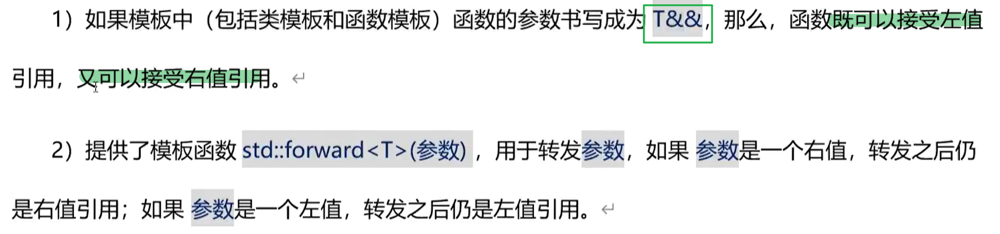

  举例：

  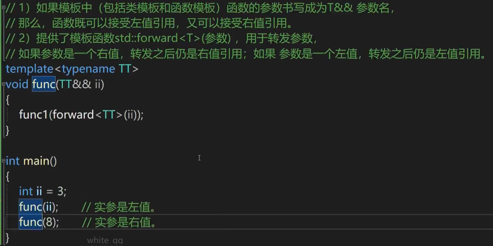

  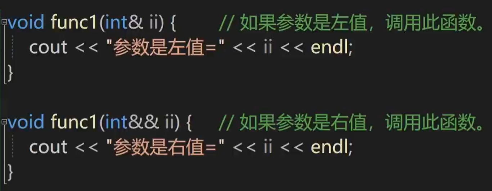

###### 7、新增容器和正则表达式

- 新增容器：
  - std::array：保存在栈内存中，相比堆内存中的std::vector，访问更加灵活，具有更高的处理性能和效率
  - std::forward_list：单向链表，std::list 是双向链表  https://elloop.github.io/c++/2015-12-25/learning-using-stl-7-std-forward-list
  - 无序容器：无序容器中的元素不进行排序，内部通过 Hash 表实现，插入和搜索元素的平均复杂度为 *O(constant)*
    - std::unordered_map / std::unordered_multimap
    - std::unordered_set / std::unordered_multiset
  - 元组 std::tuple
- 正则表达式：C++11 提供正则表达式库操作 std::string 对象，对模式 **std::regex** (本质是 std::basic_regex)进行初始化，通过 **std::regex_match 进行匹配**，从而产生 std::smatch （本质是 std::match_results 对象）。

###### 8、成员变量默认初始化

```cpp
class Solution {
public:
	int arg = 1; //C11之前是会报错  （C11标标准出来后在类中是允许这样初始化的）
}
```

###### 9、智能指针

智能指针是为了解决动态分配内存导致内存泄露和多次释放同⼀内存所提出的，C11标准中放在**< memory>**头⽂件。包括:共享指针，独占指针，弱指针。 在智能指针对象创建时，即为该指针分配了相应的内存，当对象销毁时，析构函数会自动释放内存。需要注意的是，智能指针不能像普通指针那样支持加减运算。

- **auto_ptr**

  是**较早版本**的智能指针，在进行指针拷贝和赋值的时候，**新指针直接接管**旧指针的资源并且将旧指针指向空，但是这种方式在需要访问旧指针的时候，就会出现问题。

- **shared_ptr**

  采用引用**计数器**的方法，允许多个智能指针指向同一个对象，每当多一个指针指向该对象时，指向该对象的所有智能指针内部的引用计数加1，每当减少一个智能指针指向对象时，引用计数会减1，当计数为0的时候会自动的释放动态分配的资源。

  - 智能指针将一个计数器与类指向的对象相关联，引用计数器跟踪共有多少个类对象共享同一指针
  - 每次创建类的新对象时，初始化指针并将引用计数置为1
  - 当对象作为另一对象的副本而创建时，拷贝构造函数拷贝指针并增加与之相应的引用计数
  - 对一个对象进行赋值时，赋值操作符减少左操作数所指对象的引用计数（如果引用计数为减至0，则删除对象），并增加右操作数所指对象的引用计数
  - 调用析构函数时，构造函数减少引用计数（如果引用计数减至0，则删除基础对象）

  ```cpp
  //实现代码
  template<class T> 
  class SharePtr{
  public:
      SharedPtr(T* ptr = nullptr):_ptr(ptr), _pcount(new int(1)){};
      //拷贝构造函数
      SharedPtr(const SharedPtr& s):_ptr(s.ptr), _pcount(s._pcount){
          ++(*_pcount);
      }
      //重载等号
      SharedPtr<T>& operator=(const SharedPtr& s){
          if(this != &s){
              if(--(*_pcount) == 0){//左操作对象 引用数减1 如果为0 删去
                  delete this->_ptr;//删除的是指针指向的内容
                  delete this->_pcount;
              }
              _ptr = s._ptr;
              _pcount = s._pcount;
              ++(*_pcount);
          }
          return *this;
      } 
      T* operator*(){
          return this->_ptr;
      }
      T& operator->(){
          return *(this->_ptr);
      }
      ~SharedPtr(){
          if(--(*(this->_pcount)) == 0){
              delete _ptr;
              ptr = nullptr;
              delete _pcount;
              _pcount = nullptr;
          }
      }
  private:
      T* _ptr;
      int* _pcount;//指向引用计数的指针
  }
  ```

- **unique_ptr**

  采用独享所有权语义，一个非空的unique_ptr总是拥有它所指向的资源，保证**一个对象同一时间只有一个智能指针**。

  转移一个unique_ptr将会把所有权全部从源指针转移给目标指针，源指针被置空；所以unique_ptr**不支持普通的拷贝和赋值操作**，不能用在STL标准容器中；局部变量的返回值除外（因为编译器知道要返回的对象将要被销毁）；如果你拷贝一个unique_ptr，那么拷贝结束后，这两个unique_ptr都会指向相同的资源，造成在结束时对同一内存指针多次释放而导致程序崩溃。

  相比于auto_ptr，unique_ptr删除了复制构造函数和赋值, 所以安全性更高（在编译阶段就不通过，因为这赋值函数不存在，而auto_ptr是在运行过程中会出现错误）. 用户可以专门调用`std::move`来转移所有权(transfer ownership)

- **weak_ptr**

  引用计数有一个问题就是互相引用形成环（环形引用），这样两个指针指向的内存都无法释放。需要使用weak_ptr打破环形引用。

  weak_ptr是一个弱引用，它是为了配合shared_ptr而引入的一种智能指针，它指向一个由shared_ptr管理的对象而**不影响所指对象的生命周期**，也就是说，它只引用，不计数。如果一块内存被shared_ptr和weak_ptr同时引用，当所有shared_ptr析构了之后，不管还有没有weak_ptr引用该内存，内存也会被释放。所以**weak_ptr不保证它指向的内存一定是有效的**，在使用之前使用函数lock()检查weak_ptr是否为空指针。

  - **智能指针循环引用问题**：两个对象互相使用一个shared_ptr成员变量指向对方，弱指针可以解决shared_ptr循环引用问题——弱引用并不对对象的内存进行管理，在功能上类似于普通指针，然而一个比较大的区别是，弱引用能检测到所管理的对象是否已经被释放，从而避免访问非法内存。


###### 左值lvalue & 右值rvalue

https://nettee.github.io/posts/2018/Understanding-lvalues-and-rvalues-in-C-and-C/

- 简单的定义	
  - 左值 (lvalue, locator value) 表示了一个占据内存中某个可识别的位置（也就是可以取到地址的）的对象。即赋值语句的左边应当是一个左值。
    - 但不是所有的左值都可以被赋值（如const关键字不能被赋值），可赋值的左值被称为 *可修改左值 (modifiable lvalues)* 
  - 右值 (rvalue) 则使用排除法来定义。一个表达式不是 *左值* 就是 *右值* 。 那么，右值是一个 *不* 表示内存中某个可识别位置的对象的表达式。
    - 除了数组、函数、不完整类型的所有左值都可以转换为右值。
    - 右值可以通过一些更显式的方法产生左值。例如，一元解引用操作符 `'*'` 需要一个右值参数，但返回一个左值结果。例如 `*(p + 1) = 10;   // 正确: p + 1 是右值，但 *(p + 1) 是左值`

- c++11的右值引用

  左值引用：传统的C++中引用被称为左值引用

  右值引用：C++11中增加了右值引用，右值引用关联到右值时，<u>右值被存储到特定位置，右值引用指向该特定位置</u>，也就是说，右值虽然无法获取地址，但是<u>右值引用是可以获取地址的</u>，该地址表示临时对象的存储位置

  **这里主要说一下右值引用的特点：**

  - 特点1：通过右值引用的声明，右值又“重获新生”，其生命周期与右值引用类型变量的生命周期一样长，只要该变量还活着，该右值临时量将会一直存活下去
  - 特点2：右值引用独立于左值和右值。意思是<u>右值引用类型的变量可能是左值也可能是右值</u>
  - 特点3：T&& t在发生自动类型推断的时候，它是左值还是右值取决于它的初始化。

  ```cpp
  #include <bits/stdc++.h>
  using namespace std;
  
  template<typename T>
  void fun(T&& t)
  {
  	cout << t << endl;
  }
  
  int getInt()
  {
  	return 5;
  }
  
  int main() {
  	
  	int a = 10;
  	int& b = a;  //b是左值引用
  	int& c = 10;  //错误，c是左值不能使用右值初始化
  	int&& d = 10;  //正确，右值引用用右值初始化
  	int&& e = a;  //错误，e是右值引用不能使用左值初始化
  	const int& f = a; //正确，左值常引用相当于是万能型，可以用左值或者右值初始化
  	const int& g = 10;//正确，左值常引用相当于是万能型，可以用左值或者右值初始化
  	const int&& h = 10; //正确，右值常引用
  	const int& aa = h;//正确
  	int& i = getInt();  //错误，i是左值引用不能使用临时变量（右值）初始化
  	int&& j = getInt();  //正确，函数返回值是右值
  	fun(10); //此时fun函数的参数t是右值
  	fun(a); //此时fun函数的参数t是左值
  	return 0;
  }
  ```

###### 移动赋值运算符

```cpp
//原本的代码
class Intvec
{
public:
    //有参构造
    explicit Intvec(size_t num = 0): m_size(num), m_data(new int[m_size]){
        log("constructor");
    }
	//析构函数
    ~Intvec(){
        log("destructor");
        if (m_data) {
            delete[] m_data;
            m_data = 0;
        }
    }
	//拷贝构造函数
    Intvec(const Intvec& other) : m_size(other.m_size), m_data(new int[m_size]){
        log("copy constructor");
        for (size_t i = 0; i < m_size; ++i)
            m_data[i] = other.m_data[i];
    }
	//拷贝赋值操作符
    Intvec& operator=(const Intvec& other){
        log("copy assignment operator");
        Intvec tmp(other);
        std::swap(m_size, tmp.m_size);
        std::swap(m_data, tmp.m_data);
        return *this;
    }
    //关于右值引用举例，添加实现的“移动赋值操作符”
    Intvec& operator=(Intvec&& other){
        log("move assignment operator");
        std::swap(m_size, other.m_size);
        std::swap(m_data, other.m_data);
        return *this;
    }
private:
    void log(const char* msg){
        cout << "[" << this << "] " << msg << "\n";
    }
    size_t m_size;
    int* m_data;
};

//测试
Intvec v2;
cout << "assigning rvalue...\n";
v2 = Intvec(33);
cout << "ended assigning rvalue...\n";

//调用拷贝赋值运算符的结果，因为创建了一个临时的右值，然后赋值给 v2
assigning rvalue...
[0x28ff08] constructor
[0x28fef8] copy assignment operator
[0x28fec8] copy constructor
[0x28fec8] destructor
[0x28ff08] destructor
ended assigning rvalue...
    
//添加了移动赋值操作符的结果
assigning rvalue...
[0x28ff08] constructor
[0x28fef8] move assignment operator
[0x28ff08] destructor
ended assigning rvalue...
    
//解释
//右值引用可以让我们创建对右值的引用。而且在调用结束后，右值引用就会被销毁。我们可以利用这个特性将右值的内部内容“偷”过来——因为我们不再需要使用这个右值对象了
```

###### 移动构造函数

[移动构造函数](http://c.biancheng.net/view/7847.html)

上面说到了移动赋值运算符，那么移动构造函数长啥样？

```cpp
// MemoryBlock.h
class MemoryBlock{
public:
   // Simple constructor that initializes the resource.
   explicit MemoryBlock(size_t length)
      : _length(length)
      , _data(new int[length]){
      std::cout << "In MemoryBlock(size_t). length = "
                << _length << "." << std::endl;
   }

   // Destructor.
   ~MemoryBlock(){
      std::cout << "In ~MemoryBlock(). length = "
                << _length << ".";

      if (_data != nullptr){
         std::cout << " Deleting resource.";
         // Delete the resource.
         delete[] _data;
      }

      std::cout << std::endl;
   }

   // Copy constructor.
   MemoryBlock(const MemoryBlock& other)
      : _length(other._length)
      , _data(new int[other._length])
   {
      std::cout << "In MemoryBlock(const MemoryBlock&). length = "
                << other._length << ". Copying resource." << std::endl;

      std::copy(other._data, other._data + _length, _data);
   }

   // Copy assignment operator.
   MemoryBlock& operator=(const MemoryBlock& other)
   {
      std::cout << "In operator=(const MemoryBlock&). length = "
                << other._length << ". Copying resource." << std::endl;

      if (this != &other)
      {
         // Free the existing resource.
         delete[] _data;

         _length = other._length;
         _data = new int[_length];
         std::copy(other._data, other._data + _length, _data);
      }
      return *this;
   }
    
	//移动构造函数
    MemoryBlock(MemoryBlock&& other): _data(nullptr), _length(0){
        //将源对象中的类数据成员添加到要构造的对象
        _data = other._data;
        _length = other._length;
        //将源对象的数据成员分配给默认值。 这可以防止析构函数多次释放资源
        other._data = nullptr;
        other._length = 0;
    }
    
    //移动赋值运算符
    MemoryBlock(MemoryBlock&& other): _data(nullptr), _length(0){
        if (this != &other) {
            // Free the existing resource.
            delete[] _data;

            // Copy the data pointer and its length from the
            // source object.
            _data = other._data;
            _length = other._length;

            // Release the data pointer from the source object so that
            // the destructor does not free the memory multiple times.
            other._data = nullptr;
            other._length = 0;        
	}
    
   // Retrieves the length of the data resource.
   size_t Length() const
   {
      return _length;
   }

private:
   size_t _length; // The length of the resource.
   int* _data; // The resource.
};

```

##### c++从代码到可执行程序

无论是windows操作系统还是[linux操作系统](https://so.csdn.net/so/search?q=linux操作系统&spm=1001.2101.3001.7020)，C++编写代码到可执行程序的执行，都经过了**预处理、编译、汇编、链接、运行**5个步骤。有时候我们也将预编译、编译和汇编统称为编译。

###### 预处理

```shell
gcc -E hello.c -o hello.i
-E:仅执行编译预处理
-o 指定保存文件的名称
```

- 将所有的“#define”删除，并且展开所有的宏定义
- 处理所有的条件编译指令，比如“#if”、“#ifdef”、“#elif”、“#else”、“#endif”
- 处理“#include”预编译指令，将被包含的头文件插入到该编译指令的位置。（这个过程是递归进行的，因为被包含的文件可能还包含了其他文件）
- 删除所有的注释“//”和“/* */”。
- 添加行号和文件名标识，方便后边编译时编译器产生调试用的行号信息以及编译时产生编译错误或警告时能够显示行号。
- 保留所有的#pragma编译指令，因为编译器需要使用它们。

###### 编译

```shell
gcc -S hello.c(.i) -o hello.s
-S：将C代码转换为汇编代码
```

编译过程就是把预处理完的文件进行一系列的**词法分析、语法分析、语义分析以及优化后**产生相应的汇编代码文件，这个过程是整个程序构建的核心部分，也是最复杂的部分之一。

###### 汇编

```shell
gcc -c hello.c -o hello.o
-c：仅执行编译操作，不进行连接操作
```

汇编实际上指**把汇编语言代码翻译成目标机器指令**的过程。汇编器的编译过程相对于编译器来讲比较简单，它没有复杂的语法，也没有语义，也不需要做指令优化，只是根据汇编指令和机器指令的对照表一一翻译。

###### 链接

```shell
gcc hello.o -o hello
```

编译是对源文件分别进行的，每个源文件都产生一个目标文件。但由汇编程序生成的目标文件并不能立即就被执行，因为各个源文件之间可能是有相互联系的。所有的这些问题都需要经链接解决，即将源程序产生的多个目标文件链接为一个整体。即通过系统提供的“连接程序(linker)”将**一个程序的所有目标程序和系统的库文件以及系统提供的其他信息连接起来**，最终形成一个可执行的二进制文件，它的后缀是.exe，此时产生了完整的执行文件。


###### 运行

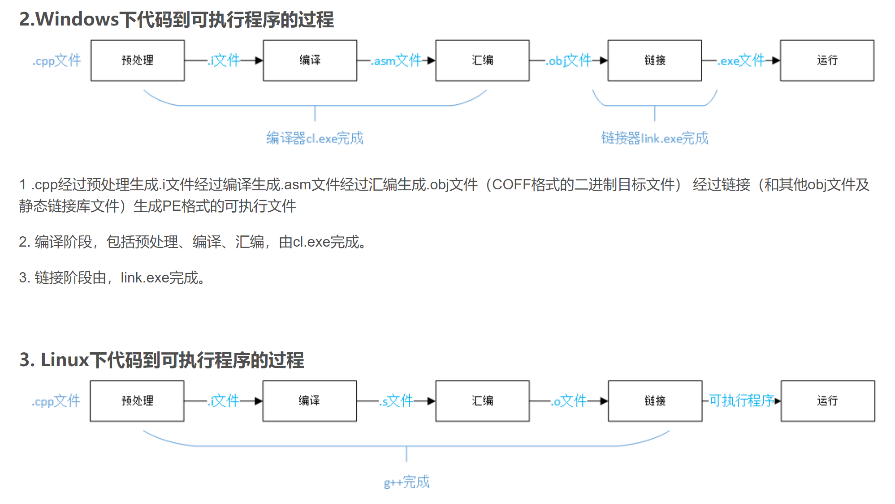

##### gcc/g++

###### GNU

**GNU**是一个操作系统，Linux操作系统包涵了<u>Linux内核</u>与<u>其他自由软件项目中的GNU组件和软件</u>，可以被称为GNU/Linux。

###### GCC:

GNU Compiler Collection(GUN 编译器集合)，它可以编译C、C++、JAVA、Fortran、Pascal、Object-C等语言。

###### gcc/g++

gcc是GCC中的GUN C Compiler（C 编译器）

g++是GCC中的GUN C++ Compiler（C++编译器）

由于编译器是可以更换的，所以gcc不仅仅可以编译C文件。所以，更准确的说法是：gcc调用了C compiler，而g++调用了C++ compiler。

<u>**gcc和g++的主要区别**</u>：

1. 对于 *.c和*.cpp文件，gcc分别当做c和cpp文件编译（c和cpp的语法强度是不一样的）

2. 对于 *.c和*.cpp文件，g++则统一当做cpp文件编译

3. 使用g++编译文件时，**g++会自动链接标准库STL，而gcc不会自动链接STL**

4. gcc在编译C文件时，可使用的预定义宏是比较少的

5. gcc在编译cpp文件时/g++在编译c文件和cpp文件时（这时候gcc和g++调用的都是cpp文件的编译器），会加入一些额外的宏。

6. 在用gcc编译c++文件时，为了能够使用STL，需要加参数 –lstdc++ ，但这并不代表 gcc –lstdc++ 和 g++等价，它们的区别不仅仅是这个。

##### GDB

[参考链接](https://zhuanlan.zhihu.com/p/74897601)

GDB（GNU Debugger）是UNIX及UNIX-like下的强大调试工具，可以调试ada, c, c++, asm, minimal, d, fortran, objective-c, go, java,pascal等语言。

对于C程序来说，需要在<u>编译时加上-g参数</u>，<u>保留调试信息</u>，否则不能使用GDB进行调试。

###### 启动调试

1、程序还未启动时，可有多种方式启动调试。

- 调试启动无参程序，`gdb 可执行文件`，然后输入run命令，即可运行程序：

  ```shell
  $ gdb helloWorld
  (gdb)
  ```

- 调试启动无参程序，`gdb 可执行文件 `，然后

  ```
  //方式1
  $ gdb hello
  (gdb)run '参数'
  //方式2
  gdb hello
  (gdb) set args '‘'参数'
  (gdb) run
  ```

- <u>调试core文件</u>

  当程序core dump时，可能会产生core文件，它能够很大程序帮助我们定位问题。前提是系统没有限制core文件的产生，可以使用命令limit -c查看：如果结果是0，即便程序core dump了也不会有core文件留下。

> ​		**什么是core dump？**
>
> ​		分析core dump是Linux应用程序调试的一种有效方式，core dump又称为“核心转储”，是该进程实际使		用的物理内存的“快照”。分析core dump文件可以获取应用程序崩溃时的现场信息，如程序运行时的		CPU寄存器值、堆栈指针、栈数据、函数调用栈等信息。

​		调试方式：`$ gdb 程序文件名 core文件名`

2、调试已运行程序

首先使用ps命令找到运行程序的进程号，然后有两种操作方式。

- 第一种使用attach 

  ```shell
  $ gdb
  (gdb) attach 进程号
  ```

- 第二种直接调试

  ```shell
  gdb hello 进程号  
  ```

###### 断点设置

- 查看已设置的断点 `info breakpoints`

- 断点设置

  - 根据行号设置断点 `b 9  #break 可简写为b`

  - 根据函数名设置断点 `b 函数名`

  - 根据条件设置断点

    - `break test.c:23 if b==0` //指当在b等于0时，程序将会在第23行断住。
    - `condition 1 b==0` //使得b等于0时，产生断点1

  - 设置临时断点 `tbreak test.c:l0  #在第10行设置临时断点`

  - 跳过多次设置断点 `ignore 1 30`//1是你要忽略的断点号，可以通过前面的方式查找到，30是需要跳过的次数。

  - 根据表达式值变化产生断点

    `watch a` //这个时候，让程序继续运行，如果a的值发生变化，则会打印相关内容

  - 禁用或启动断点 `disable/enable 断点号`

  - 断点清除  `clear 指定位置` 或者 `delete 断点号`

###### 变量查看

前提：在查看变量之前，**<u>需要先启动调试并设置断点</u>。**

- 普通变量查看

  - 打印基本类型变量，数组，字符数组 `(gdb) p a` //print简写成p，打印a的值，多文件重名变量前面加文件名区分 `(gdb) p 'testGdb.h'::a`

  - 打印指针指向内容

    ```shell
    (gdb) p *d@10
    $3 = {0, 1, 2, 3, 4, 5, 6, 7, 8, 9}
    ```

  - 还可以**按照特定格式打印变量**等

- 查看内存内容

  ```shell
  命令：`x/[n][f][u] addr`
  n 表示要显示的内存单元数，默认值为1
  f 表示要打印的格式，前面已经提到了格式控制字符
  u 要打印的单元长度
  addr 内存地址
  
  单元类型常见有如下：
  b 字节
  h 半字，即双字节
  w 字，即四字节
  g 八字节
  
  举例：把float变量e按照二进制方式打印，并且打印单位是一字节
  (gdb) x/4tb &e
  0x7fffffffdbd4:    00000000    00000000    00001000    01000001
  (gdb) 
  ```

- 自动显示变量内容
  假设我们希望程序断住时，就显示某个变量的值，可以使用display命令。

  ```shell
  (gdb) display e
  1: e = 8.5
  # 那么每次程序断住时，就会打印e的值。
  ```

###### 单步调试

- 单步执行-next

  next命令（可简写为n）用于在程序断住后，<u>继续执行下一条语句。不进入函数内部</u>。

- 单步进入-step

  使用step命令（可简写为s），它可以单步<u>跟踪到函数内部</u>，但前提是该函数有调试信息并且有源码信息。

- 继续执行到下一个断点-continue

  continue命令（可简写为c）或者fg，它会继续执行程序，直到再次遇到断点处

- 继续运行到指定位置-until，可以简写为u

- 跳过执行--skip

  skip可以在step时跳过一些不想关注的函数或者某个文件的代码

###### 源码查看

如何在GDB调试模式下**查看源码或对源码进行编辑**。

- 列出源码：list命令（可简写为l），它用来打印源码

  - l啥也不加 列出全部源码
  - l后面跟行号，**列出指定行附近源码**
  - l后面跟函数名，**列出指定函数附近源码**
  - 还有一些不写了

- 指定源码路径

  可能会出现源码路径改变等问题，这个时候可以使用dir命名指定源码路径

- 编辑源码

  可以直接在gdb模式下编辑源码，可以根据习惯更改编辑器。

  编辑完保存后，需要重新编译程序：

  ```shell
  (gdb)shell gcc -g -o main main.c test.c
  ```

#### 语法

##### extern"C"

extern是C/C++语言中<u>表明函数和全局变量作用范围（可见性）的关键字，该关键字告诉编译器，其声明的函数和变量可以在本模块或其它模块中使用</u>。通常，在模块的头文件中对本模块提供给其它模块引用的函数和全局变量以关键字extern声明。例如，如果模块B欲引用该模块A中定义的全局变量和函数时只需包含模块A的头文件即可。这样，模块B中调用模块A中的函数时，在编译阶段，模块B虽然找不到该函数，但是并不会报错；它会在连接阶段中从模块A编译生成的目标代码中找到此函数。

与extern对应的关键字是static，被它修饰的全局变量和函数只能在本模块中使用。因此，一个函数或变量只可能被本模块使用时，其不可能被extern “C”修饰。`extern int a;`仅仅是一个变量的声明，其并不是在定义变量a，并未为a分配内存空间。变量a在所有模块中作为一种全局变量只能被定义一次，否则会出现连接错误

<u>extern "C" 包含双重含义，从字面上即可得到：首先，被它修饰的目标是“extern”的；其次，被它修饰的目标是“C”的。</u>被`extern "C"`修饰的变量和函数是按照C语言方式编译和连接的；

extern "C"的真实目的是实现**类C和C++的混合编程**。在C++源文件中的语句前面加上extern "C"，表明它按照类C的编译和连接规约来编译和连接，而不是C++的编译的连接规约。这样在类C的代码中就可以调用C++的函数or变量等。

在C语言的头文件中，对其外部函数只能指定为extern类型，**C语言中不支持extern "C"声明**，在.c文件中包含了extern "C"时会出现编译语法错误。所以使用**extern "C"全部都放在于cpp程序相关文件或其头文件中**。

- C++调用C函数

  ```cpp
  //xx.h
  extern int add(...)
  
  //xx.c
  int add(){
      
  }
  
  //xx.cpp
  extern "C" {
      #include "xx.h"
  }
  ```

- C调用c++函数

  ```cpp
  //xx.h
  extern "C"{
      int add();
  }
  //xx.cpp
  int add(){    
  }
  //xx.c
  extern int add();
  ```


##### static && extern

static既可用于<u>存储局部变量</u>，也可用于存储<u>全局变量</u>; extern用于存储外部<u>全局变量</u>。

static“静态”不是指存储方式，而是指对函数的作用域仅限于本文件，使用<u>内部函数</u>，可以使函数的使用范围仅限于本文件，如果在不同的文件中有同名的内部函数，也不会互相干扰；

在定义函数时，如果使用了关键字extern ，表明此函数是<u>外部函数</u>，<u>函数都是外部性质的</u>，因此在定义函数时，关键字extern可以省略。但是，在调用函数的文件中，一般要<u>用extern说明所调用的函数是外部函数</u>。

使用static声明的全局变量的作用于仅限于本文件，在其他文件中即使使用了extern说明，也无法使用该变量；

##### inline && define && typedef

###### inline

内联函数以代码复杂为代价，以省去函数调用的开销来提高执行效率。所以如果内联函数体内代码执行时间相比函数调用开销较大，则没有太大的意义；另一方面每一处内联函数的调用都要复制代码，消耗更多的内存空间，因此以下情况不宜使用内联函数：

- 函数体内的**代码比较长**，将导致内存消耗代价
- 函数体内有循环，函数**执行时间要比函数调用开销大**

###### define

- 宏在<u>**预处理阶段**</u>完成替换，之后被替换的文本参与编译，相当于直接插入了代码，运行时不存在函数调用，执行起来更快；宏替换发生在编译阶段之前，属于文本插入替换；

- 宏主要用于定义常量及书写复杂的内容；
- 宏不检查类型；
- 宏不是语句，不在在最后加分号；

###### typedef

- typedef主要用于定义类型别名；
- typedef是编译的一部分；
- typedef会检查数据类型；
- typedef是语句，要加分号标识结束；
- 注意对指针的操作，typedef char * p_char和#define p_char char *区别巨大；


##### static的用法和意义

###### 用法：

static的意思是静态的，可以用来修饰变量，函数和类成员。

- 变量：被static修饰的变量就是静态变量，它会在程序运行过程中一直存在，会被放在**静态存储区**。局部静态变量的作用域在**函数体**中，全局静态变量的作用域在**这个文件**里。
- 函数：被static修饰的函数就是静态函数，静态函数只能在**本文件中**使用，不能被其他文件调用，也不会和其他文件中的同名函数冲突。
- 类：而在类中，被static修饰的成员变量是类静态成员，这个静态成员会被类的多个对象共用。被static修饰的成员函数也属于静态成员，不是属于某个对象的，访问这个静态函数不需要引用对象名，而是通过引用类名来访问。类中静态成员均需要**类内声明，类外初始化/实现**（static修饰的变量先于对象存在，所以static修饰的变量要在类外初始化）。
  - 静态成员函数**默认**只能访问类中的静态成员变量，如果要访问非静态成员时，**要用对象来引用**。局部静态变量在函数调用结束后也不会被回收，会一直在程序内存中，直到该函数再次被调用，它的值还是保持上一次调用结束后的值。
  - static成员函数**不能被virtual修饰**，静态成员函数没有this指针，虚函数的实现是为每一个对象分配一个vptr指针，而vptr是通过this指针调用的，所以不能为virtual

注意和const的区别。const强调值不能被修改，而static强调唯一的拷贝，对所有类的对象都共用。

###### 意义：

- 隐藏：当同时编译多个文件时，所有未加static前缀的全局变量和函数都具有全局可见性。
- 保持变量内容的持久。存储在静态数据区的变量会在程序**刚开始运行时就完成初始化**，也是唯一的一次初始化。共有两种变量存储在静态存储区：全局变量和static变量，只不过和全局变量比起来，static可以控制变量的可见范围，说到底static还是用来隐藏的。
- static的第三个作用是变量默认初始化为0（在静态数据区，内存中所有的字节默认值都是0x00，包括全局便变量）

##### const

###### 原理：

**将const修饰的类成员函数称之为const成员函数**，const修饰类成员函数，实际 **修饰该成员函数隐含的this指针**，表明在该成员函数中 **不能对类的任何成员进行修改**。就是说本来this是一个指针常量，指针的指向不能变，而再加上const就是说变成了常量指针常量，指针指向的值也不能改变。

所以**const 关键字不能与 static 关键字同时使用，因为 static 关键字修饰静态成员函数，静态成员函数不含有 this 指针，即不能实例化，const 成员函数必须具体到某一实例。**

<u>**构造函数和析构函数不允许使用类型限定符，不可以加const**</u>

###### 用法

1. 阻止一个变量被改变，可以使用const关键字。在定义该const变量时，通常需要对它进行初始化，因为以后就没有机会再去改变它了；

2. 对指针来说，可以指定指针本身为const，也可以指定指针所指的数据为const，或二者同时指定为const；

3. 在一个函数声明中，const可以修饰形参，表明它是一个输入参数，在函数内部不能改变其值；

4. 对于类的成员函数，若指定其为const类型，则表明其是一个常函数，不能修改类的成员变量，类的常对象只能访问类的常成员函数；

5. 对于类的成员函数，有时候必须指定其返回值为const类型，以使得其返回值不为“左值”。

6. const成员函数可以<u>访问</u>非const对象的非const<u>数据成员</u>、const<u>数据成员</u>，也可以<u>访问</u>const对象内的<u>所有数据成员</u>；

7. 非const成员函数可以访问非const对象的非const数据成员、const数据成员，但不可以访问const对象的任意数据成员；

   总结来就是<u>**权限可以被缩小但不能被放大**。</u>

8. 一个没有明确声明为const的成员函数**被看作是将要修改对象中数据成员的函数**，而且编译器不允许它为一个const对象所调用。因此**const对象只能调用const成员函数**，而非const对象可以调用const成员函数和非const成员函数。

9. 非const成员函数可以调用const成员函数和非const成员函数；而const成员函数不可以调用非const成员函数。

10. const类型变量可以通过类型转换符const_cast将const类型转换为非const类型；

11. const类型变量必须定义的时候进行初始化，因此也导致如果类的成员变量有const类型的变量，那么该变量必须在类的初始化列表中进行初始化；

12. 对于函数值传递的情况，因为参数传递是通过复制实参创建一个临时变量传递进函数的，函数内只能改变临时变量，但无法改变实参。则这个时候无论加不加const对实参不会产生任何影响。但是在引用或指针传递函数调用中，因为传进去的是一个引用或指针，这样函数内部可以改变引用或指针所指向的变量，这时const 才是实实在在地保护了实参所指向的变量。因为在编译阶段编译器对调用函数的选择是根据实参进行的，所以，只有引用传递和指针传递可以用是否加const来重载。一个拥有顶层const的形参无法和另一个没有顶层const的形参区分开来。

##### using namespace std;

https://blog.csdn.net/ly_6699/article/details/88649415?spm=1001.2101.3001.6650.1&utm_medium=distribute.pc_relevant.none-task-blog-2%7Edefault%7ECTRLIST%7ERate-1-88649415-blog-72824668.235%5Ev38%5Epc_relevant_default_base&depth_1-utm_source=distribute.pc_relevant.none-task-blog-2%7Edefault%7ECTRLIST%7ERate-1-88649415-blog-72824668.235%5Ev38%5Epc_relevant_default_base&utm_relevant_index=2

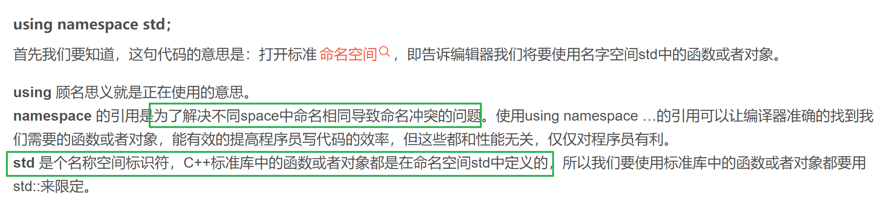

##### 重写override和隐藏hide

重写指的是在派生类中覆盖基类中的同名函数，**重写就是重写函数体**，**要求基类函数必须是虚函数**且：

- 与基类的虚函数有相同的参数个数
- 与基类的虚函数有相同的参数类型
- 与基类的虚函数有相同的返回值类型

隐藏指的是某些情况下，派生类中的函数屏蔽了基类中的<u>同名函数</u>：

- 两个函数参数相同，但是基类函数不是虚函数。**和重写的区别在于基类函数是否是虚函数**。
- 两个函数参数不同，无论基类函数是不是虚函数，都会被隐藏。和重载的区别在于两个函数不在同一个类中。

```cpp
// 父类
class A {
public:
    virtual void fun(int a) { // 虚函数
        cout << "This is A fun " << a << endl;
    }  
    void add(int a, int b) {
        cout << "This is A add " << a + b << endl;
    }
};

// 子类
class B: public A {
public:
    void fun(int a) override {  // 覆盖
        cout << "this is B fun " << a << endl;
    }
    void add(int a) {   // 隐藏，只要是子类中出现和父类同名的成员函数，子类的同名函数会隐藏掉父类中所有的同名成员函数，此时如果想访问到父类中被隐藏的同名成员函数，需要加上作用域
        cout << "This is B add " << a + a << endl;
    }
};

int main() {
    // 基类指针指向派生类对象时，基类指针可以直接调用到派生类的覆盖函数，也可以通过 :: 调用到基类被覆盖的虚函数；
    //而基类指针只能调用基类的被隐藏函数，无法识别派生类中的隐藏函数。

    A *p = new B();
    p->fun(1);      // 调用子类 fun 覆盖函数
    p->A::fun(1);   // 调用父类 fun
    p->add(1, 2);
    // p->add(1);      // 错误，识别的是 A 类中的 add 函数，参数不匹配
    // p->B::add(1);   // 错误，无法识别子类 add 函数
    return 0;
}
```

##### 各种声明

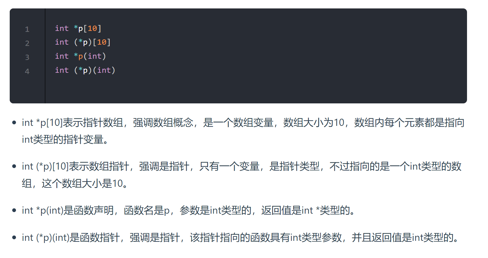

##### sizeof

###### strlen和sizeof区别

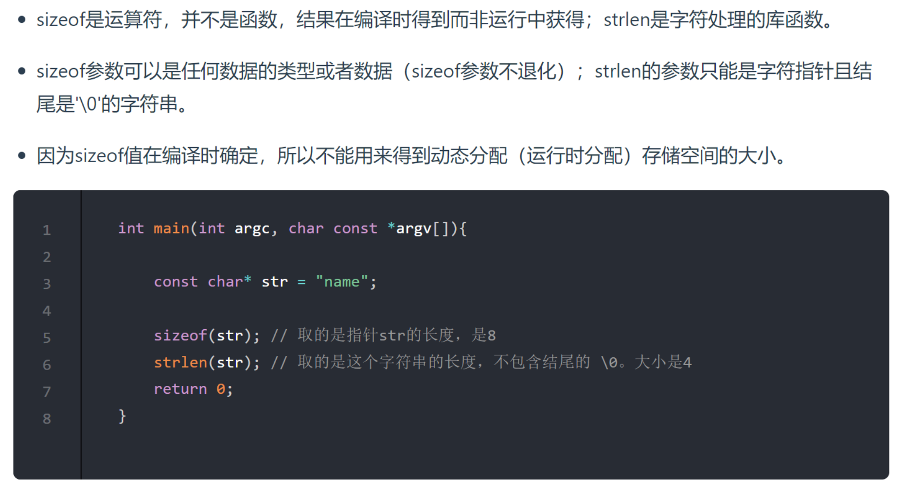

###### sizeof指针&&引用&&数组名

- sizeof指针得到的是本指针的大小，sizeof引用得到的是引用所指向变量的大小，sizeof数组名是数组大小

  ```cpp
  #include<iostream>
  using namespace std;
  void fun(int *P)
  {
  	cout<<"在函数中"<<sizeof(P)<<endl;//4
  }
  int main()
  {
  	int A[10];
  	int* B=new int[10];
  	cout<<"数组名"<<sizeof(A)<<endl;//40
  	cout<<"指针"<<sizeof(B)<<endl;//4
  	fun(A);
  }
  ```

###### 数组名和指针（这里为指向数组首元素的指针）区别？

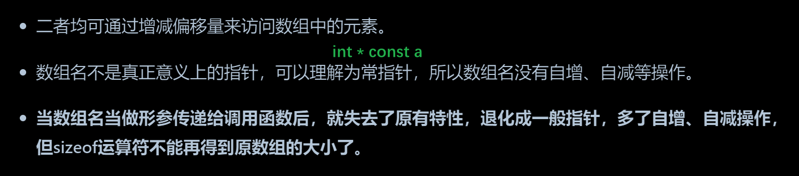

##### C++ #include " " 与 <>有什么区别？

区别是若 #include "" 查找成功，则遮蔽 #include <> 所能找到的同名文件；否则再按照 #include <> 的方式查找文件。另外标准库头文件都放在 #include <> 所查找的位置。

<u>一般来说 #include <> 的查找位置是标准库头文件所在目录， #include "" 的查找位置是当前源文件所在目录。不过这些都可由编译器调用参数等配置更改</u>。

<>先去系统目录中找头文件，如果没有在到当前目录下找。所以像标准的头文件 stdio.h、stdlib.h等用这个方法。
而""首先在当前目录下寻找，如果找不到，再到系统目录中寻找。 这个用于include自定义的头文件，让系统优先使用当前目录中定义的。

##### 虚函数表和虚表指针

首先整理一下虚函数表的特征：

- 虚函数表是**全局共享**的元素，即全局仅有一个，在**编译时就构造完成**
- 虚函数表类似一个数组，**类对象中存储vptr指针**，指向虚函数表，即虚函数表不是函数，不是程序代码，不可能存储在代码段
- 虚函数表存储虚函数的地址,即虚函数表的元素是指向类成员函数的指针,而类中虚函数的个数在编译时期可以确定，即虚函数表的大小可以确定,即大小是在编译时期确定的，不必动态分配内存空间存储虚函数表，所以不在堆中

根据以上特征，虚函数表类似于类中静态成员变量.静态成员变量也是全局共享，大小确定，因此最有可能存在全局数据区，测试结果显示：

虚函数表vtable在Linux/Unix中存放在可执行文件的只读数据段中(rodata)，这与微软的编译器将虚函数表存放在常量段存在一些差别。由于虚表指针vptr跟虚函数密不可分，对于有虚函数或者继承于拥有虚函数的基类，对该类进行实例化时，**在构造函数执行时会对虚表指针进行初始化，并且存在对象内存布局的最前面。**

一般分为五个区域：栈区、堆区、代码区、全局静态区、常量区。

C++中**虚函数表位于只读数据段（.rodata），也就是C++内存模型中的常量区；而虚函数则位于代码段（.text），也就是C++内存模型中的代码区。**

##### 构造函数不是虚函数

（1）创建一个对象时需要确定对象的类型，而**虚函数是在运行时动态确定其类型**的。在构造一个对象时，由于对象还未创建成功，编译器无法知道对象的实际类型

（2）虚函数的调用需要**虚函数表指针vptr，而该指针存放在对象的内存空间**中，若构造函数声明为虚函数，那么由于对象还未创建，还没有内存空间，更没有虚函数表vtable地址用来调用虚构造函数了

（3）虚函数的作用在于通过父类的指针或者引用调用它的时候能够变成调用子类的那个成员函数。而构造函数是在**创建对象时自动调用的**，不可能通过父类或者引用去调用，因此就规定构造函数不能是虚函数。

##### 构造函数和析构函数不能被继承

https://blog.csdn.net/Hanoch_Liu/article/details/104505009

**构造函数和析构函数是用来处理对象的创建和析构的，它们只知道对在它们的特殊层次的对象做什么**。**在整个继承关系中的所有的构造函数和析构函数都必须被调用，也就是说，构造函数和析构函数不能被继承**。

子类的构造函数会显示的调用父类的构造函数或隐式的调用父类的默认的构造函数进行父类部分的初始化。

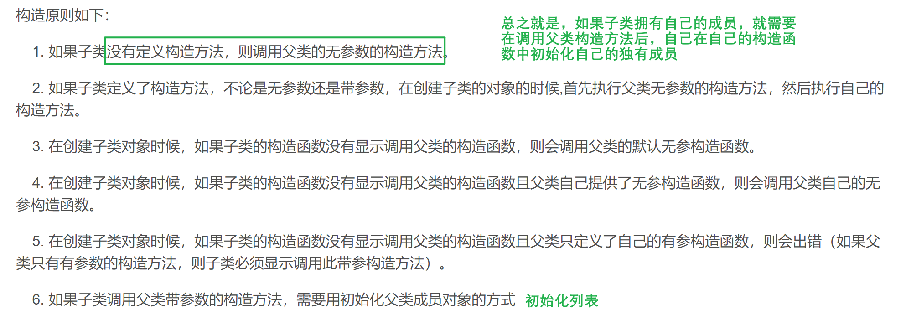

##### trivial destructor

“trivial destructor”一般是指用户没有自定义析构函数，而由系统生成的，这种析构函数在《STL源码解析》中成为“无关痛痒”的析构函数。

反之，用户自定义了析构函数，则称之为“non-trivial destructor”，这种析构函数**如果申请了新的空间一定要显式的释放，否则会造成内存泄露**

##### this指针

###### this是什么

this指针指向对象的首地址，只有在成员函数中才有定义，并且只能在成员函数中使用，在全局函数、静态成员函数中都不能用this。this的存储位置会因编译器不同有不同存储位置。

###### this的原理

一个对象的this指针并不是对象本身的一部分，不会影响 sizeof(对象) 的结果。

this作用域是在类内部，当在类的**非静态成员函数**中访问类的**非静态成员**的时候，编译器会自动将对象本身的地址作为一个隐含参数传递给函数。它作为非静态成员函数的隐含形参，对各成员的访问均通过this进行。

实际上，**非静态成员函数**第一个参数为为`T * const this`，即this传入参数为当前对象地址。由此可见，this在**成员函数的开始前构造，在成员函数的结束后清除**。这个生命周期同任何一个函数的参数是一样的，没有任何区别。

###### this的用法

- 在类的非静态成员函数中返回类对象本身的时候，直接使用 return *this；
- 当形参数与成员变量名相同时用于区分，如this->n = n （不能写成n = n）

###### delete this

在类对象的内存空间中，**只有数据成员和虚函数表指针**，并不包含代码内容，类的成员函数单独放在代码段中。当调用delete this时，类对象的内存空间被释放。**在delete this之后进行的其他任何函数调用，只要不涉及到this指针的内容，都能够正常运行**。一旦涉及到this指针，如操作数据成员，调用虚函数等，就会出现不可预期的问题。

delete this释放了类对象的内存空间，但是内存空间却并不是马上被回收到系统中，可能是缓冲或者其他什么原因，**导致这段内存空间暂时并没有被系统收回**。此时这段内存是可以访问的，你可以加上100，加上200，但是其中的值却是不确定的。当你获取数据成员，可能得到的是一串很长的未初始化的随机数；访问虚函数表，指针无效的可能性非常高，造成系统崩溃。

如果在类的析构函数中调用delete this, delete this会去调用本对象的析构函数，而析构函数中又调用delete this，形成无限递归，造成堆栈溢出，系统崩溃。

##### 成员初始化列表

【初始化列表是发生在构造函数之前的】

- 有些情况必须用：https://blog.csdn.net/u012611878/article/details/79200544

  1、需要初始化的数据成员是对象的情况(这里包含了继承情况下，通过显示调用父类的构造函数对父类数据成员进行初始化)；【如果成员类对象是没有默认无参构造，不用初始化列表会报错，需要在初始化列表中调用这个类成员的带参数的构造函数】
  2、需要初始化const修饰的类成员；
  3、需要初始化引用成员数据；

  【2和3中，这两种对象要在声明后马上初始化，而在构造函数中，做的是对他们的赋值，这样是不被允许的】

- 效率高


##### 虚析构的链式结构

由于类的多态性，基类指针可以指向派生类的对象，**如果删除该基类的指针，就会调用该指针指向的派生类析构函数，而派生类的析构函数又自动调用基类的析构函数**，这样整个派生类的对象完全被释放。

https://blog.csdn.net/lwwl12/article/details/109365872?app_version=6.0.0&code=app_1562916241&csdn_share_tail=%7B%22type%22%3A%22blog%22%2C%22rType%22%3A%22article%22%2C%22rId%22%3A%22109365872%22%2C%22source%22%3A%22m0_46485526%22%7D&uLinkId=usr1mkqgl919blen&utm_source=app

虚函数表中的析构函数的位置，是放了一个函数指针，A::'scalar deleting destructor’函数，用于在调用对象的析构函数后delete内存。

而当发生多态时，子类生成的‘deleting destructor’函数会替换虚表中父类的‘deleting destructor’函数。所以在调用时会调用子类的虚构函数，然后delete子类对象。之所以在输出时会发现父类对象的析构函数也被调用，是因为在子类的虚构函数的汇编代码中，调用了父类的析构函数。**简单来说，就是虚析构函数的地址存在于虚函数表中，也会像普通的虚函数一样进行覆盖，但是在子类的析构函数中包含着对父类析构函数的调用。**

补充：https://zhuanlan.zhihu.com/p/400044925 这里面说到栈上的多态对象释放时，会自动链式调用析构函数，而在堆上建立的需要virtual。

##### C++的四种强制转换

reinterpret_cast/const_cast/static_cast /dynamic_cast

https://interviewguide.cn/notes/03-hunting_job/02-interview/01-01-04-basic.html

1、static_cast

static_cast < type-id > (expression)：该运算符把expression转换为type-id类型，但没有运行时类型检查来保证转换的安全性。它主要有如下几种用法：

- 用于类层次结构中基类（父类）和派生类（子类）之间指针或引用引用的转换
  - 进行上行转换（把派生类的指针或引用转换成基类表示）是安全的
  - 进行下行转换（把基类指针或引用转换成派生类表示）时，由于没有动态类型检查，所以是不安全的
- 用于基本数据类型之间的转换，如把int转换成char，把int转换成enum。这种转换的安全性也要开发人员来保证。
- 把空指针转换成目标类型的空指针
- 把任何类型的表达式转换成void类型

2、dynamic_cast

dynamic本⾝只能⽤于存在虚函数的父子关系的强制类型转换，在进⾏下⾏转换时，dynamic_cast具有类型检查（信息在虚函数中）的功能，比static_cast更安全  ；  

转换后必须是类的指针、引⽤或者void*（指针转指针，引用转引用）  ，基类要有虚函数，可以交叉转换；

3、reinterpret_cast

reinterpret_cast 用于进行各种不同类型的指针之间、不同类型的引用之间以及指针和能容纳指针的整数类型之间的转换。转换时，执行的是逐个比特复制的操作。

这种转换提供了很强的灵活性，但转换的安全性只能由程序员的细心来保证了。

4、const_cast

const_cast<type_id> (expression)

该运算符用来修改类型的const或volatile属性。除了const 或volatile修饰之外， type_id和expression的类型是一样的。用法如下：

- 常量指针被转化成非常量的指针，并且仍然指向原来的对象
- 常量引用被转换成非常量的引用，并且仍然指向原来的对象
- const_cast一般用于修改底指针(指针常量是顶层指针，常量指针是底层指针)。如const char *p形式

##### C/C++ 函数调用是如何实现的

https://www.jianshu.com/p/9f547d8428c3

大概就是首先将上个方法的栈顶位置作为当前方法的栈底位置，然后减少栈顶指针，意味着开辟空间。形参要从右往左依次入栈。

调用结束后，需要将栈顶指针恢复到未调用之前的位置。也就是说相当于把开辟的内存回收，并且回到上个方法的原始位置，继续执行。

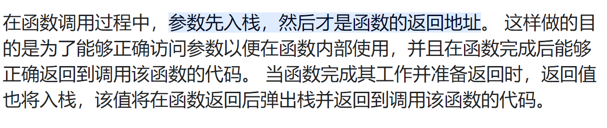

##### 为什么模板类一般都是放在一个h文件中

https://blog.csdn.net/lijiayu2015/article/details/52650790

简单来说 如果模板声明和定义分别写在test.h和test.cpp文件中，那么在main.cpp会include test.h文件，那么main中调用某个模板函数时，test.h中没有定义，所以呢编译器寄希望于连接器，希望可以在test.cpp中找到该模板的实例化二进制代码，但是因为C++标准明确表示，***当一个模板不被用到的时侯它就不该被实例化出来***，所以其实test.cpp中虽然有定义，但是没有被实例化，所以实际上test.cpp编译出来的test.obj文件中关于模板函数的一行二进制代码也没有，于是连接器就傻眼了，只好给出一个连接错误。

##### 读程序

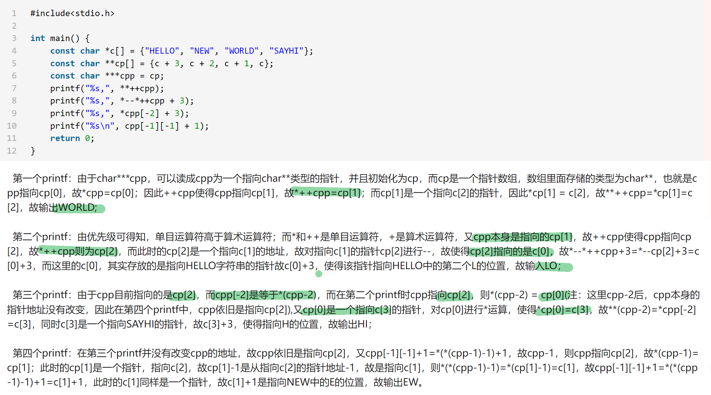

#### 

#### 内存

##### new的内存是连续的吗

堆分配的空间在**逻辑地址上是连续的**，但在**物理地址上是不连续的**（因为采用了页式内存管理,windows下有段机制、分页机制），如果逻辑地址空间上已经没有一段连续且足够大的空间，则分配内存失败。

##### new异常

###### 返回空指针

当内存分配失败时，new会返回一个空指针（nullptr）吗？

在符合C++标准的实现版本中，答案是**不会**。在正常情况下，如果new失败，那么就会thrown一个`std::bad_alloc`。在如下情况下会返回NULL来指明失败：

1. 使用nothrow，`T *p = new (std::nothrow) T(args);`
2. 一些旧的编译器中，尤其是在C++标准发布之前的编译器
3. 明确禁用exceptions，比如一些嵌入式系统的编译器

###### 抛出异常

在标准的C++中，new操作符在内存分配失败时会抛出std::bad_alloc异常。这是一个派生自std::exception的异常类，用于表示**内存分配失败**的情况。当new无法分配所需内存时，它会抛出此异常，以便在异常处理机制下进行适当的处理。

##### 自由存储区&&堆

https://www.cnblogs.com/qg-whz/p/5060894.html

事实上，我在网上看的很多博客，划分自由存储区与堆的分界线就是new/delete与malloc/free。然而，尽管C++标准没有要求，但很多编译器的new/delete都是以malloc/free为基础来实现的。那么请问：借以malloc实现的new，所申请的内存是在堆上还是在自由存储区上？

从技术上来说，堆（heap）是C语言和操作系统的术语。堆是操作系统所维护的一块特殊内存，它提供了动态分配的功能，当运行程序调用malloc()时就会从中分配，稍后调用free可把内存交还。而**自由存储是C++中通过new和delete动态分配和释放对象的抽象概念**，**通过new来申请的内存区域可称为自由存储区**。基本上，所有的C++编译器默认使用堆来实现自由存储，也即是缺省的全局运算符new和delete也许会按照malloc和free的方式来被实现，这时藉由new运算符分配的对象，说它在堆上也对，说它在自由存储区上也正确。但程序员也可以通过重载操作符，改用其他内存来实现自由存储，例如全局变量做的对象池，这时自由存储区就区别于堆了。我们所需要记住的就是：

> 堆是操作系统维护的一块内存，而自由存储是C++中通过new与delete动态分配和释放对象的抽象概念。堆与自由存储区并不等价。

https://segmentfault.com/a/1190000040529002

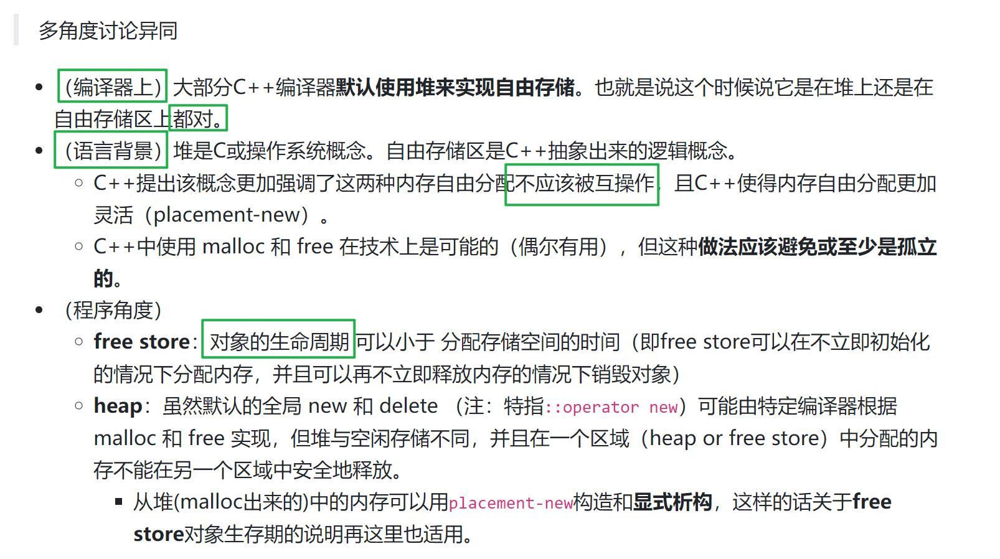

##### 内存对齐 && \#pragma pack(n)

1、 分配内存的顺序是按照声明的**顺序**。

2、 每个变量相对于起始位置的偏移量**必须是该变量类型大小的整数倍**，不是整数倍空出内存，直到偏移量是整数倍为止。

3、 最后整个结构体的大小必须是里面变量类型**最大值的整数倍**。

添加了#pragma pack(n)后规则就变成了下面这样：

1、 偏移量要是n和当前变量大小中较小值的整数倍

2、 整体大小要是n和最大变量大小中较小值的整数倍

3、 n值必须为1,2,4,8…，为其他值时就按照默认的分配规则

##### RAII

RAII是Resource Acquisition is Initialization(资源获取即初始化)的缩写，直译过来是“资源获取即初始化”，也就是说在构造函数中申请分配资源，在析构函数中释放资源。

RALL是C++语言的一种管理资源，避免泄漏的用法。RALL利用C++构造的对象最终会被销毁的原则。利用C++对象生命周期的概念来控制程序的资源,比如内存,文件句柄,网络连接等。在RAII的指导下，我们应该使用类来管理资源，将资源和对象的生命周期绑定。

智能指针（std::shared_ptr和std::unique_ptr）即RAII最具代表的实现，使用智能指针，可以实现自动的内存管理，再也不需要担心忘记delete造成的内存泄漏。

RAII的做法是使用一个对象，在其构造时获取对应的资源，在对象生命周期内控制对资源的访问，使之始终保持有效，最后在对象析构的时候，释放构造时获取的资源。简单地说，**就是把资源的使用限制在对象的生命周期之中，自动释放。**

举个简单的例子，通常在多线程编程的时候，都会用到std::mutex,以下为例

```cpp
std::mutex mutex_;

void fun() {
  mutex_.lock();  
  if (...) {
    mutex_.unlock();
    return;
  }  
  mutex_.unlock()
}
```

在上述代码中，如果if分支多的话，每个if分支里面都要释放锁，如果一不小心忘记释放，那么就会造成故障，为了解决这个问题，我们使用RAII技术，代码如下：

```c++
std::mutex mutex_;

void fun() {
  std::lock_guard<std::mutex> guard(mutex_);

  if (...) {
    return;
  }
}
//在guard出了fun作用域的时候，会自动调用mutex_.unlock()进行释放，避免了很多不必要的问题。
```

##### 内存泄漏的定位

[内存泄漏](https://zhuanlan.zhihu.com/p/523628871?utm_id=0)

###### 日志

这种方案的核心思想，就是在每次分配内存的时候，**打印指针地址**，在释放内存的时候，打印内存地址，这样在程序结束的时候，通过分配和释放的差，如果**分配的条数大于释放的条数**，那么基本就能确定程序存在内存泄漏，然后根据日志进行详细分析和定位。

###### 统计

统计方案可以理解为日志方案的一种特殊实现，其主要原理是在分配的时候，**统计分配次数**，在释放的时候，则是**统计释放的次数**，这样在**程序结束前判断这俩值是否一致**，就能判断出是否存在内存泄漏。

此方法可帮助跟踪已分配内存的状态。为了实现这个方案，需要创建三个自定义函数，一个用于内存分配，第二个用于内存释放，最后一个用于检查内存泄漏。

###### 工具

- 在Linux上比较常用的内存泄漏检测工具是valgrind，对于leak.c文件

  - 通过gcc -g leak.c -o leak命令进行编译

  - 执行valgrind --leak-check=full ./leak

- 使用工具软件BoundsChecker，BoundsChecker是一个运行时错误检测工具，它主要定位程序运行时期发生的各种错误；

##### 内存池

[内存池](https://blog.csdn.net/weixin_48101150/article/details/121336318)

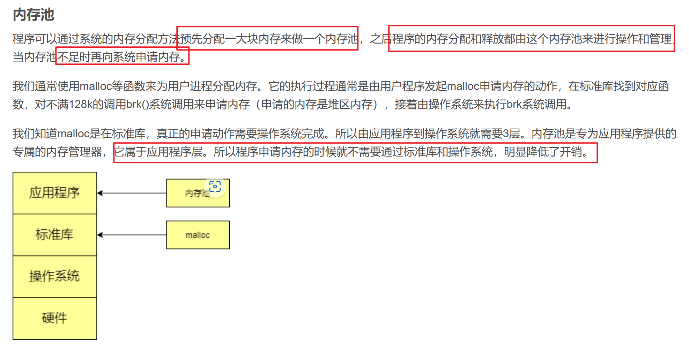

内存池可以解决内存碎片问题和申请效率问题。

###### 简单实现

为某个类实现一个内存池，在类内重载operator new和operator delete函数。其中类对象大小为8，要求内存池大小为18，分为两组，每组第一位表示标志位表示这组有没有被占用。如果全部占用就再申请内存（一般内存池可能会扩展内存池，这里简单地直接用malloc申请）。

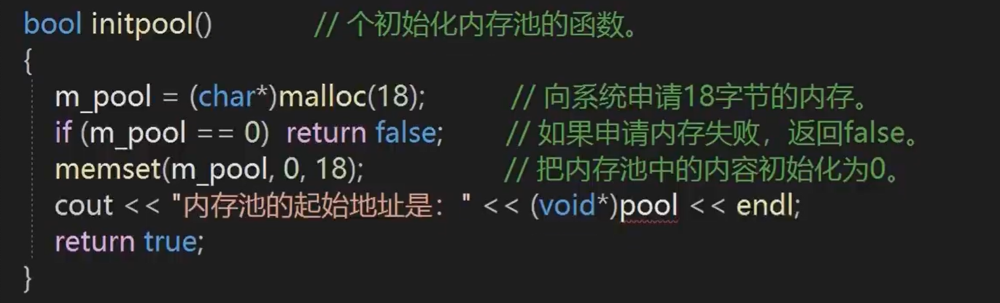

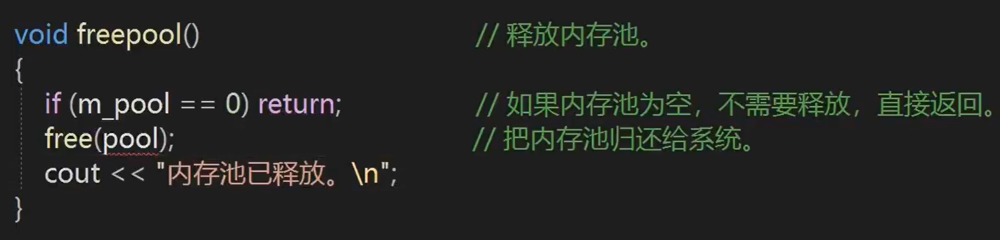

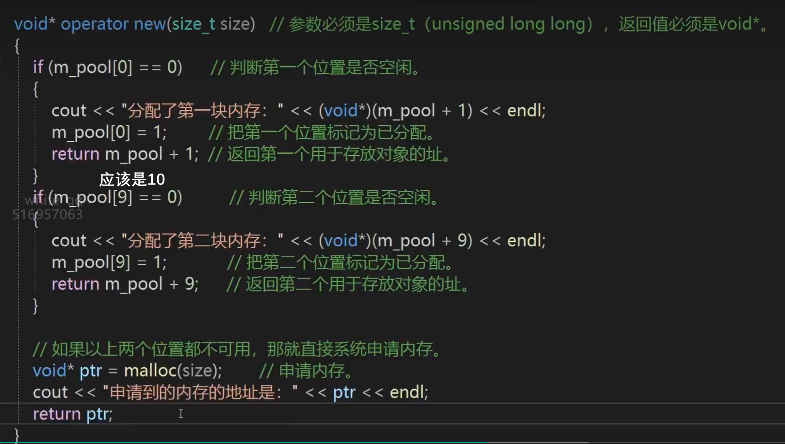

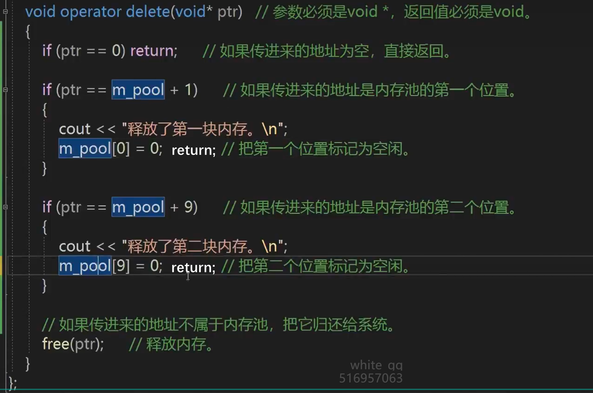

#### STL

##### stl

###### 诞生

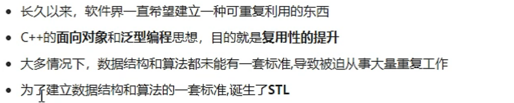

###### 基本概念

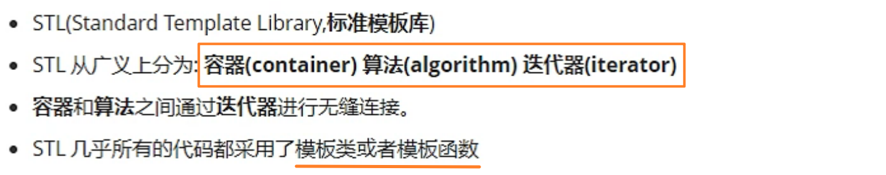

###### 六大组件

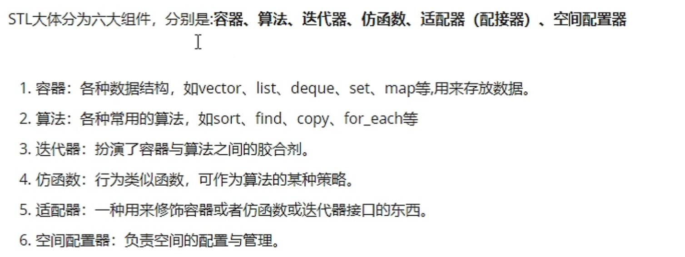

- 容器

  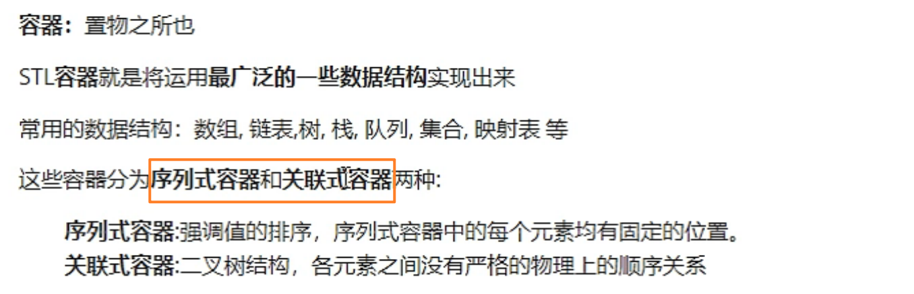

- 算法

  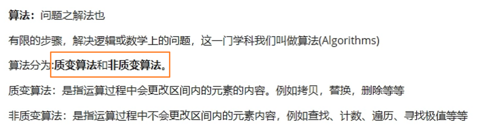

- 迭代器

  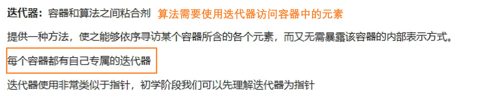

  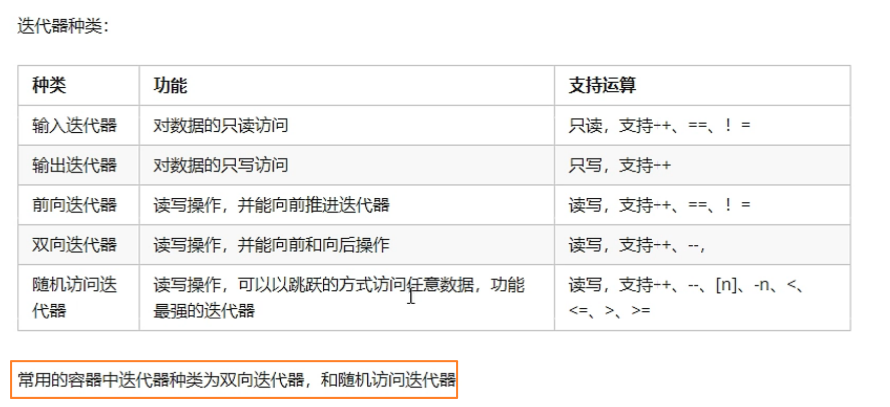

##### STL的配接器

简单的理解容器适配器，其就是将不适用的序列式容器（包括 vector、deque 和 list）变得适用。

- **STL提供的各种配接器中：**

  - 改变仿函数接口者：称为function adapter
  - 改变容器接口者：称为container adapter
  - 改变迭代器接口者：称为iterator adapter

- STL 提供了 3 种容器适配器，分别为 stack 栈适配器、queue 队列适配器以及 priority_queue 优先权队列适配器。其中，各适配器所使用的默认基础容器以及可供用户选择的基础容器：

  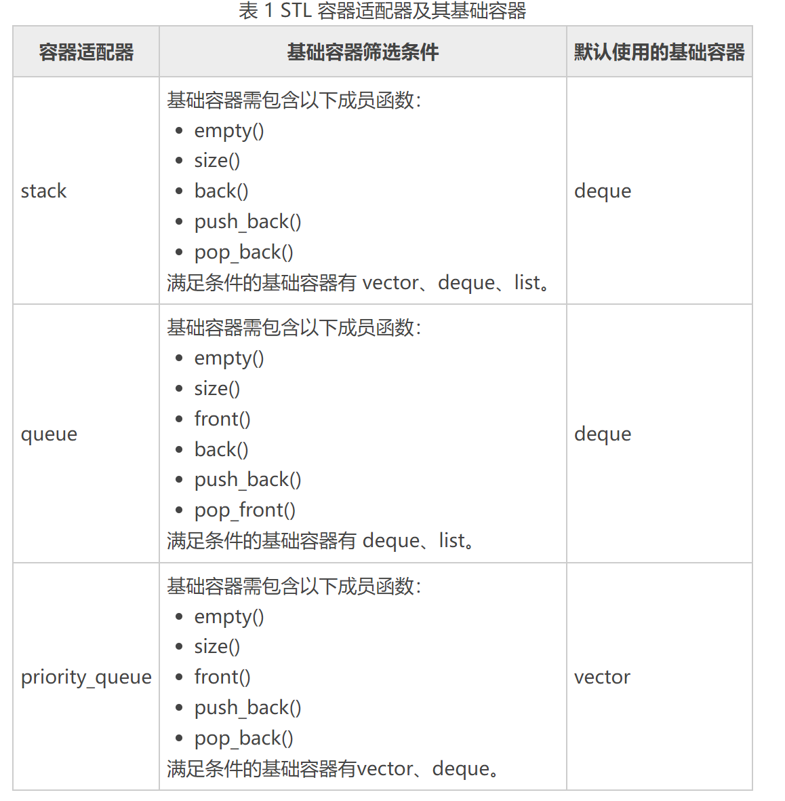

##### STL的空间配置器allocator

整个STL的操作对象都存放在容器之中（vertor、list），而容器一定需要配置空间以放置资料，这就是空间配置器的作用。allocator是STL的重要组成，但是一般用户不怎么熟悉他，因为allocator隐藏在所有容器（包括vector）身后，默默**完成内存配置与释放，对象构造和析构的工作**。

举例子：

```cpp
vector<int> vec;
//vector创建的幕后的STL实现
template<class T, class Alloc = alloctor<T>>
//容器vector的第二个参数有默认值,也就是说，我们可以自己按照STL标准实现一个allocator
```

###### STL的allocator接口要求

STL是一个标准，只对接口进行规范，接口背后的实现可以有不同版本，所以目前流行的STL如Visual C++采用的P. J. Plauger 版本，GCC编译器采用的SGI STL版本等都是常见的STL。SGI STL是最流行的版本，我们主要关注SGI STL的allocator实现。

STL标准要求的allocator必要接口主要有：`allocate`，`deallocate`，`construct`和`destroy`函数。整个allocator最重要的函数就是这四个。从功能上，这四者可以简单理解为C++的`::operator new`和`::operator delete`，构造函数和析构函数，实际上，一个最简单的`allocator`就可以理解为对`new`，`delete`的简单封装,以及对构造函数和析构函数的直接调用。

###### 关注SGI STL的allocator实现

SGI STL 实现了两个allocator：一个是标准的std::allocator，另一个是特殊的std::alloc。

其中标准的std::allocator部分符合STL标准，它在文件 defalloc.h 中实现。但是SGI STL的容器并不使用它，也不建议我们使用，它存在的意义仅在于为用户提供一个兼容老代码的折衷方法，其实现仅仅是对new和delete的简单包装。

> 特殊配置器 std::alloc

这个配置器是SGI STL的默认配置器，它在`<memory>`中实现。

`<memory>`中包含三个文件：

- `<stl_construct.h>`：定义了全局函数construct()和destroy()，负责对象构造和析构。
- `<stl_alloc.h>`：内存配置和释放在此处实现，其内部有两级配置器，第一级结构简单，封装malloc()和free()，第二级实现了自由链表和内存池，用于提升大量小额内存配置时的性能。
  - 当配置区块超过128bytes时，称为足够大，使用第一级配置器，直接使用malloc()和free(),(个人理解是mmap)。 当配置区块不大于128bytes时，为了降低额外负担，直接使用第二级配置器，采用复杂的memory pool处理方式（个人理解就是brk）。
- `<stl_uninitialiezed.h>`：一些用于用于填充和拷贝大块内存的全局函数。

对象构造和/析构，与内存配置/释放是分离实现的。

##### STL相关容器的对比

[STL相关容器的对比](https://blog.csdn.net/Jacky_Feng/article/details/115016884)

**序列式容器是通过元素在容器中的位置顺序存储和访问元素，而关联容器则是通过键 (key) 存储和读取元素。**

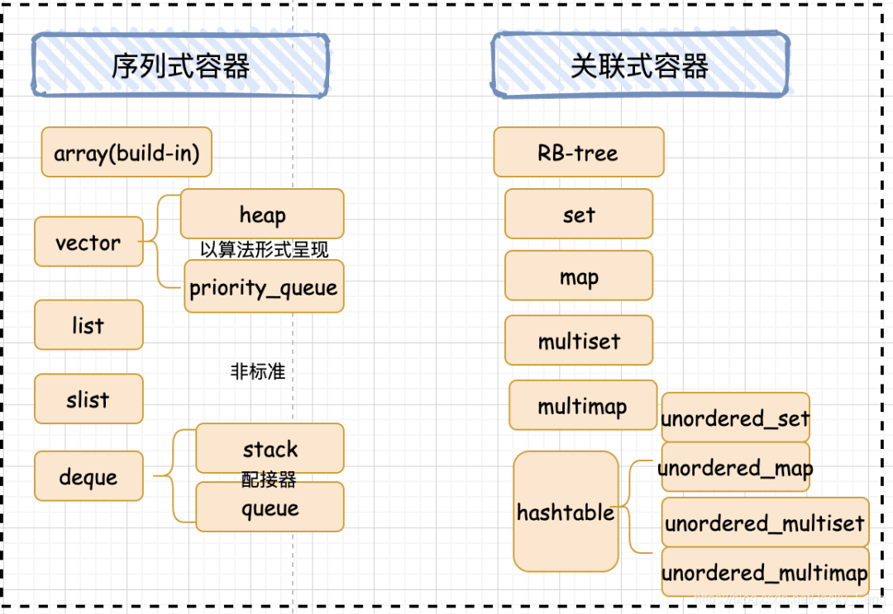

list的底层实现就是不连续的内存空间，实现的双向循环链表；

deque就是由中控器连接起来的多个连续内存空间，形成的双端数组，可以在头尾插入。中控器记录的是每个缓冲区的地址，所以随机访问要比vector慢，但是头部插入比vector快。

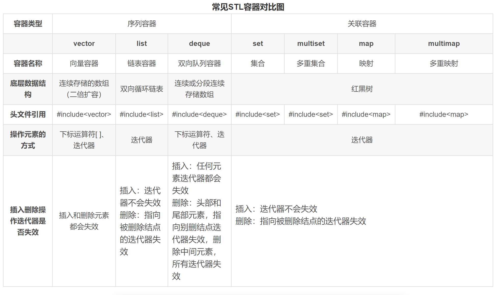

##### vector实现原理

其底层所采用的[数据结构](http://c.biancheng.net/data_structure/)非常简单，就只是一段连续的线性内存空间

使用迭代器实现遍历。

##### sort底层如何实现

sort()源码中采用的是一种叫做IntroSort内省式排序的混合式排序算法

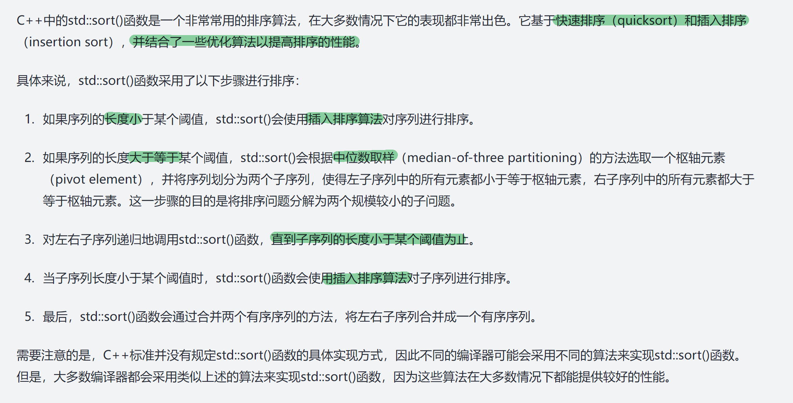

##### Vector的resize和reserve有什么区别

###### resize

resize(n)会**改变vector的大小，使其包含n个元素**。如果n大于当前的大小，那么新的元素会被添加到vector的末尾，如果n小于当前的大小，那么末尾的元素会被删除。resize会**改变vector的size()。**

###### reserve

reserve(n)**不会改变vector的大小**，它只是**预先分配足够的内存**，以便在未来可以容纳n个元素。reserve**不会改变vector的size()，但可能会改变capacity()**。reserve的主要目的是为了优化性能，避免在添加元素时频繁进行内存分配。

简单来说，resize改变的是vector中元素的数量，而reserve改变的是vector的内存容量。

##### emplace_back && push_back

- push_back() 向容器尾部添加元素时，首先会**创建**这个元素，然后再将这个元素**拷贝或者移动**到容器中（如果是拷贝的话，事后会自行销毁先前创建的这个元素）

- emplace_back通常在性能上优于push_back，因为它可以避免不必要的复制或移动操作。emplace_back() 在实现时，则是**直接在容器尾部创建**这个元素，省去了拷贝或移动元素的过程。


##### vector的扩容删除

###### 新增

1. 新增元素：vector通过一个连续的数组存放元素，如果集合已满，在新增数据的时候，就要分配一块更大的内存来扩容，将原来的数据复制过来，释放之前的内存，在插入新增的元素；

   对比可以发现采用成倍方式扩容，可以保证常数的时间复杂度，而增加指定大小的容量只能达到O(n)的时间复杂度，因此，使用成倍的方式扩容。

   - 考虑可能产生的堆空间浪费，成倍增长倍数不能太大，使用较为广泛的扩容方式有两种，以2二倍的方式扩容，或者以1.5倍的方式扩容。（不同的编译器实现的扩容方式不一样，VS2015中以1.5倍扩容，GCC以2倍扩容）
   - 以2倍的方式扩容，导致下一次申请的内存必然大于之前分配内存的总和，导致之前分配的内存不能再被使用，所以最好倍增长因子设置为(1,2)之间。

   resize()函数只改变容器的元素数目，未改变容器大小。用reserve(size_type)只是扩大capacity值，这些内存空间可能还是“野”的，如果此时使用“[ ]”来访问，则可能会越界。而resize(size_type new_size)会真正使容器具有new_size个对象。

2. 对vector的任何操作，一旦引起空间重新配置，指向原vector的所有迭代器就都失效了 ；

3. 初始时刻vector的capacity为0，塞入第一个元素后capacity增加为1；

###### 删除

1. 向量容器vector的成员函数pop_back()可以删除最后一个元素。**该容器的大小（size）会减 1，但容量（capacity）不会发生改变。**
2. 函数erase()可以删除由一个iterator指出的元素，也可以删除一个指定范围的元素。**该容器的大小（size）会减小，但容量（capacity）不会发生改变。**
3. 还可以采用通用算法remove()来删除容器中所有和指定元素值相等的元素，并返回指向最后一个元素下一个位置的迭代器。值得一提的是，调用该函数**不会改变容器的大小和容量**。


##### stl中的hashtable实现

hashtable中的bucket所维护的list既不是list也不是slist，而是其自己定义的<u>由hashtable_node数据结构组成的linked-list</u>，而<u>bucket聚合体本身使用vector进行存储</u>。hashtable的迭代器只提供前进操作，不提供后退操作。

在hashtable设计bucket的数量上，其内置了28个质数[53, 97, 193,...,429496729]，在<u>创建hashtable时，会根据存入的元素个数选择大于等于元素个数的质数作为hashtable的容量</u>（vector的长度），其中每个bucket所维护的linked-list长度也等于hashtable的容量。如果插入hashtable的元素个数超过了bucket的容量，就要<u>进行重建table操作，即找出下一个质数，创建新的buckets vector，重新计算元素在新hashtable的位置</u>

##### hashtable解决冲突

###### 开放地址法

- **线性探测**

  使用hash函数计算出的位置如果已经有元素占用了，则向后依次寻找，找到表尾则回到表头，直到找到一个空位

- **二次探测**

  使用hash函数计算出的位置如果已经有元素占用了，按照1^2、2^2、3^2…的**步长**依次寻找，如果步长是随机数序列，则称之为**伪随机探测**

###### **开链**/链地址法/拉链法

每个表格维护一个list，如果hash函数计算出的格子相同，则按顺序存在这个list中

***开链法怎么做优化***

###### **再散列**

发生冲突时使用**另一种hash函数**再计算一个地址，直到不冲突

###### **公共溢出区**

一旦hash函数计算的结果相同，就放入**公共溢出区**


##### 哈希表和红黑树

哈希表实现unordered_map和unorderd_set，红黑树实现map和set。

###### 哈希表

STL的hashtable使用链地址法解决冲突的哈希表。表长是一个质数，开始值是53，当元素个数超过表长时会自动扩容为大概原先两倍的一个素数。

C++ STL 标准库中，不仅是 unordered_xxx 容器，**所有无序容器的底层实现都采用的是哈希表存储结构**。更准确地说，**是用“链地址法”（又称“开链法”）解决数据存储位置发生冲突的哈希表**。

当使用无序容器存储键值对时，会先申请一整块连续的存储空间，但此空间并不用来直接存储键值对**，而是存储各个链表的头指针**，各键值对**真正的存储位置是各个链表的节点**。

无序容器中，负载因子的计算方法为： **负载因子 = 容器存储的总键值对 / 桶数**。负载因子越大，意味着容器越满，即各链表中挂载着越多的键值对。 默认情况下，无序容器的最大负载因子为 1.0。如果操作无序容器过程中，使得**最大复杂因子超过了默认值，则容器会自动增加桶数，并重新进行哈希**，以此来减小负载因子的值。 需要注意的是，此过程会导致**容器迭代器失效**，但指向单个键值对的引用或者指针仍然有效。

###### 选择依据

权衡四个因素: 查找速度，数据量， 内存使用，可扩展性。

总体来说，hash查找速度会比红黑树快，而且查找速度基本和数据量大小无关，属于常数级别；而红黑树的查找速度是log(n)级别。并不一定常数就比log(n) 小，hash还有hash函数的耗时，如果考虑效率，特别是在元素达到一定数量级时，考虑hash。但若对内存使用特别严格， 希望程序尽可能少消耗内存，那么一定要小心，特别是当hash对象特别多时，就更无法控制了，而且 hash的构造速度较慢。

红黑树并不适应所有应用树的领域。如果数据基本上是静态的，那么让他们待在他们能够插入，并且不影响平衡的地方会具有更好的性能。如果数据完全是静态的，例如，做一个哈希表，性能可能会更好一些。

在实际的系统中，例如，需要使用动态规则的防火墙系统，使用红黑树而不是哈希表被实践证明具有更好的伸缩性。Linux内核在管理vm_area_struct时就是采用了红黑树来维护内存块的。																																					

##### 简单说一下traits技法

[阿秀--traits技法](https://interviewguide.cn/notes/03-hunting_job/02-interview/01-04-01-STL.html#:~:text=traits%E6%8A%80%E6%B3%95%E5%88%A9%E7%94%A8%E2%80%9C%E5%86%85%E5%B5%8C%E5%9E%8B%E5%88%AB%E2%80%9C%E7%9A%84%E7%BC%96%E7%A8%8B%E6%8A%80%E5%B7%A7%E4%B8%8E%E7%BC%96%E8%AF%91%E5%99%A8%E7%9A%84template%E5%8F%82%E6%95%B0%E6%8E%A8%E5%AF%BC%E5%8A%9F%E8%83%BD%EF%BC%8C%E5%A2%9E%E5%BC%BAC%2B%2B%E6%9C%AA%E8%83%BD%E6%8F%90%E4%BE%9B%E7%9A%84%E5%85%B3%E4%BA%8E%E5%9E%8B%E5%88%AB%E8%AE%A4%E8%AF%81%E6%96%B9%E9%9D%A2%E7%9A%84%E8%83%BD%E5%8A%9B%E3%80%82%E5%B8%B8%E7%94%A8%E7%9A%84%E6%9C%89iterator_traits%E5%92%8Ctype_traits%E3%80%82)

traits技法利用“内嵌型别“的编程技巧与**编译器的template参数推导功能**，增强C++未能提供的关于型别认证方面的能力。常用的有iterator_traits和type_traits。

###### **iterator_traits**

被称为**特性萃取机**，能够方便的让外界获取以下5种型别：

- value_type：迭代器所指对象的型别
- difference_type：两个迭代器之间的距离
- pointer：迭代器所指向的型别
- reference：迭代器所引用的型别
- iterator_category：三两句说不清楚，建议看书

###### **type_traits**

关注的是型别的**特性**，例如这个型别是否具备non-trivial defalt ctor（默认构造函数）、non-trivial copy ctor（拷贝构造函数）、non-trivial assignment operator（赋值运算符） 和non-trivial dtor（析构函数），如果答案是否定的，可以采取直接操作内存的方式提高效率。


##### 其他


##### 函数指针

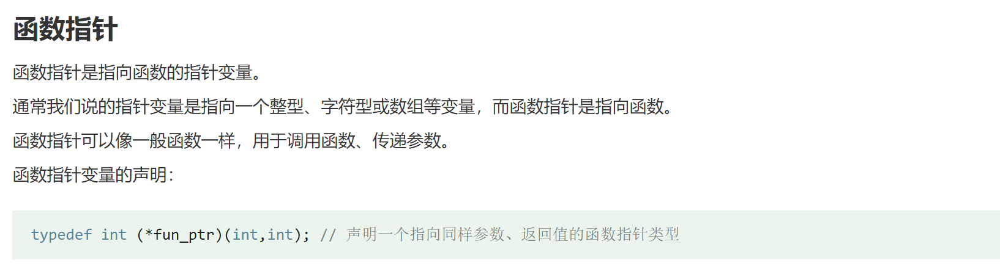

```c++
#include <stdio.h>
 
int max(int x, int y){
    return x > y ? x : y;
}
 
int main(void){
    /* p 是函数指针 */
    int (* p)(int, int) = & max; // &可以省略
    int a, b, c, d;
 
    printf("请输入三个数字:");
    scanf("%d %d %d", & a, & b, & c);
 
    /* 与直接调用函数等价，d = max(max(a, b), c) */
    d = p(p(a, b), c); 
 
    printf("最大的数字是: %d\n", d);
 
    return 0;
}
```

- 函数指针的作用

  函数指针主要是能够用一个指针的方式指向一个函数，并且还可以换换指向别的函数，比如有多个函数的申明，它们有不同的具体实现，如果需要调用它们，就可以用一个指针轮流指向它们。（函数指针允许将函数作为变元传递给其他函数）

  把函数指针当作变量的意思，变量是变化的，具体到程序里面运行时（时间不同）的变量的值（函数指针）也可能是不同的（变化的）。既然函数指针可以做为变量，就可以扩展，作用不言而喻。

  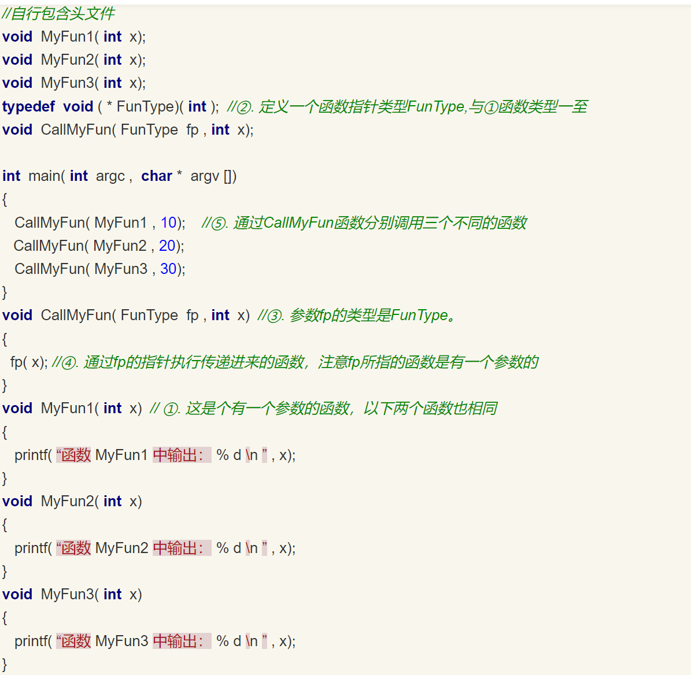

##### ⭐explicit 关键字

指定构造函数或转换函数 (C++11起)为显式, 即它不能用于[隐式转换](https://link.zhihu.com/?target=https%3A//zh.cppreference.com/w/cpp/language/implicit_conversion)和[复制初始化](https://link.zhihu.com/?target=https%3A//zh.cppreference.com/w/cpp/language/copy_initialization).

https://zhuanlan.zhihu.com/p/52152355

```c++
class Point {
public:
    int x, y;
    explicit Point(int x = 0, int y = 0)
        : x(x), y(y) {}
};
```

https://www.cnblogs.com/apocelipes/p/14415033.html

###### 拷贝初始化和直接初始化

- 当用于类类型对象时，初始化的拷贝形式和直接形式有所不同：直接初始化直接调用与实参匹配的构造函数，拷贝初始化总是调用拷贝构造函数。拷贝初始化首先使用指定构造函数创建一个临时对象，然后用拷贝构造函数将那个临时对象拷贝到正在创建的对象。举例如下。

  ```c++
  string str1("I am a string");//语句1 直接初始化
  string str2(str1);//语句2 直接初始化，str1是已经存在的对象，直接调用拷贝构造函数对str2进行初始化
  string str3 = "I am a string";//语句3 拷贝初始化，先为字符串”I am a string“创建临时对象，再把临时对象作为参数，使用拷贝构造函数构造str3
  string str4 = str1;//语句4 拷贝初始化，这里相当于隐式调用拷贝构造函数，而不是调用赋值运算符函数
  ```

##### NRV优化

[(23条消息) 关于NRV优化详细分析_FreeeLinux的博客-CSDN博客](https://blog.csdn.net/FreeeLinux/article/details/53941190)

Named Return Value(NRV) Optimization

什么是NRV优化呢，顾名思义，就是保存返回值的变量不再使用没名没姓的__temp0这样的东西了，而是直接把c作为返回变量，因此应该将NRV翻译为“有名字的返回变量”吧。

NVR优化的最大好处就是**不会再去调用那次多余拷贝构造函数了**。

NRV优化的时候：

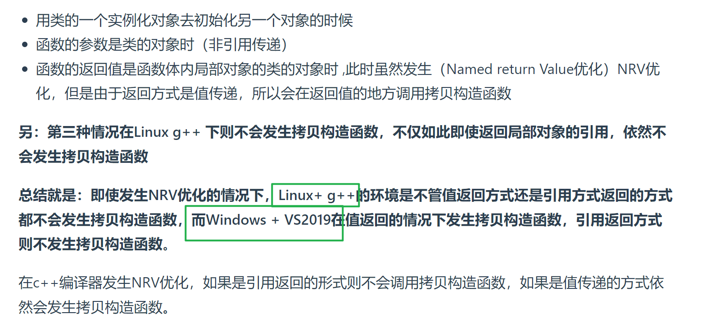

#### 线程

##### 创建三个线程，依次打印1到100

```cpp
#include <iostream>
// #include <thread>
#include "mingw.thread.h"
// #include<mutex>
#include "mingw.mutex.h"

using namespace std;

static int state=1;
static mutex d_mutex;
static const int times=100;
void printNum(int targetState, string flag){
    while(state < 100){
        d_mutex.lock();
        if(state%3 == targetState ){
            cout<<"thread"<<flag<<":"<<state<<endl;
            state++;
        }
        d_mutex.unlock();
    }
}

int main(){

    thread t1(printNum,0,"A");
    thread t2(printNum,1,"B");
    thread t3(printNum,2,"C");
    t1.join();
    t2.join();
    t3.join();
    return 0;
}
```

##### 原子操作

对简单临界资源的访问，如果使用mutex开销较大，但是即使是一个简单变量的读取和写入操作，如果不加锁，也有可能会导致读写值混乱。

`std::atomic<T>`原子操作，是个类模板，用来封装某个类型的值，包含在头文件`<atomic>`中。

原子操作一般都是指“不可分割的操作”（也就是说这种操作状态要么是完成的，要么是没完成的），即在多线程中不会被打断的程序执行片段。可以把原子操作理解成一种**不需要用到互斥量加锁（无锁）技术的多线程并发编程方式**。从效率上来说，原子操作要比互斥量的方式效率要高。**互斥量的加锁一般是针对一个代码段，而原子操作针对的一般都是一个变量**。

```cpp
//举例
#include <iostream>
#include <thread>
#include <atomic>
using namespace std;
std::atomic<int> g_count = 0; //封装了一个类型为int的 对象（值）

void mythread1() {
    for (int i = 0; i < 1000000; i++) {
        g_count++;//一般atomic原子操作，针对++，–，+=，-=，&=，|=，^=是支持的，其他操作不一定支持。例如使用g_count = g_count + 1就会产生错误。
    }
}

int main() {
    std::thread t1(mythread1);
    std::thread t2(mythread1);
    t1.join();
    t2.join();
    cout << "正常情况下结果应该是200 0000次，实际是" << g_count << endl;//200 0000
}
```

##### 多线程

https://paul.pub/cpp-concurrency/

##### 线程池

**C++11**加入了线程库，从此告别了标准库不支持并发的历史。然而C++对于多线程的支持还是比较低级，稍微高级一点的用法都需要自己去实现，比如线程池、信号量等。线程池（thread pool）这个东西，一般在面试时的回答都是：“管理一个任务队列，一个线程队列，然后每次去一个任务分配给一个线程去做，循环往复。”

具体是现在os.md.

#### 设计模式

[参考链接](https://zhuanlan.zhihu.com/p/431714886)

##### 分类

总体来说设计模式分为三大类：

<u>创建型模式</u>，共五种：工厂方法模式、抽象工厂模式、单例模式、建造者模式、原型模式。

<u>结构型模式</u>，共七种：适配器模式、装饰器模式、代理模式、外观模式、桥接模式、组合模式、享元模式。

<u>行为型模式</u>，共十一种：策略模式、模板方法模式、观察者模式、迭代子模式、责任链模式、命令模式、备忘录模式、状态模式、访问者模式、中介者模式、解释器模式。

其实还有两类：并发型模式和线程池模式。

##### 规则

总原则：开闭原则（Open Close Principle），就是说<u>对扩展开放，对修改关闭</u>。

1、单一职责原则：每个类应该实现单一的职责，如若不然，就应该把类拆分。

2、里氏替换原则（Liskov Substitution Principle）

里氏代换原则(LSP)面向对象设计的基本原则之一。 里氏代换原则中说，<u>任何基类可以出现的地方，子类一定可以出现</u>。  里氏替换原则中，子类对父类的方法尽量不要重写和重载。因为父类代表了定义好的结构，通过这个规范的接口与外界交互，子类不应该随便破坏它。

3、依赖倒转原则（Dependence Inversion Principle）

这个是开闭原则的基础，具体内容：<u>面向接口编程</u>，依赖于抽象而不依赖于具体。写代码时用到具体类时，不与具体类交互，而<u>与具体类的上层接口交互</u>。

4、接口隔离原则（Interface Segregation Principle）

每个接口中<u>不存在子类用不到却必须实现的方法</u>，如果不然，就要将接口拆分。使用多个隔离的接口，比使用单个接口（多个接口方法集合到一个的接口）要好。

5、迪米特法则（最少知道原则）（Demeter Principle）

一个类对自己依赖的类知道的越少越好。也就是说无论被依赖的类多么复杂，都应该将逻辑封装在方法的内部，通过public方法提供给外部。这样<u>当被依赖的类变化时，才能最小的影响该类</u>。

6、合成复用原则（Composite Reuse Principle）

原则是尽量首先使用合成/聚合的方式，而不是使用继承。

##### 工厂模式

###### 简单工厂模式

它的主要特点是需要在工厂类中做判断，从而创造相应的产品。当增加新的产品时，就需要修改工厂类。

###### 工厂方法模式

是指定义一个用于创建对象的接口，让子类决定实例化哪一个类，Factory Method使一个类的实例化延迟到其子类。

工厂方法模式也有缺点，每增加一种产品，就需要增加一个对象的工厂。

###### 抽象工厂模式

提供一个创建一系列相关或相互依赖对象的接口，而无需指定它们具体的类。

##### 单例模式

```cpp
//Singleton.h  
class Singleton{  
public:  
    static Singleton* GetInstance();  
private:  
    Singleton() {}  
    static Singleton *singleton;  
};  
//Singleton.cpp  
Singleton* Singleton::singleton = NULL;  
Singleton* Singleton::GetInstance(){  
    if(singleton == NULL)  
        singleton = new Singleton();  
    return singleton;  
}  
```

##### 原型模式

”用原型实例指定创建对象的种类，并且通过拷贝这些原型创建新的对象“，顾名思义，先搞一个原型对象出来，然后在这个原型对象的基础上修修补补再弄出一个新对象来。就类似复制粘贴功能。

- 当构建的多个对象，均需要处于某种原始状态时，就可以先构建一个拥有此状态的原型对象，其他对象基于原型对象来修改。

##### 适配器模式

适配器模式将一个类的接口转换成客户希望的另外一个接口，使得原本由于接口不兼容而不能一起工作的那些类可以一起工作。


#### 疑问


