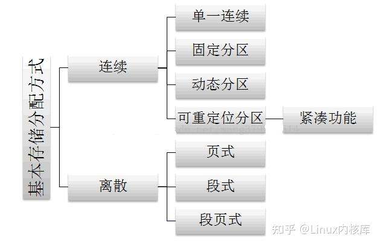
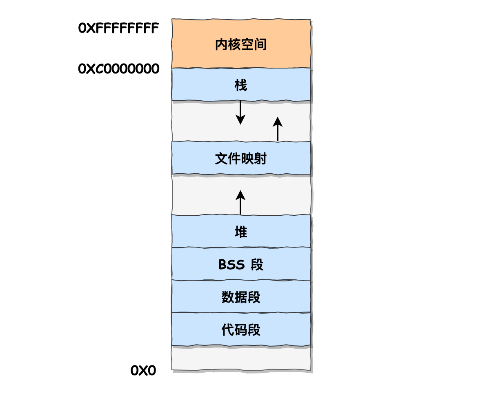
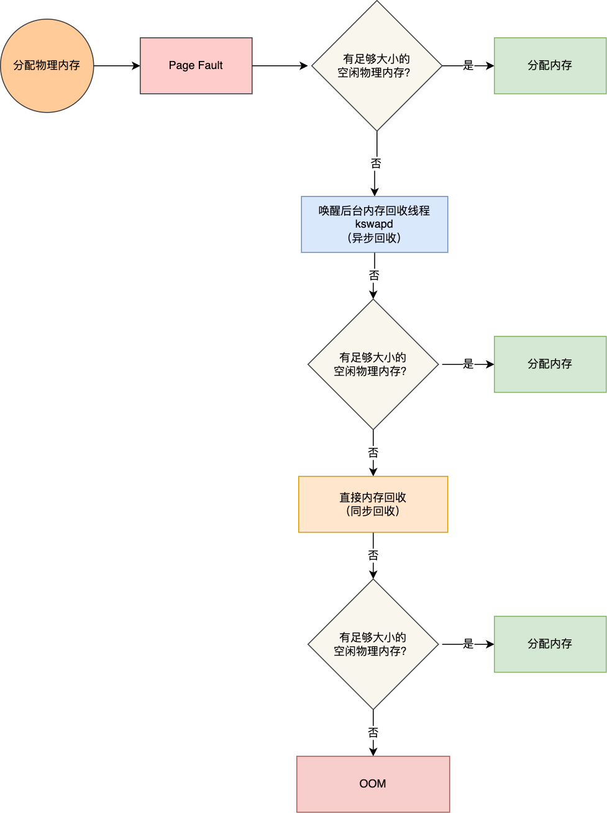

### 硬件结构

#### CPU执行程序

##### 线路位宽与CPU位宽

###### 线路位宽: 

​	线路的位宽最好一次就能访问到所有的**内存地址**, **指地址总线的位数**;

​	如果CPU 操作 4G 大的内存，那么就需要 32 条地址总线，因为 `2 ^ 32 = 4G`;

​	~~通常说的**操作系统的位数**，指的是地址总线的位宽;~~

###### CPU 位宽: 

​	代表的是 CPU 一次可以**计算（运算）的数据量**, CPU 位宽越大，可以计算的数值就越大;

​	有CPU在计算时，数据需要先保存在寄存器中，因此CPU位宽一般就是指**寄存器的位数**

​	最好不要小于线路位宽,通常来说 64 位 CPU 的地址总线是 **48 位**，而 32 位 CPU 的地址总线是 32 位; 

​	32 位和 64 位 CPU 最主要区别在于一次能计算多少字节数据,  如果计算的数额**不超过 32 位**数字的情况下，32 位和 64 位 CPU 之间**没什么区别**的，只有当计算超过 32 位数字的情况下，64 位的优势才能体现出来。

​	32 位 CPU 最大只能操作 4GB 内存，就算你装了 8 GB 内存条，也没用。而 64 位 CPU 寻址范围则很大，理论最大的寻址空间为 `2^64`

硬件的 64 位和 32 位指的是 CPU 的位宽，软件的 64 位和 32 位指的是指令的位宽.

##### 程序执行过程

1. cpu→程序计数器→地址总线→数据总线→指令寄存器
2. 程序计数器++
3. 分析指令寄存器并执行

#### 存储器

##### 层次结构

CPU 并不会直接和每一种存储器设备直接打交道，而是每一种存储器设备只和它**相邻的存储器**设备打交道.

CPU会逐层寻找数据,存储层次结构也形成了**缓存**的体系.

| 存储器                 | 速度/(CPU 时钟周期)                      | 大小                   | 材质       |
| ---------------------- | ---------------------------------------- | ---------------------- | ---------- |
| 寄存器                 | 半个                                     |                        |            |
| L1 cache(cpu核心独有)  | 2-4个                                    | 几十 KB 到几百 KB 不等 | cache SRAM |
| L2 cache(cpu核心独有)) | 10-20个                                  | 几百 KB 到几 MB 不等   |            |
| L3 cache(cpu共享)      | 20-60个                                  | 几 MB 到几十 MB 不等   |            |
| 内存                   | 200~300 个                               |                        | DRAM芯片   |
| SSD                    | 内存的读写速度比 SSD 大概快 `10~1000` 倍 |                        |            |
| HDD                    | 速度比内存慢 `10W` 倍左右                |                        |            |

##### CPU Cache 的结构

CPU Cache Line, 表示 **CPU Cache 一次性能加载数据的大小**, 对应某个内存块大小

###### 直接映射 Cache 

内存的访问地址，包括**组标记、CPU Cache Line 索引、偏移量**这三种信息;

 CPU Cache 里的数据结构，由**索引 + 有效位 + 组标记 + 数据块**组成;

##### **缓存命中**

###### 提高**「数据缓存」缓存命中率**

按照内存布局顺序访问

###### 提高「指令缓存」缓存命中率

CPU 自身的动态分支预测 (有规律的条件分支语句能够让 CPU 的分支预测器发挥作用);

`likely` 和 `unlikely` 这两种宏，如果 `if` 条件为 `ture` 的概率大，则可以用 `likely` 宏把 `if` 里的表达式包裹起来，反之用 `unlikely` 宏;

###### 多核 CPU 的缓存命中率

**线程绑定在某一个 CPU 核心上**: 如果一个线程在不同核心来回切换，各个核心的缓存命中率就会受到影响;

#### CPU 缓存一致性

#### CPU Cache 的数据写入

##### 1.写直达

内存和cache一同写入

##### 2.写回

只写入cache; 在cache块被替换时才会将脏cache重新写回内存(读入或写入不存在cache中的数据,对应的cache块都会被替换)

#### 缓存一致性问题

**多核心**cpu每个核心独享L1/L2cache, 基于**写回**方式产生的缓存一致性问题.

实现缓存一致性，需要满足写传播和事务串行化，就是保证大家都同步更新并且更新顺序是相同的。

##### 写传播

###### 总线嗅探

当某个 CPU 核心更新了 Cache 中的数据，总线把这个事件广播通知给其他所有的核心，然后每个 CPU 核心都会监听总线上的广播事件，并检查是否有相同的数据，如果有就跟着更新。

##### 事务串行化

###### MESI协议

已修改、独占、共享、已失效

#### CPU数据读取

这种因为多个线程同时读写同一个 Cache Line 的不同变量时，而导致 CPU Cache 失效的现象称为**伪共享（False Sharing）**

##### 避免伪共享

避免 Cache 伪共享实际上是用**空间换时间**的思想，浪费一部分 Cache 空间，从而换来性能的提升。

#### CPU线程选择

##### 调度类

优先级是 Deadline > Realtime > Fair,**实时任务总是会比普通任务优先被执行**

###### 1.Deadline

实时任务,调度策略是deadline和目前时间越靠近越先被调度.

###### 2.Realtime

优先级高的可以抢占;

相同优先级时,可以FIFO或者RR(时间片)

###### 3.Fair

CFS : 完全公平调度（Completely Fair Scheduling）

- 每个任务有nice值, 表示优先级的修正数值，它与优先级（priority）的关系是这样的：priority(new) = priority(old) + nice。内核中，priority 的范围是 0~139，值越低，优先级越高，其中前面的 0~99 范围是提供给实时任务使用的，而 nice 值是映射到 100~139，这个范围是提供给普通任务用的，因此 nice 值调整的是普通任务的优先级。

- 每个任务有vruntime, 会优先选择 vruntime 少的任务, 计算时考虑权重值, nice值小对应的权重大.「同样的实际运行时间」里，高权重任务的 vruntime 比低权重任务的 vruntime **少**。**nice缩小了，权重变大了，vruntime就变少了，就会优先被调用**。

  

可以调整任务的 `nice` 值从而调整**普通任务**的执行时间.

但是不管怎么缩小 nice 值，任务**永远都是普通任务**，如果某些任务要求实时性比较高，可以考虑改变**任务的优先级以及调度策略**，使得它变成实时任务.

#### 软中断

##### 中断

中断是系统用来**响应**硬件设备请求的一种机制，操作系统收到硬件的中断请求，会打断正在执行的进程，然后调用内核中的**中断处理程序**来响应请求.

中断处理程序在响应中断时，可能还会「临时关闭中断」.

为了保证**之前的正常进程调度**且**避免其他中断的丢失**, 中断处理程序要短且快。

##### 软中断

Linux 系统为了解决中断处理程序执行过长和中断丢失的问题，将中断过程分成了**两个阶段**，分别是「上半部和下半部分」。中断处理程序的上部分和下半部可以理解为：

- **上半部**直接处理硬件请求，也就是**硬中断**，主要是负责耗时短的工作，特点是快速执行；
- 下半部是由**内核**触发，也就说**软中断**，主要是负责上半部未完成的工作，通常都是耗时比较长的事情，特点是延迟执行；

不过，软中断**不只是**包括硬件设备中断处理程序的下半部，一些**内核自定义事件**也属于软中断，比如内核调度等、RCU 锁（内核里常用的一种锁）等。

每一个 **CPU 都有各自**的软中断内核线程.

#### 补码

「负数为什么要用补码方式来表示」:如果负数不是使用补码的方式表示，则在做基本对加减法运算的时候，**还需要多一步操作来判断是否为负数，如果为负数，还得把加法反转成减法，或者把减法反转成加法**

#### 小数

##### 小数十进制与二进制的转换

十进制→二进制:	整数部分使用除2取余法, 小数部分用**乘 2 取整法**.

二进制小数→十进制:	整数部分正常幂数,小数部分取负幂.

##### 计算机存储小数

计算机存储的是浮点数:

- 首先,十进制小数转换成二进制小数;
- 然后将二进制小数,用规范化的科学技术法表示, 默认小数点前面有个1,小数点后面的是尾数
- 计算机用 ***符号位/指数/尾数*** 表示浮点数,其中为了保证指数部分的无符号,会进行一个**偏移**,例如8位指数的float会在原来指数基础上+127

因为有的**小数**无法可以用「完整」的二进制来表示，所以计算机里只能采用**近似数的方式来保存**，那两个近似数相加，得到的必然也是一个近似数

### 系统结构

#### 内核

##### 内核能力

内核作为应用连接硬件设备的**桥梁**

- 进程调度
- 内存管理
- 设备管理
- 系统调用

##### 内核空间 & 用户空间

- 进程在用户态时，只能访问用户空间内存；
- 只有进入内核态后，才可以访问内核空间的内存；

#### Linux内核

##### MultiTask

 Linux 是一个多任务的操作系统，意味着可以有多个任务同时执行，这里的「同时」可以是并发或并行

##### SMP对称多处理

每个 CPU 的地位是相等的

##### ELF**可执行文件链接格式**

首先通过「编译器」编译成汇编代码，接着通过「汇编器」变成目标代码，最后通过「链接器」把多个目标文件以及调用的各种函数库链接起来，形成一个可执行文件，也就是 ELF 文件。

执行 ELF 文件的时候，会通过「装载器」把 ELF 文件装载到内存里，CPU 读取内存中的指令和数据，于是程序就被执行起来了

##### Monolithic Kernel **宏内核**

**<u>Linux 内核架构就是宏内核</u>**，意味着 Linux 的内核是一个完整的可执行程序，且拥有最高的权限。

**宏内核**的特征是系统内核的所有模块，比如进程调度、内存管理、文件系统、设备驱动等，都运行在内核态；

**微内核**架构的内核只保留最基本的能力，比如进程调度、虚拟机内存、中断等，把一些应用放到了用户空间；

**混合类型内核**，像是宏内核的方式包裹着一个微内核；

#### windows

Windows NT，NT 全称叫 New Technology

同样支持 MultiTask 和 SMP，**Window 的内核设计是混合型内核**；

Windows 的可执行文件格式叫 PE，称为**可移植执行文件**

### 内存管理

#### 虚拟内存

操作系统为每个进程分配独立的一套「**虚拟地址**」，互不干涉。

进程不能直接访问物理地址；

虚拟内存地址映射到物理内存地址，有分段分页两种方式。

##### 分段

###### 分段原理

段表地址映射

###### 内存碎片

外碎片 && 内存交换效率低

##### 分页

###### 分页原理

页表地址映射

###### 碎片及内存交换效率

内碎片 && 换入换出的只有少数页，**内存交换的效率就相对比较高。**

**Swap** 就是把一块磁盘空间或者本地文件，当成内存来使用，它包含换出和换入两个过程：

- **换出（Swap Out）** ，是把进程暂时不用的内存数据存储到磁盘中，并释放这些数据占用的内存；
- **换入（Swap In）**，是在进程再次访问这些内存的时候，把它们从磁盘读到内存中来；

###### 多级页表

局部性原理

###### TLB

时间局部性原理

##### 段页式管理

优缺点

##### ⭐Linux具体内存管理

**Linux 系统中的每个段都是从 0 地址开始的整个 4GB 虚拟空间（32 位环境下），也就是所有的段的起始地址都是一样的。这意味着，Linux 系统中的代码，包括操作系统本身的代码和应用程序代码，所面对的地址空间都是线性地址空间（虚拟地址），这种做法相当于屏蔽了处理器中的逻辑地址概念，段只被用于访问控制和内存保护。**

每个进程都各自有独立的虚拟内存，但是**每个虚拟内存中的内核地址，其实关联的都是相同的物理内存**。

###### 用户空间分布

代码段、全局变量、BSS、函数栈、堆内存、文件映射区。

文件映射区：我们的程序在运行过程中还需要依赖动态链接库，这些动态链接库以 .so 文件的形式存放在磁盘中。这些动态链接库中的代码段，数据段，BSS 段，以及通过 mmap 系统调用映射的共享内存区，在虚拟内存空间的存储区域叫做文件映射与匿名映射区.

##### 虚拟内存的作用

https://www.xiaolincoding.com/os/3_memory/vmem.html#%E6%80%BB%E7%BB%93

- 扩展逻辑内存
- 隔离进程，解决了多进程之间地址冲突
- 页表里的页表项中除了物理地址之外，还有一些标记属性的比特，比如控制一个页的读写权限，标记该页是否存在等。在内存访问方面，操作系统提供了更好的安全性。

#### malloc详解

##### 内存分配

malloc 申请内存的时候，会有brk和mmap两种方式向操作系统申请堆内存。

- 如果用户分配的内存小于 **128 KB**，则通过 brk() 申请内存；
- 如果用户分配的内存大于 128 KB，则通过 mmap() 申请内存；

###### brk()系统调用

从堆分配内存：将「堆顶」指针向高地址移动，获得新的内存空间；

###### mmap()系统调用

在文件映射区域分配内存；

> **malloc() 分配的是虚拟内存**，只有在访问已分配的虚拟地址空间的时候，操作系统通过查找页表，发现虚拟内存对应的页没有在物理内存中，就会触发缺页中断，然后操作系统会建立虚拟内存和物理内存之间的映射关系

###### brk && mmap

mmap() 分配的内存每次**释放**都会归还给操作系统，于是每次 mmap 分配的虚拟地址都是缺页状态的，在第一次访问该虚拟地址的时候，就会触发缺页中断。

brk()释放的内存放在malloc内存池中，下次申请从内存池中取出内存，可能这个内存块的虚拟地址与物理地址的**映射关系还存在**，这样不仅减少了系统调用的次数，也减少了缺页中断的次数，这将大大降低 CPU 的消耗。

对于小块内存，伴随频繁的malloc和free，堆内将产生越来越多不可用的碎片，导致内存泄漏。默认分配大块内存 (128KB) 才使用 mmap 分配内存空间。

##### 预分配

malloc() 在分配内存的时候，并不是老老实实按用户预期申请的字节数来分配内存空间大小，而是**会预分配更大的空间作为内存池**。

具体会预分配多大的空间，跟 malloc 使用的内存管理器有关系。

##### free释放内存

malloc 通过 **brk() 方式**申请的内存的情况，在free 释放内存后，堆内存并没有归还给操作系统。先缓存着放进 **malloc 的内存池里**，当进程再次申请内存时就可以直接**复用**。

通过 **mmap 方式**申请的内存，free 释放内存后就会归归还给操作系统。

在malloc申请内存时，会有多出来的字节保存该内存块的大小等信息，在free的时候，会根据内存块大小信息（对传入的地址**左偏移16字节**），得知释放多大的内存。

#### 内存满了

##### 内存分配

因为malloc这种分配的是虚拟内存，当真实访问的时候，会发生缺页中断。

如果内存中还有空间，会分配对应的物理内存给虚拟内存，如果内存满了，内核会内存回收。

##### 内存回收方式

###### 后台回收 kswapd

唤醒kswapd内核线程，异步回收，不会阻塞进程。

###### 直接回收 direct reclaim

同步回收，会阻塞进程，造成延迟和高系统负荷。

###### OOM（out of memory）

内核会根据算法选择一个进程杀掉。

OOM killer 就会根据每个进程的内存占用情况和 `oom_score_adj` 的值进行打分，得分最高的进程就会被首先杀掉。

调整`/proc/[pid]/oom_score_adj` 值，来降低被 OOM killer 杀掉的概率。

应用系统中存在无法回收的内存或使用的内存过多，最终使得程序运行要**用到的内存大于能提供的<u>最大内存</u>**。此时程序就运行不了，系统会提示**<u>内存溢出</u>**。

##### 可回收资源

文件页和匿名页的回收都是基于 LRU 算法。

###### 文件页回收

指内核缓存的磁盘数据和内核缓存的文件数据，即在内存释放之后，还能在磁盘文件中读取；

干净文件页可以直接释放（不影响性能），脏页需要重新写入磁盘中再回收（发生磁盘I/O，会影响性能）；

###### 匿名页回收

没有硬盘文件这样的载体，有可能还会被访问到，所以通过linux的Swap机制，将不尝访问的匿名页写到磁盘中，然后释放内存。（发生磁盘I/O，会影响性能）

匿名页回收的方式是通过 Linux 的 **Swap 机制**，

##### 解决回收的性能影响

###### 调整优先回收文件页/匿名页

` /proc/sys/vm/swappiness`

###### 尽早触发 kswapd 内核线程异步回收内存

通过尽早的触发「后台内存回收」来避免应用程序进行直接内存回收。

`/proc/sys/vm/min_free_kbytes`

###### NUMA 架构下的内存回收策略

设置 `/proc/sys/vm/zone_reclaim_mode`为 0，这样在**回收本地内存之前，会在其他 Node 寻找空闲内存**，从而避免在系统还有很多空闲内存的情况下，因本地 Node 的本地内存不足，发生频繁直接内存回收导致性能下降的问题；

#### 在 4GB 物理内存的机器上申请 8G 内存

- 在 32 位操作系统，因为进程理论上最大能申请 3 GB 大小的虚拟内存，所以直接申请 8G 内存，会申请失败。
- 在 64位 位操作系统，因为进程理论上最大能申请 128 TB 大小的虚拟内存，即使物理内存只有 4GB，申请 8G 内存也是没问题，因为申请的内存是虚拟内存。如果这块虚拟内存被访问了，要看系统有没有 Swap 分区：
  - 如果没有 Swap 分区，因为物理空间不够，进程会被操作系统杀掉，原因是 OOM（内存溢出）；
  - 如果有 Swap 分区，即使物理内存只有 4GB，程序也能正常使用 8GB 的内存，进程可以正常运行；

总结就是：

- 如果申请的内存比进程本身的用户空间大，就会申请失败，否则能成功申请（要保证内存可以容下需要的表示虚拟内存的空间，比如连新添加的页表项都没地方放，那也是OOM，可以通过开启swap解决这个问题）；
- 访问的时候要看是否开启了swap分区，如果开启了有可能可以正常运行（因为swap也是有极限的），否则OOM。

#### LRU改善

##### LRU算法 

Least recently used

LRU 算法一般是用**「链表」**作为数据结构来实现的，链表头部的数据是最近使用的，而链表末尾的数据是最久没被使用的。

传统的 LRU 算法的**实现思路**是这样的：

- 当访问的页在内存里，就直接把该页对应的 LRU 链表节点移动到链表的头部。
- 当访问的页不在内存里，除了要把该页放入到 LRU 链表的头部，还要淘汰 LRU 链表末尾的页。

##### LRU缺陷

###### 预读失败

- 预读：操作系统出于空间局部性原理（靠近当前被访问数据的数据，在未来很大概率会被访问到），会在读取磁盘文件时预读其他的数据到系统的读缓存（Page Cache）中。如果预读数据命中，**可以减少 磁盘 I/O 次数，提高系统磁盘 I/O 吞吐量**。

- 预读失败：如果预读进来的页面没有被访问，就是预读失效。但是因为刚读进来的页面会占据LRU链表靠前的位置，这个时候有可能把热点数据淘汰掉，**大大降低了缓存命中率**。

- 避免预读失败的影响：

  **让预读页停留在内存里的时间要尽可能的短，让真正被访问的页才移动到 LRU 链表的头部，从而保证真正被读取的热数据留在内存里的时间尽可能长**。

  - linux通过设计活跃和非活跃的LRU链表：

    **active list** 活跃内存页链表，这里存放的是最近被访问过（活跃）的内存页；

    **inactive list** 不活跃内存页链表，这里存放的是很少被访问（非活跃）的内存页；

    预读页就只需要加入到 inactive list 区域的头部，当页被**真正访问**的时候，才将页插入 active list 的头部；如果预读的页一直没有被访问，就会从 inactive list **移除**。

    当预读页被插入active list时，active list淘汰的页会插到inactive list的头部。

  - mysql设计young区域和old的LRU区域；

###### 缓存污染

- 缓存污染：当我们在批量读取数据的时候，由于数据被访问了一次，这些大量数据都会被加入到「活跃 LRU 链表」里，然后之前缓存在活跃 LRU 链表（或者 young 区域）里的热点数据全部都被淘汰了，**如果这些大量的数据在很长一段时间都不会被访问的话，那么整个活跃 LRU 链表（或者 young 区域）就被污染了**。
- 影响：被淘汰的热数据又被再次访问的时候，由于缓存未命中，就会产生**大量的磁盘 I/O**，系统性能就会急剧下降。
- 解决：**提高进入到活跃 LRU 链表（或者 young 区域）的门槛**
  - Linux 操作系统：在内存页被访问**第二次**的时候，才将页从 inactive list 升级到 active list 里

#### Linux虚拟内存详解

>这里就只记录自己不清楚的地方，不按照原文梳理了。原文地址https://www.xiaolincoding.com/os/3_memory/linux_mem.html#_4-6-%E6%B7%B1%E5%85%A5%E7%90%86%E8%A7%A3-linux-%E8%99%9A%E6%8B%9F%E5%86%85%E5%AD%98%E7%AE%A1%E7%90%86

##### 64 位机器上进程虚拟内存空间分布

在用户空间和内核空间中有个canonical address 空洞。

用户空间前16位全为0，内核空间前6位全为1，可以快速判断访问地址是用户空间还是内核空间。访问canonical address 空洞就是非法访问。
