## mysql语句执行

MySQL 的架构共分为两层：Server 层和存储引擎层。Server 层负责建立连接、分析和执行 SQL；存储引擎层负责数据的存储和提取。


### 1、连接器

```mysql
# 先连接 MySQL 服务，然后才能执行 SQL 语句
mysql -h$ip -u$user -p
```

 MySQL 是基于 TCP 协议进行传输的，连接的过程需要先经过 TCP 三次握手，然后连接器就要开始验证你的用户名和密码，随后连接器就会获取该用户的权限，然后保存起来。

MySQL 定义了空闲连接的最大空闲时长 和 支持的最大连接数；MySQL 的连接也跟 HTTP 一样，有短连接和长连接的概念。

### 2、查询缓存

### 3、解析器

词法分析和语法分析

### 4、执行SQL

#### 预处理器

- 检查 SQL 查询语句中的表或者字段是否存在；
- 将 `select *` 中的 `*` 符号，扩展为表上的所有列

#### 优化器

**优化器主要负责将 SQL 查询语句的执行方案确定下来**，比如在表里面有多个索引的时候，优化器会基于查询成本的考虑，来决定选择使用哪个索引。

覆盖索引（covering index ，或称为索引覆盖）即**从非主键索引中就能查到的记录，而不需要查询主键索引中的记录**。

#### 执行器

根据执行计划执行 SQL 查询语句，从存储引擎读取记录，返回给客户端。Server 层每从存储引擎**读到一条记录**就会发送给客户端，客户端是等查询语句查询完成后，才会显示出所有的记录。

举例三种执行过程：

- 主键索引查询

- 全表扫描

- 索引下推

  索引下推能够减少**二级索引**在查询时的回表操作，提高查询的效率，因为它将 Server 层部分负责的事情，交给存储引擎层去处理了。

  具体来说，没有索引下推的时候，每查询到一条二级索引记录，都要进行回表操作，然后将记录返回给 Server，接着 Server 再判断该记录是否符合其他条件。

  而使用索引下推后，存储引擎定位到二级索引后，**先不执行回表**操作，而是先判断一下<u>**该索引中包含的列的条件**</u>是否成立，**直接过滤掉不满足条件的记录**。如果条件**成立**，则**执行回表**操作，将完成记录返回给 Server 层。Server 层再判断其他的查询条件是否成立，如果成立则将其发送给客户端；否则跳过该记录，然后向存储引擎索要下一条记录。

  也就是说，使用了索引下推后，虽然索引中的某些列无法使用到联合索引，但是因为它包含在联合索引里，所以直接在存储引擎过滤出满足该列的记录后，才去执行回表操作获取整个记录。相比于没有使用索引下推，节省了很多回表操作。

## mysql存储结构

### 数据存放

InnoDB存储引擎为例，我们每创建一个 database（数据库） 都会在 /var/lib/mysql/ 目录里面创建一个以 database 为名的目录，然后保存表结构和表数据的文件都会存放在这个目录里。database目录下，有三个文件：

- db.opt，用来存储当前数据库的默认字符集和字符校验规则。
- t_order.frm ，t_order 的**表结构**会保存在这个文件。
- t_order.ibd，t_order 的**表数据**会保存在这个文件，这个文件也称为独占表空间文件。从 MySQL 5.6.6 版本开始， MySQL 中每一张表的数据都存放在一个独立的 .ibd 文件。

#### 表空间文件结构

表空间由段（segment）、区（extent）、页（page）、行（row）组成。

- 行：数据库表中的记录都是按行（row）进行存放的，每行记录根据不同的行格式，有不同的存储结构；

- 页：InnoDB 的数据是**按「数据页」为单位来读写**，默认大小16KB；页有很多类型，数据表中的行记录是用「数据页」来管理的。

- 区：在表中数据量大的时候，为某个索引分配空间的时候就不再按照页为单位分配了，而是按照区（extent）为单位分配。每个区的大小为 1MB，对于 16KB 的页来说，连续的 64 个页会被划为一个区，这样就**使得链表中相邻的页的物理位置也相邻**，就能使用顺序 I/O 了。

- 段：表空间是由各个段（segment）组成的，段是由多个区（extent）组成的。段一般分为数据段、索引段和回滚段等。

  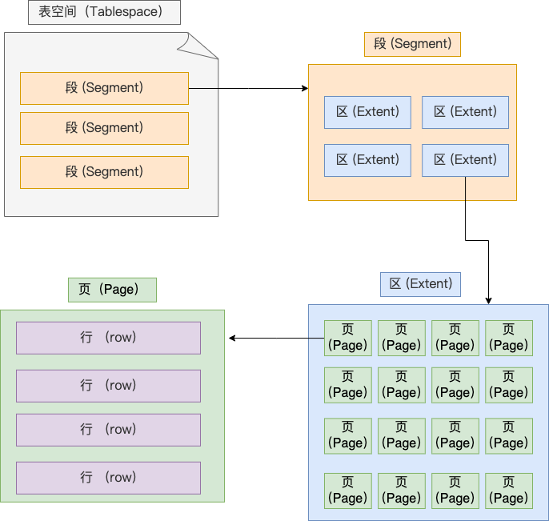

### InnoDB数据页

#### 数据页结构

数据页包括七个部分，结构及功能如下图：

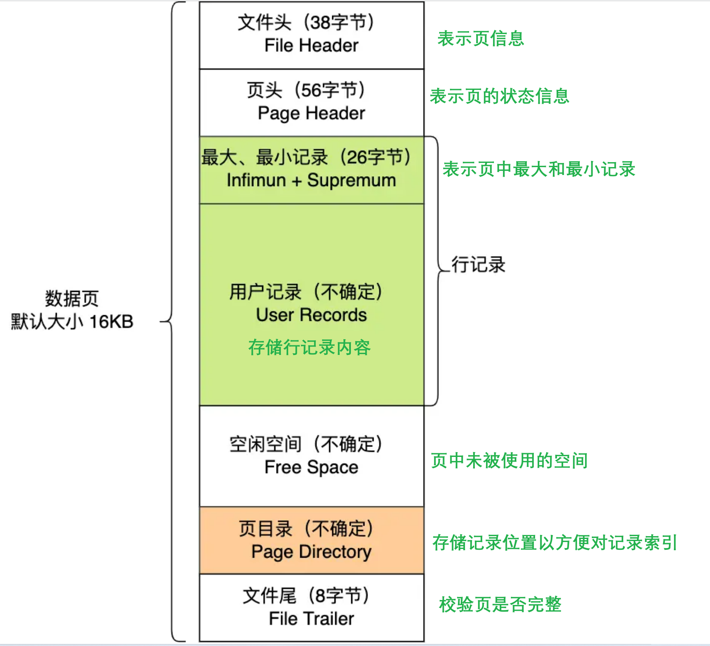

其中，File Header 中有两个指针，分别指向上一个数据页和下一个数据页，连接起来的页相当于一个**双向的链表**，实现逻辑上的连续。

#### 数据页查询

数据页中的记录按照「主键」顺序**组成单向链表**，为提高检索效率，使用**页目录**进行索引。

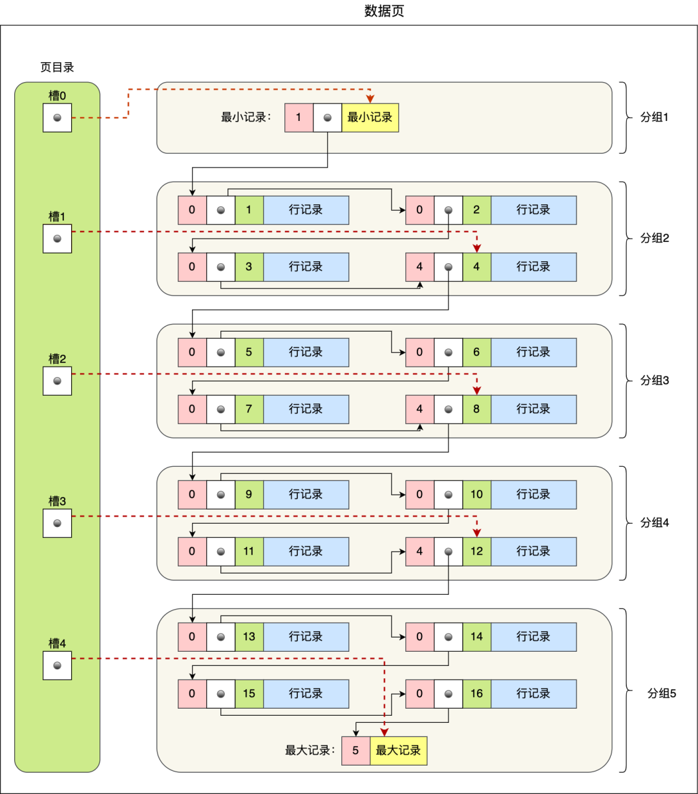

- 将所有的记录分组，每个记录组的最后一条记录就是组内最大的那条记录，并且最后一条记录的头信息中会存储该组一共有多少条记录（上图中粉红色字段）
- 页目录中的每个槽（slot）相当于指针指向了**不同组的最后一个记录**，即将每组最后一条记录的地址偏移量按照先后顺序存储起来。槽相当于分组记录的索引，记录是按照「主键值」从小到大排序的。
- 我们通过槽查找记录时，使用二分法快速**定位**要查询的记录在哪个**槽**，然后**遍历槽**找到对应的记录，无需从最小记录开始遍历整个页中的记录链表。「槽对应的值都是这个组的主键最大的记录」，当我们找到对应的槽后，会使用上一个槽的指针，它下一个指向的就是定位槽的第一个记录。

#### B+树查询

InnoDB 里的 B+ 树中的**每个节点都是一个数据页**，如下图：

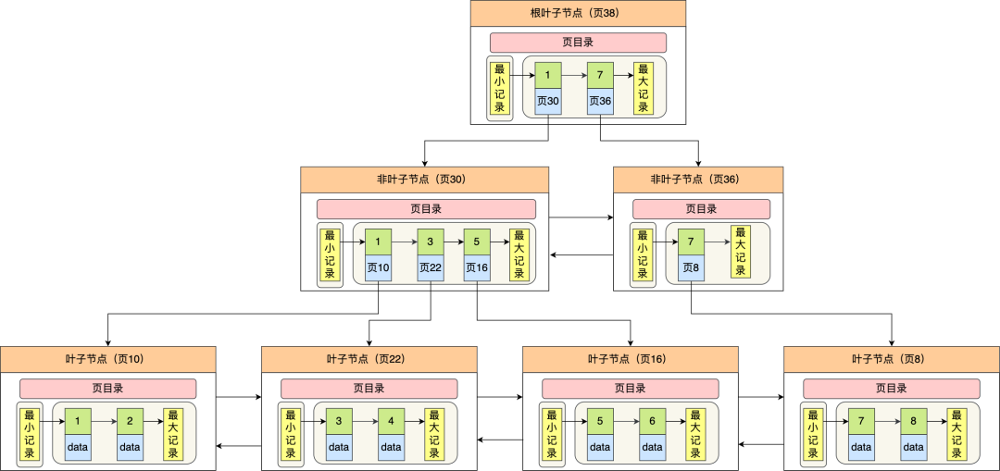

查找时，首先通过二分法快速定位到包含该记录的页，然后在该页内进行二分法快速定位记录所在的分组（槽号），最后在分组内进行遍历查找。

### InnoDB 行记录

#### 行格式

行格式（row_format），就是一条记录的存储结构。

InnoDB 提供了 4 种行格式，分别是 Redundant、Compact、Dynamic和 Compressed 行格式。

##### Redundant

不是一种紧凑的行格式，很古老，已经弃用。

##### Compact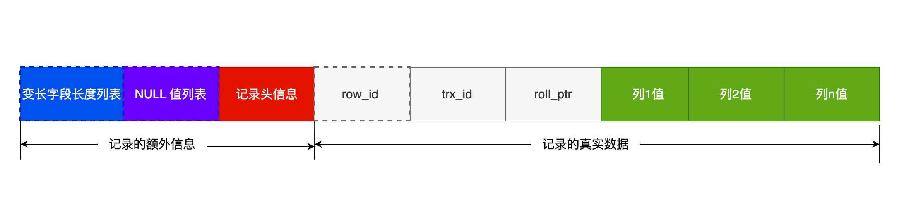

###### 记录的额外信息

记录的额外信息包含 3 个部分：变长字段长度列表、NULL 值列表、记录头信息。

1. **变长字段长度列表**

   针对变长字段（如varchar）数据的存储，需要把**数据占用的大小**存到「变长字段长度列表」里面，读取数据的时候根据这个「变长字段长度列表」去读取对应长度的数据。

   ~~**NULL** 不会存放在行格式中记录的真实数据部分里~~

   变长字段的真实数据占用的字节数会按照列的顺序**逆序存放**，因为记录头信息指向的是额外信息和真实信息的中间位置，这样可以使得位置靠前的记录的真实数据和数据对应的字段长度信息可以同时**在一个 CPU Cache Line** 中，这样就可以提高 CPU Cache 的**命中率**。

   > 「变长字段长度列表」只出现在数据表有变长字段的时候，即如果表中没有变长字段，就不用记录此额外信息。

2. **NULL 值列表**：把值为 NULL 的列存储到 NULL值列表中。

   如果**存在允许 NULL 值的列**，则每个列对应一个二进制位（bit），二进制位按照列的顺序逆序排列。`1`代表该列的值为NULL，`0`代表该列的值不为NULL。当数据表的字段**都定义成 NOT NULL** 的时候，这时候表里的行格式就**不会有 NULL 值列表**了。

   NULL 值列表必须用整数个字节的位表示（1字节8位），如果使用的二进制位个数不足整数个字节，则在字节的**高位**补 `0`。

3.  **记录头信息**

   包含内容很多，比较重要的有：

   - delete_mask ：标识此条数据是否被删除。
   - next_record：下一条记录的位置。记录与记录之间是通过链表组织的。next_record指向的是下一条记录的「记录头信息」和「真实数据」之间的位置，这样的好处是向左读就是记录头信息，向右读就是真实数据，比较方便。
   - record_type：表示当前记录的类型，0表示普通记录，1表示B+树非叶子节点记录，2表示最小记录，3表示最大记录。

###### 记录的真实数据

1. row_id

   如果我们建表的时候指定了主键或者唯一约束列，那么就没有 row_id 隐藏字段了。如果既没有指定主键，又没有唯一约束，那么 InnoDB 就会为记录添加 row_id 隐藏字段。row_id**不是必需**的，占用 6 个字节。

2. trx_id：事务id，即表示这个数据是由哪个事务生成的。 trx_id是必需的，占用 6 个字节。

3. roll_pointer：记录上一个版本的指针。roll_pointer 是必需的，占用 7 个字节。

##### Dynamic & Compressed

Dynamic 和 Compressed 两个都是紧凑的行格式，它们的行格式都和 Compact 差不多，因为都是基于 Compact 改进一点东西。从 MySQL5.7 版本之后，默认使用 Dynamic 行格式。

#### varchar(n) 中 n 最大取值

varchar(n) 字段类型的 n 代表的是最多存储的字符数量。

MySQL 规定一行记录除了 TEXT、BLOBs 类型的列，限制最大为 **65535 字节。**

回答这个问题，还需要知道数据库表的字符集，因为字符集代表着1个字符要占用多少字节。

在算 varchar(n) 中 n 最大值时，需要减去 **「变长字段长度列表」和 「NULL 值列表」**所占用的字节数的。也就是说65535里面，包含这两者。如果是单字段，n最大值为65532；**如果有多个字段的话，要保证所有字段的长度 + 变长字段字节数列表所占用的字节数 + NULL值列表所占用的字节数 <= 65535**。

#### 行溢出

如果某条记录比较大，一个页可能就存不了一条记录。这个时候就会**发生行溢出，多的数据就会存到另外的「溢出页」中**。在一般情况下，InnoDB 的数据都是存放在 「数据页」中。但是当发生行溢出时，溢出的数据会存放到「溢出页」中。

##### Compact 行格式：

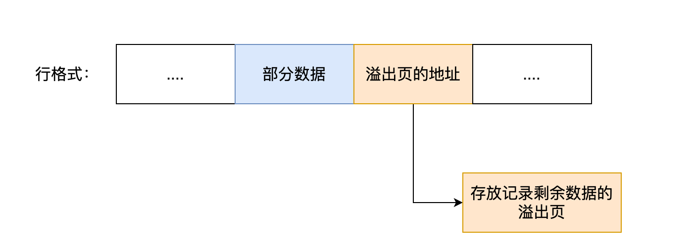

##### Compressed 和 Dynamic

完全行溢出:

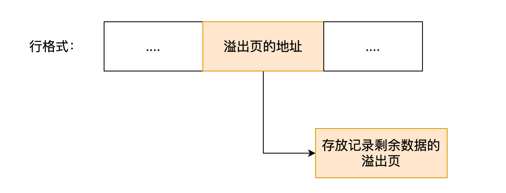


## 索引

索引的定义就是帮助存储引擎快速获取数据的一种数据结构，形象的说就是**索引是数据的目录**。

所谓的存储引擎，说白了就是如何存储数据、如何为存储的数据建立索引和如何更新、查询数据等技术的实现方法。

### 索引分类

四个角度来分类索引。

#### 按「数据结构」分类

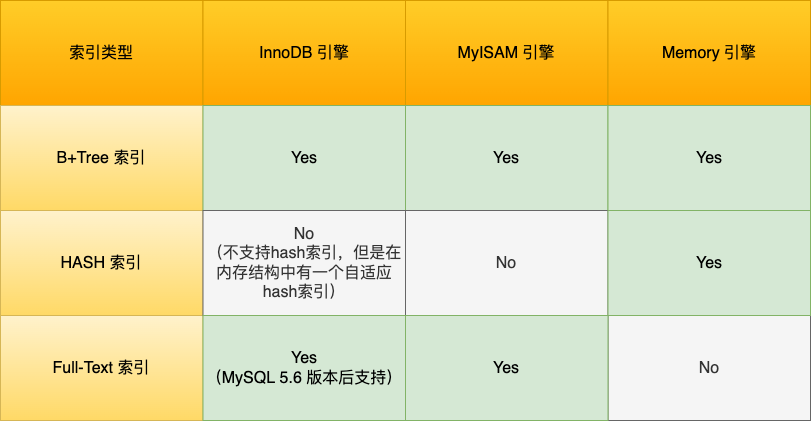

##### **B+tree索引**

InnoDB中，**创建的主键索引和二级索引默认使用的是 B+Tree 索引**。

B+Tree 是一种多叉树，**叶子节点才存放数据，非叶子节点只存放索引**，而且每个节点里的数据是**按主键顺序存放**的。每一层父节点的索引值都会出现在下层子节点的索引值中，因此在叶子节点中，包括了所有的索引值信息，并且每一个叶子节点都有**两个指针，分别指向下一个叶子节点和上一个叶子节点**，形成一个双向链表。

###### **数据查询**

查询时，B+Tree 会自顶向下逐层进行查找。数据库的索引和数据都是存储在硬盘的，我们可以把读取一个节点当作一次磁盘 I/O 操作。

B+Tree 存储千万级的数据只需要 3-4 层高度就可以满足，这意味着从千万级的表查询目标数据最多需要 3-4 次磁盘 I/O，所以**B+Tree 相比于 B 树和二叉树来说，最大的优势在于查询效率很高，因为即使在数据量很大的情况，查询一个数据的磁盘 I/O 依然维持在 3-4次。**

- 使用主键查询时：自顶向下逐层查找，将查找到的叶子节点返回server层
- 使用二级索引查询时：

> 主键索引的 B+Tree 的叶子节点存放的是**实际数据**，所有完整的用户记录都存放在主键索引的 B+Tree 的叶子节点里；二级索引的 B+Tree 的叶子节点存放的是**主键值**。

​	先检索**二级索引**中的 B+Tree 的索引值，找到对应的叶子节点并获取**主键值**，然后再通过**主键索引**中的 B+Tree 树查询到对应的叶子节点，然后**获取整行数据**。这个过程叫**「回表」**，也就是说要查两个 B+Tree 才能查到数据。

​	如果二级索引的索引值中包含了需要查找的数据，就不需要回表了，这个过程就叫作**「覆盖索引」**。

##### **Hash索引**

##### **Full-text索引**

#### 按「物理存储」分类：

##### **聚簇索引（主键索引）**

在创建表时，InnoDB 存储引擎会根据不同的场景选择不同的列作为索引：

- 如果有**主键**，默认会使用主键作为聚簇索引的索引键（key）；
- 如果**没有主键**，就选择**第一个不包含 NULL 值的唯一列**作为聚簇索引的索引键（key）；
- 在上面两个都没有的情况下，InnoDB 将自动生成一个**隐式自增 id 列**作为聚簇索引的索引键（key）；

##### **二级索引（辅助索引）**

除聚簇索引外，其它索引都属于辅助索引（Secondary Index），也被称为二级索引或非聚簇索引

#### 按「字段特性」分类：

##### **主键索引**

在mysql中就是聚簇索引。

主键索引就是建立在主键字段上的索引，通常在创建表的时候一起创建，一张表最多只有一个主键索引，索引列的值不允许有空值。

```mysql
create table table_name(
    ...
    primary key (column1) using BTREE
);
```

##### **唯一索引**

唯一索引建立在 **UNIQUE 字段**上的索引，一张表可以有**多个**唯一索引，索引列的值必须**唯一**，但是允许有**空值**。

```mysql
#建表时
create table table_name(
    ...
    unique key (column1, column2,...)
);
#建表后
create unique index index_name on table_name(column1, column2...);
```

##### **普通索引**

普通索引就是建立在普通字段上的索引，既不要求字段为主键，也不要求字段为 UNIQUE。

```mysql
#建表时
create table table_name(
    ...
    index(column1, column2,...)
);
#建表后
create index index_name on table_name(column1, column2...);
```

##### **前缀索引**

前缀索引是指对字符类型字段的前几个字符建立的索引，前缀索引可以建立在字段类型为 char、 varchar、binary、varbinary 的列上。目的是为了**减少**索引占用的**存储空间**，提升查询效率。\

```mysql
#建表时
create table table_name(
    column1_list
    index(column_name(length))
);
#建表后
create index index_name on table_name(column_name(length));
```

#### 按「字段个数」分类：

##### **单列索引**

建立在单列上的索引称为单列索引.

##### **联合索引**

通过将多个字段组合成一个索引，该索引就被称为联合索引。

联合索引的**非叶子节点**用该索引中的**多个字段**的值作为 B+Tree 的 key 值。联合索引查询的 B+Tree 是先按 左边的字段进行排序，左侧字段相同时，再依次按照右的边字段排序。

查询时，使用**最左匹配原则**，按照最左优先的方式进行索引的匹配。如果不遵循「最左匹配原则」，联合索引会失效，这样就无法利用到索引快速查询的特性了。

###### 范围查询

联合索引查询在遇到**范围查询**（如 >、<）的时候，就会**停止匹配**，也就是范围查询的字段可以用到联合索引，但是在范围查询字段的后面的字段无法用到联合索引。注意，对于 >=、<=、BETWEEN、like 前缀匹配的范围查询，并不会停止匹配，会在前面的范围查询字段**相等的几条数据**查询时，使用后面的索引值匹配。

###### 索引下推

**索引下推优化**（index condition pushdown)， 可以在联合索引遍历过程中，对联合索引中包含的字段先做判断，直接过滤掉不满足条件的记录，减少回表次数。

上文在[执行器](执行器)做了具体说明。

###### 索引区分度

区分度就是某个字段 column 不同值的个数「除以」表的总行数。建立联合索引时，要把**区分度大的字段排在前面**，这样区分度大的字段越有可能被更多的 SQL 使用到。

###### 联合索引进行排序

`select * from order where status = 1 order by create_time asc`，更好的方式给 status 和 create_time 列建立一个联合索引，因为这样可以避免 MySQL 数据库发生文件排序。

### 使用索引的时机

#### 索引的优缺点

优点：提高查询速度；

缺点：占用空间；创建和维护耗时；表的增删改时，B+树需要维护索引的有序性；

#### 适用场景

- 字段有唯一性限制的，比如商品编码；
- 经常用于 `WHERE` 查询条件的字段。
- 经常用于 `GROUP BY` 和 `ORDER BY` 的字段

#### 不需要创建的场景

- `WHERE` 条件，`GROUP BY`，`ORDER BY` 里用不到的字段；
- 字段中存在大量重复数据，比如性别字段； MySQL 有一个***查询优化器***，如果发现某个值出现在表的数据行中的百分比很高的时候，它一般会忽略索引，进行全表扫描。
- 表数据太少；
- 经常更新的字段；因为索引字段频繁修改，由于要维护 B+Tree的有序性，那么就需要频繁的重建索引

### 索引优化

#### 前缀索引优化

减小索引项的大小；

但是无法使用覆盖索引，`order by`也用不上；

#### 覆盖索引优化

减少回表，不需要查询出包含整行记录的所有信息，也就减少了大量的 I/O 操作

#### 主键索引自增

通过对主键字段声明 `AUTO_INCREMENT` 属性实现主键索引自增。

自增主键，**插入**一条新记录，都是**追加操作**，不需要重新移动数据，如果数据页满了，再开一个新的即可，效率非常高；

非自增主键，由于每次插入主键的索引值都是**随机**，插入新数据到数据页的中间位置，将不得不移动其它数据来满足新数据的插入，甚至需要从一个页面复制数据到另外一个页面，我们通常将这种情况称为**页分裂**。页分裂还有可能会造成**大量的内存碎片**，导致索引结构不紧凑，从而影响查询效率。

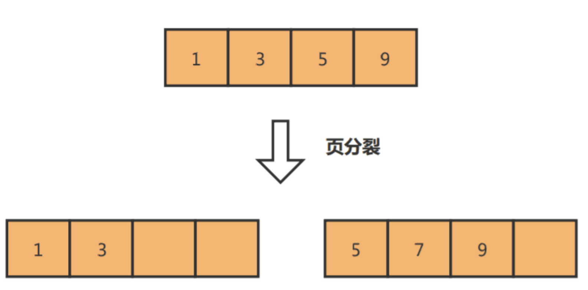

#### 索引设置为 NOT NULL

原因有二：

1、索引列存在 NULL 就会导致优化器在做索引选择的时候更加复杂，更加难以优化；

2、NULL 值是一个没意义的值，但是它会占用物理空间（compact中的[NULL值列表](#Compact)），所以会带来的存储空间的问题

#### 防止索引失效

***索引失效的场景：***

- 当我们使用**左或者左右模糊匹配**的时候，也就是 `like %xx` 或者 `like %xx%`这两种方式都会造成索引失效；
- 当我们在查询条件中对**索引列做了表达式计算、函数、类型转换操作**，这些情况下都会造成索引失效；
  - 索引保存的是索引字段的原始值，而不是经过函数计算后（或者表达式计算等）的值；
  -  关于类型隐式转换，MySQL 在遇到字符串和数字比较的时候，会自动把**字符串转为数字**，然后再进行比较。（比如这个时候将字符串列，在查询中写成了数字，索引就会失效）
- 联合索引要能正确使用需要**遵循最左匹配原则**，也就是按照最左优先的方式进行索引的匹配，否则就会导致索引失效。
- 在 WHERE 子句中，如果在 **OR 前的条件列是索引列，而在 OR 后的条件列不是索引列**，那么索引会失效。

***特例：***

- 使用左模糊匹配（like "%xx"）并不一定会走全表扫描，关键还是看数据表中的字段。如果数据库表中的字段**只有主键+二级索引**，那么即使使用了左模糊匹配，也不会走全表扫描（type=all），而是走**全扫描二级索引树**(type=index)。

- 如果数据库表中的**字段都是索引**的话，即使查询过程中，没有遵循最左匹配原则，也是走全扫描二级索引树(type=index)

### 索引的数据结构

要设计一个适合 MySQL 索引的数据结构，至少满足以下要求：

- 能在尽可能少的磁盘的 I/O 操作中完成查询工作；
- 要能高效地查询某一个记录，也要能高效地执行范围查找；

二叉搜索树：

- 优点：很好的利用二分查找快速定位数据
- 缺点L每当插入的元素都是树内最大的元素，就会导致二分查找树退化成一个链表；

二叉平衡树

- 优点：保证了查询操作的时间复杂度就会一直维持在 O(logn) ；
- 缺点：本质上还是二叉树，随着元素的增多，树的高度会越来越高，磁盘 I/O 操作的次数就越多（树的高度就等于每次查询数据时磁盘 IO 操作的次数）

B树

- 优点：多叉树降低了树的高度，减少磁盘I/O次数；
- 缺点：
  - B 树的每个节点都包含数据（索引+记录），而用户的记录数据的大小很有可能远远超过了索引数据，这就需要花费更多的磁盘 I/O 操作次数来读到「有用的索引数据」；
  - 而且查询期间会将更多不相关记录加载到内存中，占用内存资源；
  - 使用B树做范围查询，需要使用中序遍历，涉及多节点的磁盘I/O，效率很低；

B+树

- B+ 树的**非叶子节点不存放实际的记录数据**，仅存放索引，因此数据量相同的情况下，B+树的非叶子节点比B树可以存放更多的索引，查询底层节点的磁盘 I/O次数会更少。
- B+ 树有大量的**冗余节点**，使得 B+ 树在插入、删除的效率都更高，比如删除根节点的时候，不会像 B 树那样会发生复杂的树的变化；
- B+ 树叶子节点之间用**双向链表连接**了起来，有利于范围查询。

### Mysql单表行数

- MySQL 的表数据是以页的形式存放的，页在磁盘中不一定是连续的。
- 页的空间是 16K, 并不是所有的空间都是用来存放数据的，会有一些固定的信息，如，页头，页尾，页码，校验码等等。
- 在 B+ 树中，叶子节点和非叶子节点的数据结构是一样的，区别在于，叶子节点存放的是实际的行数据，而非叶子节点存放的是主键和页号。
- 索引结构不会影响单表最大行数，2000W 也只是推荐值，超过了这个值可能会导致 B + 树层级更高，影响查询性能。
- 在保持相同的层级（相似查询性能）的情况下，在行数据大小不同的情况下，其实这个最大建议值也是不同的，而且影响查询性能的还有很多其他因素，比如，数据库版本，服务器配置，sql 的编写等等。

### count 函数

count() 是一个聚合函数，函数的参数不仅可以是字段名，也可以是其他任意表达式，该函数作用是**统计符合查询条件的记录中，函数指定的参数不为 NULL 的记录有多少个**。

MySQL 的 server 层会维护一个名叫 count 的变量，server 层会循环向 InnoDB 读取一条记录，如果 count 函数指定的参数不为 NULL，那么就会将变量 count 加 1，直到符合查询的全部记录被读完，就退出循环。最后将 count 变量的值发送给客户端。

#### 性能对比

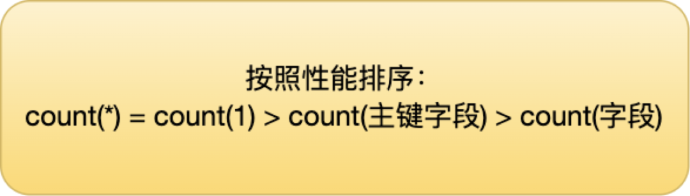

通常在没有任何查询条件下的 count(*)，**MyISAM** 的查询速度要明显快于 InnoDB，只需要 O(1 )复杂度。

因为使用 **MyISAM** 引擎时，每张数据表都有一个 **meta 信息**有存储了row_count值，由表级锁保证一致性。而 **InnoDB 存储**引擎是支持事务的，同一个时刻的多个查询，由于**多版本并发控制（MVCC）**的原因，InnoDB 表“应该返回多少行”也是不确定的。

#### count(主键字段) 

「优化器」优先选择的是二级索引，如果没有二级索引，则搜索聚簇索引，将读取到的记录返回给 server 层，然后读取记录中的 id 值，就会 id 值判断是否为 NULL，如果不为 NULL，就将 count 变量加 1。

#### count（1）

统计行数，**不管某字段是不是空**。

「优化器」优先选择的是二级索引，如果没有二级索引，则搜索聚簇索引，将读取到的记录返回给 server 层，**但是不会读取记录中的任何字段的值**，因为 count 函数的参数是 1，不是字段，所以不需要读取记录中的字段值。

####  count(*)

使用 count(`*`) 时，MySQL 会将 `*` 参数转化为参数 0 来处理，即**count(`*`) 其实等于 count(`0`)**

**count(\*) 执行过程跟 count(1) 执行过程基本一样的**，性能没有什么差异。

##### 改进

1、执行 explain 命令，获取一个近似值；

2、额外表保存计数值；

#### count(字段)

采用全表扫描的方式来计数，执行效率最差。

## 事务

### 事务

#### 事务开启

```mysql
# 开启事务两种命令
#第一种：
begin/start transaction;
# 执行命令后，并不代表事务启动了。只有在执行这个命令后，执行了增删查改操作的 SQL 语句，才是事务真正启动的时机；

# 第二种：
start transaction with consistent snapshot;
# 执行命令，就会马上启动事务。
```


### 事务特性ACID

即不考虑事务的并发（I）和数据库的可靠性（D），事务操作都是原子的情况下（A）

#### 原子性 A

`原子性 (atomicity)`

一个事务中的所有操作，要么全部完成，要么全部不完成；

通过undo log来实现；

#### 一致性 C

`一致性（consistency）`

事务操作前和操作后，数据满足完整性约束，数据库保持一致性状态；

譬如，银行系统内部转账转来转去，金额总和是不变的，也没有负数余额的账户等等；

- 一致性通过持久性+原子性+隔离性来保证；

#### 隔离性 I

`隔离性（isolation，又称独立性）`

隔离性可以防止**多个事务并发**执行时由于交叉执行而导致数据的不一致，是通过 **MVCC（多版本并发控制） 或锁机制**来保证的。

#### 持久性

`持久性（durability）`

事务处理结束后，对数据的修改就是永久的，即便系统故障也不会丢失；

持久性是通过 redo log （重做日志）来保证的；

### 并行事务问题

#### 脏读

如果一个事务「读到」了另一个「未提交事务修改过的数据」，就意味着发生了「脏读」现象。

只要一个事务读到的是未提交事务的数据，就是脏读（来自zyx）

#### 不可重复读

在一个事务内多次读取同一个数据，如果出现前后两次读到的数据不一样的情况，就意味着发生了「不可重复读」现象。

就是说事务没有做好隔离，事务A读取两次的中间，有其他事务修改了这个值。

#### 幻读

在一个事务内多次查询某个符合查询条件的**「记录数量」**，如果出现前后两次查询到的记录数量不一样的情况，就意味着发生了「幻读」现象。

就是说发现和前一次读到的记录数量不一样了，就感觉发生了幻觉一样。

***<u>幻读主要指的是插入删掉这种影响数量的操作。</u>***

### Readview

#### readview的内容

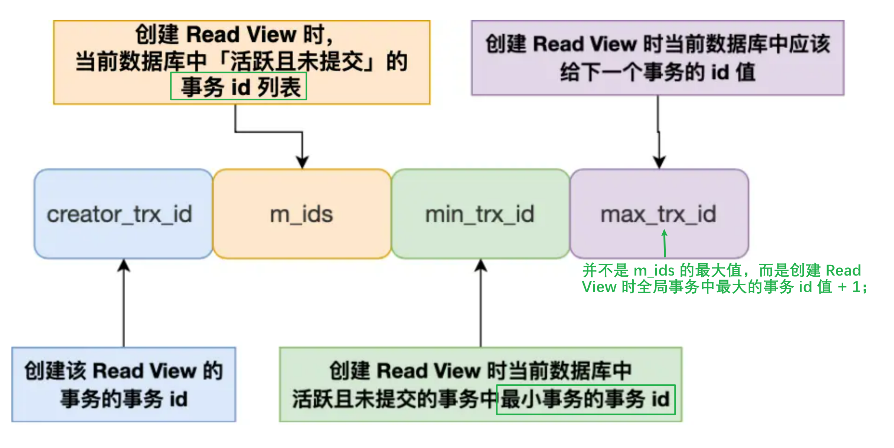

#### 聚簇索引记录中隐藏列

这个在[mysql存储结构](#记录的真实数据)中提到过两个必须的列：

- trx_id，当一个事务对某条聚簇索引记录进行改动时，就会**把该事务的事务 id 记录在 trx_id 隐藏列里**；
- roll_pointer，每次对某条聚簇索引记录进行改动时，都会把旧版本的记录写入到 undo 日志中，然后**这个隐藏列是个指针，指向每一个旧版本记录**，于是就可以通过它找到修改前的记录。

#### MVCC

通过「版本链」来控制并发事务访问同一个记录时的行为就叫 MVCC（多版本并发控制）。

我们可以把以上的trx_id做范围划分：

- trx_id < min_trx_id，那么该条记录对本事务可见；
- trx_id >= max_trx_id，那么该条记录对本事务不可见
-  min_trx_id <= trx_id < max_trx_id：
  - 如果trx_id在m_ids中，说明该事务还没有提交，不可见；
  - <u>***如果不在，说明该事务已经提交，可见***</u>（因为m_ids中的事务也是不连续的，比min_trx_id大的也有可能是已经提交的事务）

当本条记录不可见时，就沿着 **undo log 链条往下找旧版本的记录**，直到找到该记录对应的事务可见。

当本事务修改了某记录，以前的记录就变成旧版本记录了，最新记录和旧版本记录通过链表的方式串起来，即用最新记录的roll_pointer指向旧版本记录。

### 事务隔离级别

#### **读未提交（*read uncommitted*）**

指一个事务还没提交时，它做的变更就能被其他事务看到；

会出现脏读、不可重复读和幻读；

#### **读提交（*read committed*）**

指一个事务提交之后，它做的变更才能被其他事务看到；

可能发生不可重复读和幻读现象，但是不可能发生脏读现象；

通过 [Read View](#Readview) 来实现，**「每个语句执行前」都会重新生成一个 Read View**。

#### **可重复读（*repeatable read*）**

指一个事务执行过程中看到的数据，一直跟这个事务启动时看到的数据是一致的，**MySQL InnoDB 引擎的默认隔离级别**；

可重复读在[「启动事务时」](#事务开启)生成一个 [Read View](#Readview) ，然后整个事务期间都在用这个 Read View。

可能发生幻读现象，但是不可能脏读和不可重复读现象；

##### 幻读的解决

可重复读**很大程度上避免幻读现象**：针对**快照读**（普通 select 语句）**通过 MVCC 方式解决了幻读**，针对**当前读**（select ... for update 等语句）**通过 next-key lock（记录锁+间隙锁）方式解决了幻读**。

>select for update 会让select语句产生一个排它锁(X), 这个锁和update/delete的效果一样，会使两个事务无法同时更新一条记录。

###### 快照读

在事务启动后会创建一个 Read View并且事务期间一直使用该快照，select时通过这个 Read View 就可以在 undo log 版本链找到事务开始时的数据，所以事务过程中每次查询的数据都是一样的，**即使中途有其他事务插入了新纪录，是查询不出来这条数据的**，所以就很好了避免幻读问题。

###### 当前读

> MySQL 里除了普通查询是快照读，其他都是**当前读**，比如 update、insert、delete，这些语句执行前都会查询**最新版本的数据**，然后再做进一步的操作。
>
> 举例：假设你要 update 一个记录，另一个事务已经 delete 这条记录并且提交事务了，为避免产生冲突，所以 update 的时候肯定要知道最新的数据。

Innodb 引擎为了解决「可重复读」隔离级别使用「当前读」而造成的幻读问题，引出了**间隙锁**。

*例如：*

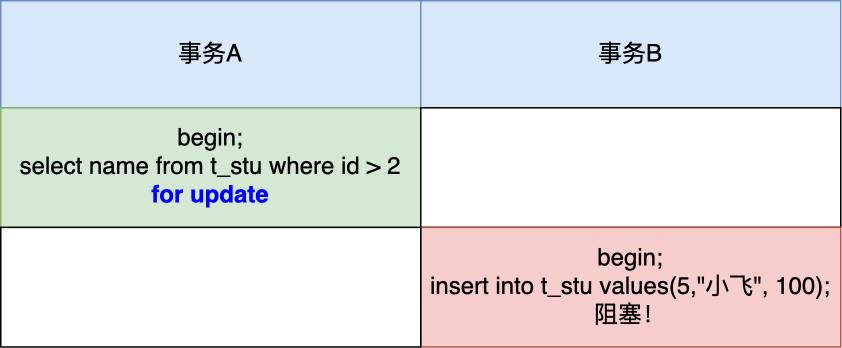

事务 A 执行了这面这条锁定读语句后，就在对表中的记录加上 id 范围为 (2, +∞] 的 next-key lock（next-key lock 是间隙锁+记录锁的组合）。

###### **特殊场景下发生幻读**

可重复读**没有能完全解决幻读**

举例说明：

- 事务A的两次快照读之间，首先事务B插入了一条查询范围内的数据，同时事务A更新了该条数据，那么在事务A第二次读取的时候出现幻读。
- 事务A第一次**快照读**，然后事务B插入查询范围内的新数据，然后事务A再一次**当前读**，出现幻读。

要避免这类特殊场景下发生幻读的现象的话，就是**尽量在开启事务之后，马上执行 select ... for update** 这类当前读的语句。

#### **串行化（*serializable* ）**

会对记录加上**读写锁**，在多个事务对这条记录进行读写操作时，如果发生了读写冲突的时候，后访问的事务必须等前一个事务执行完成，才能继续执行；

脏读、不可重复读和幻读现象都不可能会发生，但是使用「串行化」隔离级别会影响性能；

## 锁

#### 锁介绍

##### 全局锁

全局锁加上之后，整个数据库处于只读状态。对于数据的增删改操作和对数据表结构的更改都会被阻塞。

当会话断开，全局锁会被自动释放。

```mysql
# 加全局锁
flush tables with read lock
# 解锁
unlock tables
```

全局锁主要应用于做**全库逻辑备份**，这样在备份数据库期间，不会因为数据或表结构的更新，而出现备份文件的数据与预期的不一样。但是备份耗时，而且备份期间不能更新数据会造成业务停滞。那么如果数据库的引擎支持的事务支持**可重复读的隔离级别**，基于MVCC的支持，在备份数据库之前先**开启事务**。

##### 表级锁

###### 表锁

可以对某个表加上读锁（共享表锁） / 写锁（独占表锁）；

表锁是对所有线程起作用，即某线程添加了表锁，会限制别的线程的读写外，也会限制本线程接下来的读写操作；

```mysql
# 加读锁
lock tables table_name read;
# 加写锁
lock tables table_name write;
```

当会话退出后，也会释放所有表锁;

表锁的颗粒度太大，尽量避免使用。

###### 元数据锁（MDL）

> MySQL的基本操作CRUD https://blog.csdn.net/weixin_45525272/article/details/107978795；

不需要显示的使用 MDL，因为当我们对数据库表进行操作时，会**自动给这个表加上 MDL**；

MDL 是为了保证当用户对表执行 CRUD 操作时，防止其他线程对这个表结构做了变更:

- 对一张表进行 CRUD 操作时，加的是 **MDL 读锁**；
- 对一张表做结构变更操作的时候，加的是 **MDL 写锁**；

- 申请 MDL 锁的操作会形成一个队列，队列中**写锁获取优先级高于读锁**。当某线程申请不到MDL写锁阻塞时，后续的申请读锁的查询操作也会被阻塞。

MDL 是在事务提交后才会释放，这意味着**事务执行期间，MDL 是一直持有的**。

###### ⭐意向锁

意向锁的目的是为了**快速判断表里是否有记录被加锁**。

- 在对表里某些记录加上「共享锁」之前，需要先在表级别加上一个「意向共享锁」；
- 在对表里某些纪录加上「独占锁」之前，需要先在表级别加上一个「意向独占锁」；

意向共享锁和意向独占锁是表级锁，不会和行级的共享锁和独占锁发生冲突，而且意向锁之间也不会发生冲突，只会和共享表锁（lock tables ... read）和独占表锁（lock tables ... write）发生冲突。比如当我们想对某个表加上**独占表锁**时，如果当前表有意向独占锁存在，就说明表里有记录被加了独占锁。

###### AUTO-INC 锁

对于自增主键的表来说，**在插入数据时，会加一个表级别的 AUTO-INC 锁**，然后为被 `AUTO_INCREMENT` 修饰的字段赋值递增的值，等插入语句执行完成后，才会把 AUTO-INC 锁释放掉。（注意，不是再一个事务提交后才释放，而是再**执行完插入语句后就会立即释放**）。

作用就是保证插入数据时，被 `AUTO_INCREMENT` 修饰的字段的值是连续递增的。

**改进：**

MySQL 5.1.22 版本开始，InnoDB 存储引擎提供了一种**轻量级的锁**来实现自增；

在插入数据的时候，会为被 `AUTO_INCREMENT` 修饰的字段加轻量级锁，然后给该字段**赋值一个自增的值**，就把这个轻量级锁**释放**了，而**不需要等待整个**插入语句执行完后才释放锁。

关于主从复制的问题：https://www.xiaolincoding.com/mysql/lock/mysql_lock.html#auto-inc-%E9%94%81

##### 行级锁

普通的 select 语句是不会对记录加锁的，因为它属于快照读。如果要在查询时对记录加行锁，可以使用下面这两个方式，这种查询会加锁的语句称为**锁定读**。

```mysql
//对读取的记录加共享锁
select ... lock in share mode;
//对读取的记录加独占锁，update和delete操作也是要加独占锁的
select ... for update;

//上面这两条语句必须在一个事务中，因为当事务提交了，锁就会被释放，所以在使用这两条语句的时候，要加上 begin 或者 start transaction 开启事务的语句。
```

行级锁有以下几种：

###### Record Lock

Record Lock 称为记录锁，锁住的是一条记录。

记录锁有 S 锁和 X 锁之分，S 型与 S 锁兼容，S 型与 X 锁不兼容，X 型与 X 锁不兼容。

###### Gap Lock

间隙锁，锁定一个范围，但是不包含记录本身；

间隙锁只存在于可重复读隔离级别，目的是为了解决可重复读隔离级别下幻读的现象。

间隙锁虽然存在 X 型间隙锁和 S 型间隙锁，但是并没有什么区别。**间隙锁之间是兼容的**，即两个事务可以同时持有包含共同间隙范围的间隙锁，并不存在互斥关系。

###### Next-Key Lock

临键锁，是Record Lock + Gap Lock 的组合，锁定一个范围，并且锁定记录本身。

**<u>next-key锁是一个左开右闭的锁</u>**。

Next-Key Lock是会**发生冲突**的：由于记录锁之间会发生冲突，而next-key lock 是包含间隙锁+记录锁的，如果一个事务获取了 X 型的 next-key lock，那么另外一个事务在获取相同范围的 X 型的 next-key lock 时，是会被**阻塞**的。

###### 插入意向锁

一个事务在插入一条记录的时候，需要判断插入位置是否已被其他事务加了间隙锁/next-key lock 。

如果有的话，插入操作就会发生**阻塞**，并且会生成一个**插入意向锁**并处于等待状态，直到拥有间隙锁的那个事务提交。

>*PS：MySQL 加锁时，是先生成锁结构，然后设置锁的状态，**如果锁状态是等待状态，并不是意味着事务成功获取到了锁**，只有当锁状态为正常状态时，才代表事务成功获取到了锁*

不同于间隙锁的是，插入意向锁只用于并发插入操作。

如果说间隙锁锁住的是一个区间，那么「**插入意向锁」锁住的就是一个点**。因而从这个角度来说，插入意向锁确实是一种特殊的间隙锁。

插入意向锁与间隙锁的另一个非常重要的差别是：尽管「插入意向锁」也属于间隙锁，但两个事务却**不能在同一时间内，一个拥有间隙锁，另一个拥有该间隙区间内的插入意向锁**（当然，插入意向锁如果不在间隙锁区间内则是可以的）。

#### ⭐mysql加行级锁

加锁的**对象是索引**，加锁的**基本单位是 next-key lock**。

<u>（InnoDB的行锁是通过给索引上的索引项加锁来实现的，涉及到回表对聚簇索引的索引项也会加锁。）</u>

在能使用记录锁或者间隙锁就能**避免幻读现象**的场景下， next-key lock 就会**退化成记录锁或间隙锁**。

> ⭐
>
> next-key锁是左开右闭的；
>
> 当出现左闭右闭的情况，就会划分成左边的记录锁和剩余的next-key锁；这样就说成退化成了记录锁；
>
> 当出现左开右开的情况，是间隙锁；这种情况就是退化成了间隙锁；

##### 唯一索引等值查询

唯一索引意味着查询的这个值至多有一条记录存在。

- 当查询的记录是「存在」的，在索引树上定位到这一条记录后，将该记录的索引中的 next-key lock 会**退化成「记录锁」**。
  - 因为记录锁已经可以防止被修改/删除，插入等值数据会出现冲突，不需要间隙锁就可以解决幻读问题。
- 当查询的记录是「不存在」的，在索引树找到第一条大于该查询记录的记录后，将该记录的索引中的 next-key lock 会**退化成「间隙锁」**。
  - 记录不存在，查询值两侧的值的增删改都跟本次查询没冲突。只需要保证中间不会插入就不会妨碍本次查询。

>如果是用二级索引（不管是不是非唯一索引，还是唯一索引）进行锁定读查询的时候，除了会对二级索引项加行级锁，还会对**满足查询条件的记录**的主键索引项上加「记录锁」。

##### 唯一索引范围查询

- 大于等于p查询：如果等值记录存在，该记录退化成记录锁（因为不会有相同的值来插入了，不需要加间隙锁），其他数据是next-key锁。
  - 其中第一个next-key锁是从等值p开始到最后一个记录r--`(p, r]`，然后第二个next-key锁是`(r,+∞]`
- 小于p查询 && 小于等于p查询：
  - 如果条件值的记录不在表中，那么不管是「小于」还是「小于等于」的范围查询，扫描到终止范围查询的记录时，该记录中索引的 next-key 锁会退化成间隙锁，其他扫描的记录，则是在这些记录的索引上加 next-key 锁。
    - 首先找到第一条记录r1，范围为 (-∞, r1] 的 next-key 锁；
    - 找到最后一个符合条件的记录r2，范围为(r1,r2]的next-key锁;
    - 第一个不符合条件的记录r3（其实就是r2后面的一条数据），范围为(r2,r3)的间隙锁。
  - 如果等值记录存在：
    - 如果是小于等于查询：首先找到第一条记录r1，范围为 (-∞, r1] 的 next-key 锁；找到符合条件的记录p，范围为(r1,p]的next-key锁;
    - 如果小于查询，和上面 [如果条件值的记录不在表中]的情况一样，其中的r3 = p。

##### 非唯一索引等值查询

唯一索引意味着查询的这个值可能有多条记录存在。

- 当等值记录不存在，扫描到最后一个小于该查询值得数据r，和第一个大于查询值的数据p，对**(r，p)加间隙锁**；因为不存在满足查询条件的记录，所以**不会对主键索引加锁**；
- 当等值记录存在，最后一个符合条件的等值记录i，为了防止其他等值插入，需要对(r，i] 加next-key锁 和 （i，p）加间隙锁；同时，在符合查询条件的记录的主键索引上加记录锁；

>当有一个事务持有二级索引的间隙锁 (22, 39) 时，插入 age = 22 或者 age = 39 记录的语句是否可以执行成功，关键还要考虑插入记录的主键值，主键值和age共同确定插入位置，如果插入位置在加入间隙锁的22记录左边或者39的右边，就可以成功插入，否则就插入失败。

##### 非唯一索引范围查询

**默认 next-key lock**，向右访问到不满足条件的第一个值为止，没有退化成间隙锁或者记录锁的情况。

>以下纯为自己分析，没有实验证明
>
>- 大于查询：扫描得到最后一个不符合条件r，对(r, +∞]加next-key锁；对符合条件的数据的主键索引加记录锁；
>- 大于等于查询：
>  - 如果等值记录不存在：扫描得到最后一个不符合条件r，对(r, +∞]加next-key锁；
>  - 如果等值记录存在：扫描得到最后一个不符合条件r，对(r, +∞]加next-key锁；
>- ⭐小于查询：扫描得到最后一个符合条件的记录r，第一个不符合条件p，对(-∞, r]加next-key锁，对(r, p)加间隙锁；
>- 小于等于查询：
>  - 如果等值记录不存在，同 [小于查询]；
>  - 如果等值记录存在，同 [小于查询]；

##### 不加索引查询

锁定读，update 和 delete 语句如果查询条件**不加索引**，那么由于扫描的方式是**全表扫描**，于是就会对每一条记录的索引上都会加 next-key 锁，这样就相当于**锁住全表**。

当我们要执行 update 语句的时候，确保 where 条件中带上了索引列，并且在测试机确认该语句是否走的是索引扫描。我们可以打开 `MySQL sql_safe_updates` 参数，这样可以预防 update 操作时 where 条件没有带上索引列。

#### mysql死锁

##### 死锁的发生

mysql在插入记录之前，会先通过 `select ... for update` 语句查询数据是否存在，如果不存在才插入该记录。那么当两个事务同时插入相同的记录，都会调用锁定读语句查询订单是否存在（如果不加锁会出现幻读），那么当事务想要insert语句插入的时候，都彼此等待对方的间隙锁释放，形成死锁。

##### ⭐insert语句加行级锁

Insert 语句在正常执行时是不会生成锁结构的，它是靠聚簇索引记录自带的 trx_id 隐藏列（代表本记录的事务id）来作为**隐式锁**来保护记录的。

隐式锁就是在 Insert 过程中不加锁，其特点是只有在可能发生冲突时，才会将隐式锁转换为显示锁，从而减少了锁的数量，提高了系统整体性能。

举例以下两种场景：

###### **记录之间加有间隙锁**

为了避免幻读，此时是不能插入记录的；

这个时候该事务会有一个插入意向锁，处于等待状态

###### 存在唯一键冲突

插入失败；

如果主键索引重复，插入新记录的事务会给已存在的主键值重复的聚簇索引记录**添加 S 型记录锁**。

如果唯一二级索引重复，插入新记录的事务会给已存在的二级索引列值重复的二级索引记录**添加 S 型 next-key 锁**。

###### 两个事务执行相同的 insert 语句

- 唯一二级索引冲突

  事务A先插入完毕之后并未提交，此时只有隐式锁；此时事务B插入，隐式锁就会变成x型记录锁，此时事务B获取不到 S 型 next-key 锁，处于等待状态。

- 不是唯一二级索引

  不是唯一二级索引，那么两个事务，前后执行相同的 Insert 语句，是不会发生阻塞的，最后出现幻读现象。

##### 死锁避免

死锁的四个必要条件：**互斥、占有且等待、不可强占用、循环等待**。

在数据库层面，有两种策略通过「打破循环等待条件」来解除死锁状态：

- 设置事务等待锁的超时时间（事务的等待时间超过该值后，就对这个事务进行回滚）；
- 开启**主动死锁检测**。主动死锁检测在发现死锁后，主动回滚死锁链条中的某一个事务，让其他事务得以继续执行；

## 日志

更新语句的流程和[查询语句的流程](#mysql语句执行)几乎是一样的，不同的是更新语句虽然不会经过查询缓存这一步，但是会使查询缓存中的缓存数据清空，所以在mysql8.0之后就去掉了查询缓存这一项。

更新语句会涉及到 undo log（回滚日志）、redo log（重做日志） 、binlog （归档日志）这三种日志：

- **undo log（回滚日志）**：是 Innodb 存储引擎层生成的日志，实现了事务中的**原子性**，主要**用于事务回滚和 MVCC**。
- **redo log（重做日志）**：是 Innodb 存储引擎层生成的日志，实现了事务中的**持久性**，主要**用于掉电等故障恢复**；
- **binlog （归档日志）**：是 Server 层生成的日志，主要**用于数据备份和主从复制**；

#### undo log

undo log 是一种用于撤销回退的日志。在事务没提交之前，MySQL 会先记录更新前的数据到 undo log 日志文件里面，当事务回滚时，可以利用 undo log 来进行回滚。

##### 内容

在发生回滚时，就读取 undo log 里的数据，然后做原先相反操作。不同的操作，需要undo log记录的内容也是不同的。

- delete操作时，记录旧纪录的所有信息。
- insert操作时，记录插入的主键，这样在回滚时直接删除就好了。

- update操作时，记录更新的列的信息。

  - 一条记录的每一次更新操作产生的 undo log 格式都有一个 roll_pointer 指针和一个 trx_id 事务id，通过 roll_pointer 指针可以将这些 undo log 串成一个链表，这个链表就被称为**版本链**

    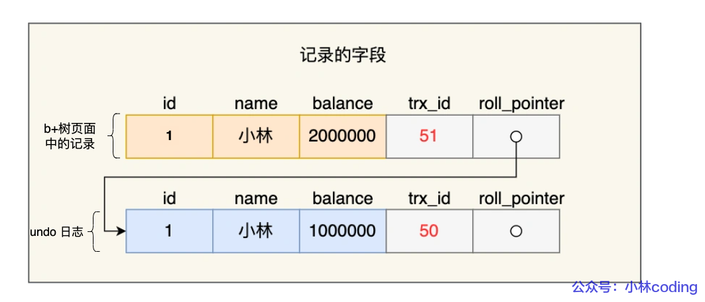

##### 作用

1、实现事务回滚，保障事务的原子性。

2、和ReadView结合实现 MVCC。

##### 刷盘（持久化到磁盘）

undo log会先存放在buffer bool里面的**undo页**。在开启事务后，InnoDB 层更新记录前，首先要记录相应的 undo log，并将其写入 Buffer Pool 中的 Undo 页面。

⭐undo log 和数据页的刷盘策略是一样的，都需要通过 **redo log 保证持久化**。

#### Buffer Pool

buffer pool相当于是在**内存**中开辟的一段缓存，用于提高读写效率。

InnoDB 为 Buffer Pool 申请一片**连续的内存空间**，然后按照默认的16KB的大小划分出一个个的页， Buffer Pool 中的页就叫做缓存页。

Buffer Pool 除了缓存「索引页」和「数据页」，还包括了 Undo 页，插入缓存、自适应哈希索引、锁信息等等。

当我们查询一条记录时，InnoDB 是会把整个页的数据加载到 Buffer Pool 中，将页加载到 Buffer Pool 后，再通过页里的「页目录」去定位到某条具体的记录。

#### redo log

>**WAL （Write-Ahead Logging）技术**
>
>WAL 技术指的是， MySQL 的写操作并不是立刻写到磁盘上，而是先写日志，然后在合适的时间再写到磁盘上。
>
>redo log＋WAL 技术，InnoDB 就可以保证即使数据库发生异常重启，之前已提交的记录都不会丢失，这个能力称为 **crash-safe**（崩溃恢复）。

因为buffer pool中的**脏页不会立即被写回磁盘**，那么为了**防止断电导致数据丢失**的问题，当有一条记录需要更新的时候，InnoDB 引擎就会先更新内存（同时标记为脏页），然后将本次对这个页的修改以 redo log 的形式记录下来。

redo log 是物理日志，**记录了某个数据页做了什么修改**，比如对 XXX 表空间中的 YYY 数据页 ZZZ 偏移量的地方做了AAA 更新，每当执行一个事务就会产生这样的一条或者多条物理日志。

在事务提交时，只要**先将 redo log 持久化到磁盘**即可，可以不需要等到将缓存在 Buffer Pool 里的脏页数据持久化到磁盘。当系统崩溃时，虽然脏页数据没有持久化，但是 redo log 已经持久化，接着 MySQL 重启后，可以**根据 redo log 的内容，将所有数据恢复到最新的状态**。

##### 和undo log

redo log 记录了此次事务「**完成后**」的数据状态，记录的是更新**之后**的值；

undo log 记录了此次事务「**开始前**」的数据状态，记录的是更新**之前**的值；

事务提交之前发生了崩溃，重启后会通过 undo log 回滚事务，事务提交之后发生了崩溃，重启后会通过 redo log 恢复事务；

##### 作用

- **实现事务的持久性，让 MySQL 有 crash-safe 的能力**，能够保证 MySQL 在任何时间段突然崩溃，重启后之前已提交的记录都不会丢失；
- **将写操作从「随机写」变成了「顺序写」**，提升 MySQL 写入磁盘的性能。
  - redo log先行写到磁盘的原因：写入 redo log 的方式使用了追加操作， 所以磁盘操作是**顺序写**，而写入数据需要先找到写入位置，然后才写到磁盘，所以磁盘操作是**随机写**。磁盘的「顺序写 」比「随机写」 高效的多，因此 redo log 写入磁盘的开销更小。

##### redo log 刷盘

###### **redo log buffer**

为避免产生大量的 I/O 操作，执行一个事务的过程中，产生的 redo log 也不是直接写入磁盘的。每当产生一条 redo log 时，会先写入到 redo log buffer，后续在持久化到磁盘。

redo log buffer 默认大小 16 MB，可以通过参数动态调整。

###### 刷盘

有多种刷盘的时机：

- MySQL **正常关闭**时；

- 当 redo log buffer 中记录的写入量**大于 redo log buffer 内存空间的一半**时，会触发落盘；

- InnoDB 的后台线程**每隔 1 秒**，将 redo log buffer 持久化到磁盘。

- **每次事务提交时**都将缓存在 redo log buffer 里的 redo log 直接持久化到磁盘

  这个策略由 `innodb_flush_log_at_trx_commit` 参数控制：

  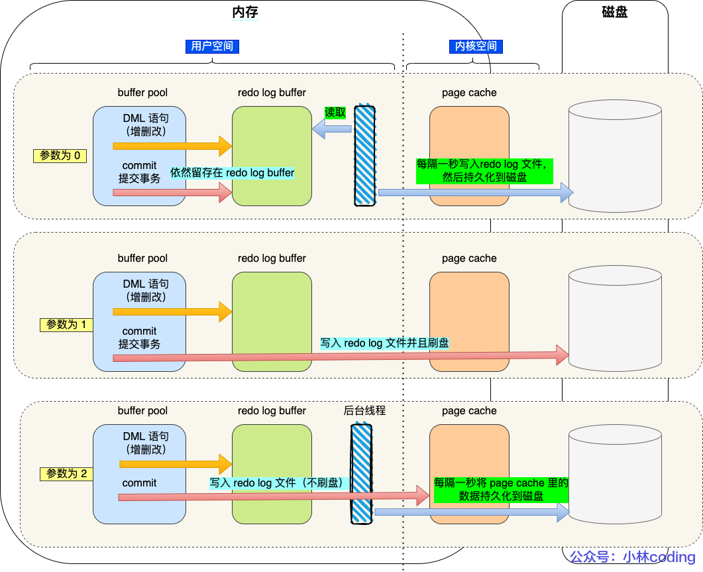

##### redo log 文件写满了

InnoDB 存储引擎有由 2 个 redo log 文件组成 1 个redo log文件组，以**循环写**的方式工作，从第一个redo log文件头开始写，写到第二个redo log文件末尾就又回到开头，相当于一个环形。

如果redo log 文件满了，这时 MySQL 不能再执行新的更新操作，也就是说 **MySQL 会被阻塞**，此时**会停下来将 Buffer Pool 中的脏页刷新到磁盘中，然后对旧的 redo log 记录进行擦除**，然后 MySQL 恢复正常运行，继续执行新的更新操作。

#### binlog

MySQL 在完成一条更新操作**后**，**Server 层**还会生成一条 binlog，等之后**事务提交**的时候，会将该事物执行过程中产生的所有 binlog 统一**写入 binlog 文件**。binlog记录了所有数据库表结构变更和表数据修改的日志。

##### redo log 和 binlog 的区别

*1、适用对象不同：*

- binlog 是 MySQL 的 Server 层实现的日志，所有存储引擎都可以使用；
- redo log 是 Innodb 存储引擎实现的日志；

*2、文件格式不同：*

- binlog 有 3 种格式类型，分别是 STATEMENT（默认格式，记录了逻辑操作）、ROW（记录操作结果）、 MIXED（视情况结合前两种模式）；
- redo log 是物理日志，记录的是在某个数据页做了什么修改，比如对 XXX 表空间中的 YYY 数据页 ZZZ 偏移量的地方做了AAA 更新；

*3、写入方式不同：*

- binlog 是追加写，写满一个文件，就创建一个新的文件继续写，不会覆盖以前的日志，保存的是**全量的日志。**
- redo log 是循环写，日志空间大小是固定，全部写满就从头开始，保存未被刷入磁盘的脏页日志。

*4、用途不同：*

- binlog 用于备份恢复、主从复制；
- redo log 用于掉电等故障恢复。

##### 主从复制

###### 数据库主从

- 数据库主主：两台都是主数据库，**同时对外提供读写**操作。客户端访问任意一台。数据存在双向同步。
- 数据库主从：一台是**主**数据库，同时对外提供**读写**操作。一台是**从**数据库，对外提供**读**的操作。数据从**主库同步到从库**。一个主库一般跟 2～3 个从库。
- 数据库主备：一台是主数据库，同时对外提供读写操作。一台是 备库，只作为备份作用，不对外提供读写，主机挂了它就取而代之。数据从主库同步到备库。

###### 主从复制

MySQL 集群的主从复制过程梳理成 3 个阶段：

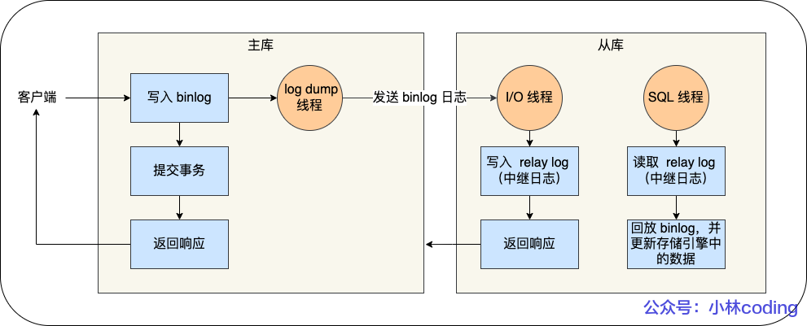

1、**写入 Binlog**：主库写 binlog 日志，提交事务，并更新本地存储数据；

2、**同步 Binlog**：把 binlog 复制到所有从库上，每个从库把 binlog 写到暂存日志中；

3、**回放 Binlog**：回放 binlog，并更新存储引擎中的数据；

关于主从复制有三种模型：同步复制（主库要等待所有从库复制成功响应）、异步复制（主库不用等，主库宕机可能数据丢失）、半同步复制（主库只要其中一部分从库复制成功就可以返回，即使主库宕机，也不存在数据丢失的风险）。

##### binlog刷盘

为了保证原子性，一个事务的 binlog 是不能被拆开的。事务执行过程中，先把日志写到 ***binlog cache***（Server 层的 cache），事务提交的时候，再把 binlog cache 写到 binlog 文件中。

每个线程有自己的 binlog cache，事务提交的时候，执行器把 binlog cache 里的完整事务写入到 binlog 文件中，并清空 binlog cache。

这里binlog刷盘的步骤和[redo log 刷盘](#redo log 刷盘)的步骤是类似的，会有参数控制是直接将binlog cache的内容写入磁盘，还是先写入page cache中（这个操作叫 `write`），之后再选中时机持久化到磁盘之中（这个操作叫 `fsync`）。

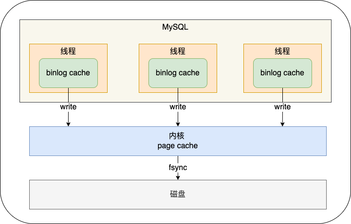

#### 两阶段提交

redo log 影响主库的数据，binlog 影响从库的数据，所以 redo log 和 binlog 必须保持一致才能保证主从数据一致。任何半成功的状态都会导致主从数据不一致（比如binlog更新了但是redolog丢失了）。

MySQL **为避免出现两份日志之间的逻辑不一致的问题**，使用了「两阶段提交」来解决。

当客户端执行 commit 语句或者在自动提交的情况下，MySQL 内部开启一个**内部 XA 事务**，分两阶段来完成 XA 事务的提交：

- **prepare 阶段**：将 XID（内部 XA 事务的 ID） 写入到 redo log，同时将 redo log 对应的事务状态设置为 prepare，然后将 **redo log 持久化到磁盘**（这里需要设置参数）；
- **commit 阶段**：把 XID 写入到 binlog，然后将 **binlog 持久化到磁盘**（这里需要设置参数）；接着调用引擎的提交事务接口，将 **redo log 状态设置为 commit**（此时该状态并不需要持久化到磁盘，只需要 write 到文件系统的 page cache 中就够了，因为只要 binlog 写磁盘成功，就算 redo log 的状态还是 prepare 也没有关系，一样会被认为事务已经执行成功）；

##### 异常重启会出现什么

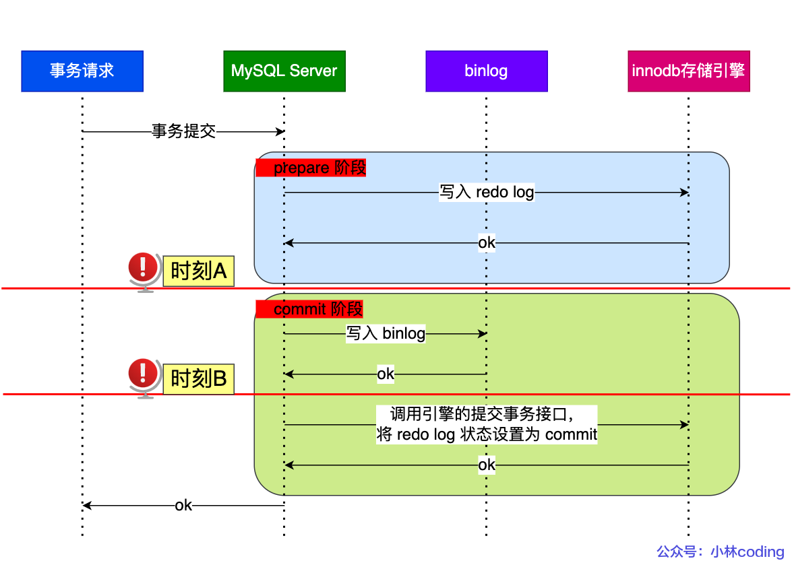

在 MySQL 重启后会按顺序扫描 redo log 文件，碰到处于 prepare 状态的 redo log，就拿着 redo log 中的 XID 去 binlog 查看是否存在此 XID：

- **如果 binlog 中没有当前内部 XA 事务的 XID，说明 redolog 完成刷盘，但是 binlog 还没有刷盘，则回滚事务**。对应时刻 A 崩溃恢复的情况。
- **如果 binlog 中有当前内部 XA 事务的 XID，说明 redolog 和 binlog 都已经完成了刷盘，则提交事务**。对应时刻 B 崩溃恢复的情况。

可以理解为 如果binlog已经写入了，意味着从库会依从binlog做改变，那么redolog要与binlog保持一致。即如果binlog写入了，就提交事务，否则就回滚事务。

##### 存在问题

- **磁盘 I/O 次数高**：每个事务提交都会进行两次 fsync（刷盘），一次是 redo log 刷盘，另一次是 binlog 刷盘。
  - 为了缓解这个问题，可以通过设置redolog和binlog在事务提交时候的参数，推迟刷新磁盘的时机，但这会带来其他风险；-
  - 可以设置[组提交](#组提交)。并在组提交时，可以通过设置参数来延迟binlog刷盘的时机。
- **锁竞争激烈**：在两阶段提交的流程基础上，还需要**加一个锁**来保证提交的原子性，保证**多事务**的情况下，两个日志的提交顺序一致。具体来说，就是在prepare之前加锁，然后在commit之后释放锁。

###### 组提交

MySQL 引入了 binlog 组提交（group commit）机制，当有多个事务提交的时候，会将多个 binlog 刷盘操作合并成一个，从而减少磁盘 I/O 的次数。

- prepare阶段不变，将commit分别三个阶段，每个阶段设置一个队列：

  - **flush 阶段**：多个事务按进入的顺序将 binlog 从 binlog cache 写入文件page cache（`write`不刷盘）；
  - **sync 阶段**：对 binlog 文件做 `fsync` 操作（多个事务的 binlog 合并一次刷盘，从page cache写入磁盘）；
  - **commit 阶段**：各个事务按顺序做 InnoDB commit 操作；

- 如果redolog页实现组提交：

  - 在flush阶段融合prepare阶段，就相当于两阶段提交变为：

    flush阶段：多事务同时*write+fysnc* redolog →然后write *binlog*；

    sync阶段，同上；

    commit阶段，同上；

## 内存

### buffer pool

Buffer Pool 是在 MySQL 启动的时候，向操作系统申请的一片连续的内存空间，默认配置下 Buffer Pool 只有 `128MB` ，可以通过参数来动态调整。mysql会按照默认的`16KB`的大小划分出一个个的页， Buffer Pool 中的页就叫做缓存页，包括索引页、数据页、undo 页，插入缓存、自适应哈希索引、锁信息等等。

- InnoDB 为每一个缓存页都创建了一个**控制块**，方便管理：

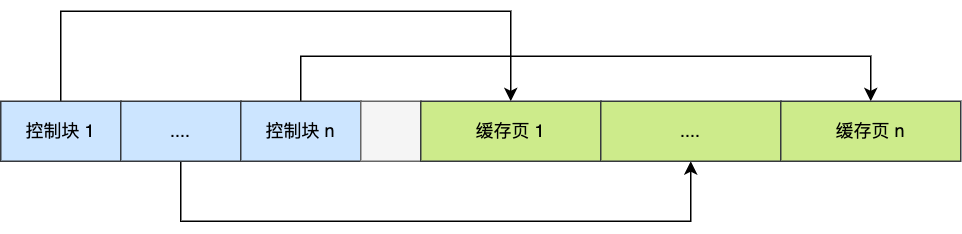

-  **Free 链表**管理空闲空间：使用链表结构，将空闲缓存页的「控制块」作为链表的节点，这个链表称为空闲链表。

- **Flush 链表**管理脏页：Flush 链表的元素都是脏页的控制块。后台线程遍历Flush链表，就可以将脏页写入磁盘。
- **LRU 链表**管理已被使用的未发生修改的Clean Page，使用LRU算法提高缓存命中率。
  - 为了解决LRU预读失败的问题，mysql将LRU分为young和old区域（对应linux的active list和inactive list），young区域在前，old区域跟在后面，**预读的页就只需要加入到 old 区域的头部，当页被真正访问的时候，才将页插入 young 区域的头部**。young和old区域的比例可以根据参数调整。
  - 为解决Buffer Pool 污染问题，进入到 young 区域条件增加了一个**停留在 old 区域的时间判断**。大概就是某old区域的数据的后续的访问时间与第一次访问的间隔时间**过短**，就不会加入young区域。
- 脏页刷盘
  - 当 **redo log 日志满了**的情况下，会主动触发脏页刷新到磁盘；
  - **Buffer Pool 空间不足**时，需要将一部分数据页淘汰掉，如果淘汰的是脏页，需要先将脏页同步到磁盘；
  - MySQL 认为空闲时，**后台线程会定期**将适量的脏页刷入到磁盘；
  - MySQL **正常关闭**之前，会把所有的脏页刷入到磁盘；

## Mysql查询语句

```shell
mysql -u root -p#建立连接，输入密码登录后进入终端

mysql> create DATABASE RUNOOB;#建立数据库
mysql> drop database RUNOOB; #删除数据库
mysql> use RUNOOB; #选择数据库

#创建数据表
CREATE TABLE IF NOT EXISTS `runoob_tbl`(
   `runoob_id` INT UNSIGNED AUTO_INCREMENT,
   `runoob_title` VARCHAR(100) NOT NULL,
   `runoob_author` VARCHAR(40) NOT NULL,
   `submission_date` DATE,
   PRIMARY KEY ( `runoob_id` )
)ENGINE=InnoDB DEFAULT CHARSET=utf8;
#创建临时表，只在当前连接可见，当关闭连接时，Mysql会自动删除表并释放所有空间。
CREATE TEMPORARY TABLE

#删除数据表
#1、drop 直接删除表信息，速度最快，但是无法找回数据
drop table user;
#2、truncate 是删除表数据，不删除表的结构，速度排第二，但不能与where一起使用
truncate table user;
#3、delete 是删除表中的数据，不删除表结构，速度最慢，但可以与where连用，可以删除指定的行
delete from user;#删除所有数据
#drop和truncate删除时不记录MySQL日志，不能回滚，delete删除会记录MySQL日志，可以回滚；

#插入语句
INSERT INTO tb_name (field1, field2, ..., fieldn) 
VAULES
(record1_value1, record1_value2, ...,record1_valuen),
(record2_value1, record2_value2, ...,record2_valuen),
...
(recordn_value1, recordn_value2, ...,recordn_valuen);

#查询
SELECT column_name,column_name
FROM table_name
[WHERE Clause]
[LIMIT N][ OFFSET M]

#更新语句
UPDATE table_name SET field1=new-value1, field2=new-value2
[WHERE Clause]

#删除语句
DELETE FROM table_name [WHERE Clause]

#UNION
#UNION ALL是取并集，UNION默认会删除筛选结果的重复元素， UNION ALL保留重复元素
SELECT expression1, expression2, ... expression_n
FROM tables
[WHERE conditions]
UNION [ALL | DISTINCT]
SELECT expression1, expression2, ... expression_n
FROM tables
[WHERE conditions];

#！！！MySQL没有实现交集Intersect和差集Except

#排序ORDER BY
SELECT field1, field2,...fieldN FROM table_name1, table_name2...
ORDER BY field1 [ASC [DESC][默认 ASC]], [field2...] [ASC [DESC][默认 ASC]]

#分组GROUP BY
SELECT column_name, function(column_name)
FROM table_name
WHERE column_name operator value
GROUP BY column_name;

#连接
#INNER JOIN（内连接,或等值连接）：获取两个表中字段匹配关系的记录。
#LEFT JOIN（左连接）：获取左表所有记录，即使右表没有对应匹配的记录。
#RIGHT JOIN（右连接）： 与 LEFT JOIN 相反，用于获取右表所有记录，即使左表没有对应匹配的记录。

#事务控制
BEGIN / START TRANSACTION #显式地开启一个事务；

COMMIT / COMMIT WORK#二者是等价的。COMMIT 会提交事务，并使已对数据库进行的所有修改成为永久性的；

ROLLBACK / ROLLBACK WORK#二者是等价的。回滚会结束用户的事务，并撤销正在进行的所有未提交的修改；

SAVEPOINT identifier#SAVEPOINT 允许在事务中创建一个保存点，一个事务中可以有多个 SAVEPOINT；

RELEASE SAVEPOINT identifier# 删除一个事务的保存点，当没有指定的保存点时，执行该语句会抛出一个异常；

ROLLBACK TO identifier #把事务回滚到标记点；

SET TRANSACTION #用来设置事务的隔离级别。InnoDB 存储引擎提供事务的隔离级别有READ UNCOMMITTED、READ COMMITTED、REPEATABLE READ 和 SERIALIZABLE。

#ALTER 修改数据表名或者修改数据表字段
#比如添加、修改或删除数据库对象，并且可以用于更改表的列定义、添加约束、创建和删除索引等
ALTER TABLE table_name ADD column_name data_type;#添加新列

# 索引
# 创建普通索引
CREATE INDEX index_name
ON table_name (column1 [ASC|DESC], column2 [ASC|DESC], ...);
# 建表的时候直接指定
CREATE TABLE table_name (
  column1 data_type,
  column2 data_type,
  ...,
  INDEX index_name (column1 [ASC|DESC], column2 [ASC|DESC], ...)
);
# 删除索引
DROP INDEX index_name ON table_name;
# 创建唯一索引
CREATE UNIQUE INDEX index_name
ON table_name (column1 [ASC|DESC], column2 [ASC|DESC], ...);

```

