### 硬件结构

#### CPU执行程序

##### 线路位宽与CPU位宽

###### 线路位宽: 

​	线路的位宽最好一次就能访问到所有的**内存地址**, **指地址总线的位数**;

​	如果CPU 操作 4G 大的内存，那么就需要 32 条地址总线，因为 `2 ^ 32 = 4G`;

​	~~通常说的**操作系统的位数**，指的是地址总线的位宽;~~

###### CPU 位宽: 

​	代表的是 CPU 一次可以**计算（运算）的数据量**, CPU 位宽越大，可以计算的数值就越大;

​	有CPU在计算时，数据需要先保存在寄存器中，因此CPU位宽一般就是指**寄存器的位数**

​	最好不要小于线路位宽,通常来说 64 位 CPU 的地址总线是 **48 位**，而 32 位 CPU 的地址总线是 32 位; 

​	32 位和 64 位 CPU 最主要区别在于一次能计算多少字节数据,  如果计算的数额**不超过 32 位**数字的情况下，32 位和 64 位 CPU 之间**没什么区别**的，只有当计算超过 32 位数字的情况下，64 位的优势才能体现出来。

​	32 位 CPU 最大只能操作 4GB 内存，就算你装了 8 GB 内存条，也没用。而 64 位 CPU 寻址范围则很大，理论最大的寻址空间为 `2^64`

硬件的 64 位和 32 位指的是 CPU 的位宽，软件的 64 位和 32 位指的是指令的位宽.

##### 程序执行过程

1. cpu→程序计数器→地址总线→数据总线→指令寄存器
2. 程序计数器++
3. 分析指令寄存器并执行

#### 存储器

##### 层次结构

CPU 并不会直接和每一种存储器设备直接打交道，而是每一种存储器设备只和它**相邻的存储器**设备打交道.

CPU会逐层寻找数据,存储层次结构也形成了**缓存**的体系.

| 存储器                 | 速度/(CPU 时钟周期)                      | 大小                   | 材质       |
| ---------------------- | ---------------------------------------- | ---------------------- | ---------- |
| 寄存器                 | 半个                                     |                        |            |
| L1 cache(cpu核心独有)  | 2-4个                                    | 几十 KB 到几百 KB 不等 | cache SRAM |
| L2 cache(cpu核心独有)) | 10-20个                                  | 几百 KB 到几 MB 不等   |            |
| L3 cache(cpu共享)      | 20-60个                                  | 几 MB 到几十 MB 不等   |            |
| 内存                   | 200~300 个                               |                        | DRAM芯片   |
| SSD                    | 内存的读写速度比 SSD 大概快 `10~1000` 倍 |                        |            |
| HDD                    | 速度比内存慢 `10W` 倍左右                |                        |            |

##### CPU Cache 的结构

CPU Cache Line, 表示 **CPU Cache 一次性能加载数据的大小**, 对应某个内存块大小

###### 直接映射 Cache 

内存的访问地址，包括**组标记、CPU Cache Line 索引、偏移量**这三种信息;

 CPU Cache 里的数据结构，由**索引 + 有效位 + 组标记 + 数据块**组成;

##### **缓存命中**

###### 提高**「数据缓存」缓存命中率**

按照内存布局顺序访问

###### 提高「指令缓存」缓存命中率

CPU 自身的动态分支预测 (有规律的条件分支语句能够让 CPU 的分支预测器发挥作用);

`likely` 和 `unlikely` 这两种宏，如果 `if` 条件为 `ture` 的概率大，则可以用 `likely` 宏把 `if` 里的表达式包裹起来，反之用 `unlikely` 宏;

###### 多核 CPU 的缓存命中率

**线程绑定在某一个 CPU 核心上**: 如果一个线程在不同核心来回切换，各个核心的缓存命中率就会受到影响;

#### CPU 缓存一致性

##### CPU Cache 的数据写入

###### 1.写直达

内存和cache一同写入

###### 2.写回

只写入cache; 在cache块被替换时才会将脏cache重新写回内存(读入或写入不存在cache中的数据,对应的cache块都会被替换)

##### 缓存一致性问题

**多核心**cpu每个核心独享L1/L2cache, 基于**写回**方式产生的缓存一致性问题.

实现缓存一致性，需要满足**写传播和事务串行化**，就是保证大家都同步更新并且更新顺序是相同的。

###### 写传播

总线嗅探：当某个 CPU 核心更新了 Cache 中的数据，总线把这个事件广播通知给其他所有的核心，然后每个 CPU 核心都会监听总线上的广播事件，并检查是否有相同的数据，如果有就跟着更新。

###### 事务串行化

MESI协议：已修改、独占、共享、已失效


#### CPU数据读取

因为多个线程同时读写同一个 Cache Line 的不同变量时，而导致 CPU Cache 失效的现象称为**伪共享（False Sharing）**

##### 避免伪共享

避免 Cache 伪共享实际上是用**空间换时间**的思想，浪费一部分 Cache 空间，从而换来性能的提升。

#### CPU线程选择

##### 调度类

优先级是 Deadline > Realtime > Fair,**实时任务总是会比普通任务优先被执行**

###### 1.Deadline

实时任务,调度策略是deadline和目前时间越靠近越先被调度.

###### 2.Realtime

优先级高的可以抢占;

相同优先级时,可以FIFO或者RR(时间片)

###### 3.Fair

CFS : 完全公平调度（Completely Fair Scheduling）

- 每个任务有nice值, 表示优先级的修正数值，它与优先级（priority）的关系是这样的：priority(new) = priority(old) + nice。内核中，priority 的范围是 0~139，值越低，优先级越高，其中前面的 0~99 范围是提供给实时任务使用的，而 nice 值是映射到 100~139，这个范围是提供给普通任务用的，因此 nice 值调整的是普通任务的优先级。

- 每个任务有vruntime, 会优先选择 vruntime 少的任务, 计算时考虑权重值, nice值小对应的权重大.「同样的实际运行时间」里，高权重任务的 vruntime 比低权重任务的 vruntime **少**。**nice缩小了，权重变大了，vruntime就变少了，就会优先被调用**。

  

可以调整任务的 `nice` 值从而调整**普通任务**的执行时间.

但是不管怎么缩小 nice 值，任务**永远都是普通任务**，如果某些任务要求实时性比较高，可以考虑改变**任务的优先级以及调度策略**，使得它变成实时任务.

#### 软中断

##### 中断

中断是系统用来**响应**硬件设备请求的一种机制，操作系统收到硬件的中断请求，会打断正在执行的进程，然后调用内核中的**中断处理程序**来响应请求.

中断处理程序在响应中断时，可能还会「临时关闭中断」.

为了保证**之前的正常进程调度**且**避免其他中断的丢失**, 中断处理程序要短且快。

##### 软中断

Linux 系统为了解决中断处理程序执行过长和中断丢失的问题，将中断过程分成了**两个阶段**，分别是「上半部和下半部分」。中断处理程序的上部分和下半部可以理解为：

- **上半部**直接处理硬件请求，也就是**硬中断**，主要是负责耗时短的工作，特点是快速执行；
- 下半部是由**内核**触发，也就说**软中断**，主要是负责上半部未完成的工作，通常都是耗时比较长的事情，特点是延迟执行；

不过，软中断**不只是**包括硬件设备中断处理程序的下半部，一些**内核自定义事件**也属于软中断，比如内核调度等、RCU 锁（内核里常用的一种锁）等。

每一个 **CPU 都有各自**的软中断内核线程.

#### 补码

「负数为什么要用补码方式来表示」:如果负数不是使用补码的方式表示，则在做基本对加减法运算的时候，**还需要多一步操作来判断是否为负数，如果为负数，还得把加法反转成减法，或者把减法反转成加法**

#### 小数

##### 小数十进制与二进制的转换

十进制→二进制:	整数部分使用除2取余法, 小数部分用**乘 2 取整法**.

二进制小数→十进制:	整数部分正常幂数,小数部分取负幂.

##### 计算机存储小数

计算机存储的是浮点数:

- 首先,十进制小数转换成二进制小数;

- 然后将二进制小数,用规范化的科学技术法表示, 默认小数点前面有个1,小数点后面的是尾数

- 计算机用 ***符号位/指数/尾数*** 表示浮点数,其中为了保证指数部分的无符号,会进行一个**偏移**,例如8位指数的float会在原来指数基础上+127

  ```
  单精度浮点数32位=1位符号位+8位指数位+23位有效数字
  
  双精度浮点数64位=1位符号位+11位指数位+52位有效数字
  ```

因为有的**小数**无法可以用「完整」的二进制来表示，所以计算机里只能采用**近似数的方式来保存**，那两个近似数相加，得到的必然也是一个近似数


### 系统结构

#### 内核

##### 内核能力

内核作为应用连接硬件设备的**桥梁**

- 进程调度
- 内存管理
- 设备管理
- 系统调用

##### 内核空间 & 用户空间

- 进程在用户态时，只能访问用户空间内存；
- 只有进入内核态后，才可以访问内核空间的内存；

#### Linux内核

##### MultiTask

 Linux 是一个多任务的操作系统，意味着可以有多个任务同时执行，这里的「同时」可以是并发（单核）或并行（多核）

##### SMP对称多处理

每个 CPU 的地位是相等的

##### ELF**可执行文件链接格式**

首先通过「编译器」编译成汇编代码，接着通过「汇编器」变成目标代码，最后通过「链接器」把多个目标文件以及调用的各种函数库链接起来，形成一个可执行文件，也就是 ELF 文件。

执行 ELF 文件的时候，会通过「装载器」把 ELF 文件装载到内存里，CPU 读取内存中的指令和数据，于是程序就被执行起来了

##### Monolithic Kernel **宏内核**

**<u>Linux 内核架构就是宏内核</u>**，意味着 Linux 的内核是一个完整的可执行程序，且拥有最高的权限。

**宏内核**的特征是系统内核的所有模块，比如进程调度、内存管理、文件系统、设备驱动等，都运行在内核态；

**微内核**架构的内核只保留最基本的能力，比如进程调度、虚拟机内存、中断等，把一些应用放到了用户空间；

**混合类型内核**，像是宏内核的方式包裹着一个微内核；

#### windows

Windows NT，NT 全称叫 New Technology

同样支持 MultiTask 和 SMP，**Window 的内核设计是混合型内核**；

Windows 的可执行文件格式叫 PE，称为**可移植执行文件**

### 内存管理

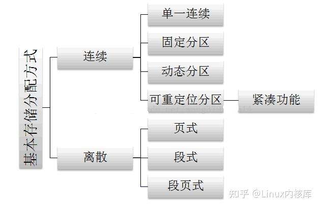


#### 虚拟内存

操作系统为每个进程分配独立的一套「**虚拟地址**」，互不干涉。

进程不能直接访问物理地址；

虚拟内存地址映射到物理内存地址，有分段分页两种方式。

##### 分段

###### 分段原理

段表地址映射

###### 内存碎片

外碎片 && 内存交换效率低

##### 分页

###### 分页原理

页表地址映射

###### 碎片及内存交换效率

内碎片 && 换入换出的只有少数页，**内存交换的效率就相对比较高。**

**Swap** 就是把一块磁盘空间或者本地文件，当成内存来使用，它包含换出和换入两个过程：

- **换出（Swap Out）** ，是把进程暂时不用的内存数据存储到磁盘中，并释放这些数据占用的内存；
- **换入（Swap In）**，是在进程再次访问这些内存的时候，把它们从磁盘读到内存中来；

###### 多级页表

局部性原理

如果某个一级页表的页表项没有被用到，也就**不需要创建这个页表项对应的二级页表**了，即可以在需要时才创建二级页表；而不分级的页表呢，**页表一定要覆盖全部虚拟地址空间**，不分级的页表就需要有 100 多万个页表项来映射（假如虚拟地址在页表中找不到对应的页表项，计算机系统就不能工作了），而二级分页则只需要 1024 个页表项（此时一级页表覆盖到了全部虚拟地址空间，二级页表在需要时创建）。

###### TLB

时间局部性原理

##### 段页式管理

优缺点

##### ⭐Linux具体内存管理

**Linux 系统中的每个段都是从 0 地址开始的整个 4GB 虚拟空间（32 位环境下），也就是所有的段的起始地址都是一样的。这意味着，Linux 系统中的代码，包括操作系统本身的代码和应用程序代码，所面对的地址空间都是线性地址空间（虚拟地址），这种做法相当于屏蔽了处理器中的逻辑地址概念，段只被用于访问控制和内存保护。**

每个进程都各自有独立的虚拟内存，但是**每个虚拟内存中的内核地址，其实关联的都是相同的物理内存**。

###### 用户空间分布

代码段、全局变量、BSS、函数栈、堆内存、文件映射区。

文件映射区：我们的程序在运行过程中还需要依赖动态链接库，这些动态链接库以 .so 文件的形式存放在磁盘中。这些动态链接库中的代码段，数据段，BSS 段，以及通过 mmap 系统调用映射的共享内存区，在虚拟内存空间的存储区域叫做文件映射与匿名映射区.

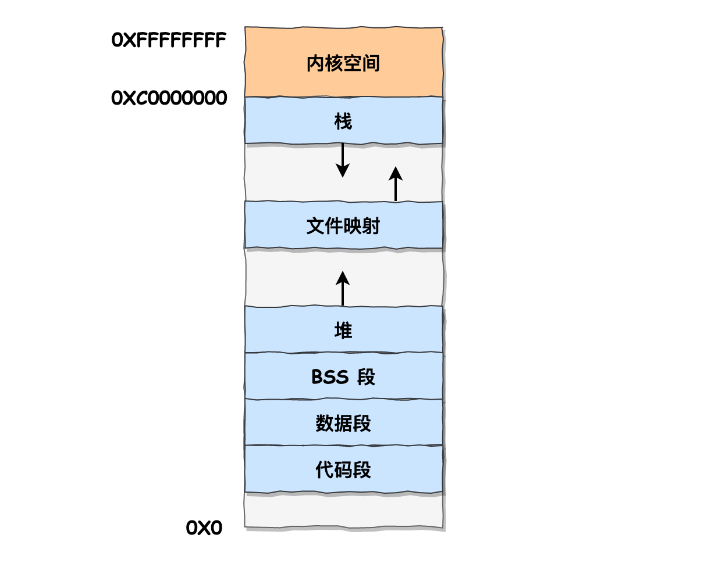

##### 虚拟内存的作用

https://www.xiaolincoding.com/os/3_memory/vmem.html#%E6%80%BB%E7%BB%93

- 扩展逻辑内存
- 隔离进程，解决了多进程之间地址冲突
- 页表里的页表项中除了物理地址之外，还有一些标记属性的比特，比如控制一个页的读写权限，标记该页是否存在等。在内存访问方面，操作系统提供了更好的安全性。

#### malloc详解

##### 内存分配

malloc 申请内存的时候，会有brk和mmap两种方式向操作系统申请堆内存。

- 如果用户分配的内存小于 **128 KB**，则通过 brk() 申请内存；
- 如果用户分配的内存大于 128 KB，则通过 mmap() 申请内存；

###### brk()系统调用

从堆分配内存：将「堆顶」指针向高地址移动，获得新的内存空间；

###### mmap()系统调用

在文件映射区域分配内存；

> **malloc() 分配的是虚拟内存**，只有在访问已分配的虚拟地址空间的时候，操作系统通过查找页表，发现虚拟内存对应的页没有在物理内存中，就会触发缺页中断，然后操作系统会建立虚拟内存和物理内存之间的映射关系

###### brk && mmap

mmap() 分配的内存每次**释放**都会归还给操作系统，于是每次 mmap 分配的虚拟地址都是缺页状态的，在第一次访问该虚拟地址的时候，就会触发缺页中断。

brk()释放的内存放在malloc内存池中，下次申请从内存池中取出内存，可能这个内存块的虚拟地址与物理地址的**映射关系还存在**，这样不仅减少了系统调用的次数，也减少了缺页中断的次数，这将大大降低 CPU 的消耗。

对于小块内存，伴随频繁的malloc和free，堆内将产生越来越多不可用的碎片，导致内存泄漏。默认分配大块内存 (128KB) 才使用 mmap 分配内存空间。

##### 预分配

malloc() 在分配内存的时候，并不是老老实实按用户预期申请的字节数来分配内存空间大小，而是**会预分配更大的空间作为内存池**。

具体会预分配多大的空间，跟 malloc 使用的内存管理器有关系。

##### free释放内存

malloc 通过 **brk() 方式**申请的内存的情况，在free 释放内存后，堆内存并没有归还给操作系统。先缓存着放进 **malloc 的内存池里**，当进程再次申请内存时就可以直接**复用**。

通过 **mmap 方式**申请的内存，free 释放内存后就会归归还给操作系统。

在malloc申请内存时，会有多出来的字节保存该内存块的大小等信息，在free的时候，会根据内存块大小信息（对传入的地址**左偏移16字节**），得知释放多大的内存。

#### 缺页中断

##### 缺页中断

- 当 CPU 访问的页面不在物理内存时，便会产生一个缺页中断，请求操作系统将所缺页调入到物理内存。

- 页表中的页表项一般包含以下信息：

  - 页号和物理页号
  - 状态位（是否存在在内存中）
  - 访问字段（最近被访问的次数）
  - 修改位（是否被修改过，修改过的话就和内存的不一致）
  - 硬盘地址（在硬盘上对应的物理块号）

- 内存分配的流程如下：

  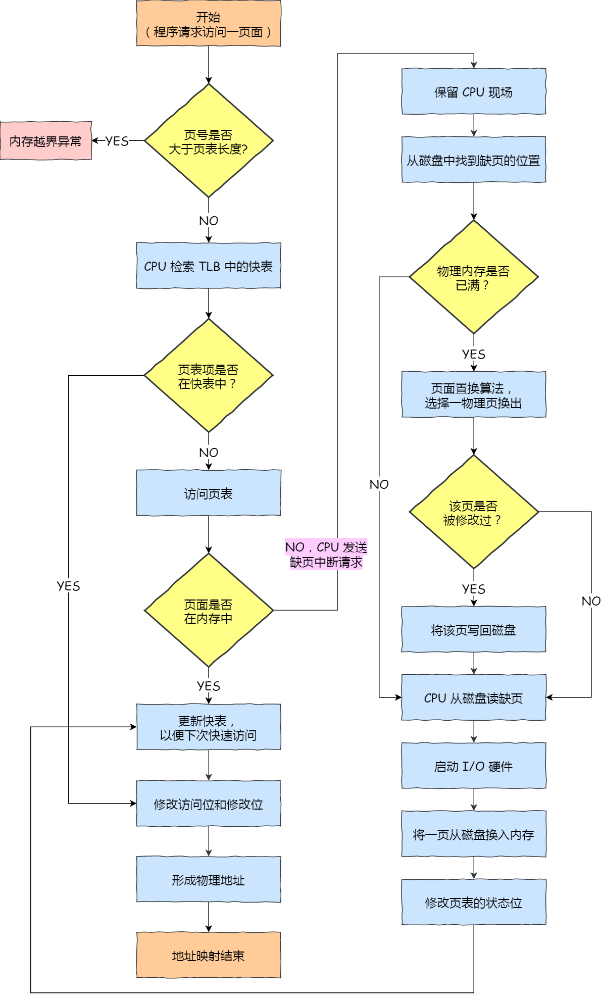

##### 页面置换算法

当请求调页但是内存已满时，需要使用页面置换算法，将请求页面装进内存，并换出被置换的物理页面。

###### 最佳页面置换算法（*OPT*）

置换在「未来」最长时间不访问的页面，理想做法，没办法真的实现；

###### 先进先出置换算法（*FIFO*）

选择在内存驻留时间很长的页面进行中置换

###### 最近最久未使用的置换算法（*LRU*）

选择最长时间没有被访问的页面进行置换，近似最优置换算法；

LRU 虽然看上去不错，但是由于开销比较大，实际应用中**比较少使用**；

[LRU改善](#LRU改善)

###### 时钟页面置换算法（*Lock*）

类似于FIFO和LRU的结合

所有的页面都保存在一个类似钟面的「环形链表」中，一个表针指向**最老的**页面；

当发生缺页中断时，算法首先检查表针指向的页面：

- 如果访问位是 1 就清除访问位，并把表针前移一个位置，重复这个过程直到找到了一个访问位为 0 的页面为止；
- 访问位位是 0 就淘汰该页面，并把新的页面插入这个位置，然后把表针前移一个位置；

###### 最不常用置换算法（*LFU*）

当发生缺页中断时，选择「访问次数」最少的那个页面，并将其淘汰；

做法是对每个页面设置一个「**访问计数器**」，每当一个页面被访问时，该页面的访问计数器就**累加 1**，然后在发生缺页中断时，**淘汰计数器值最小**的那个页面；

但是首先实现成本高，其次这样可能会误伤 *最近被频繁访问* ，但是次数没有 *过去被频繁访问页面* 的计数器高的页面。

#### 内存满了

##### 内存分配

因为malloc这种分配的是虚拟内存，当真实访问的时候，会发生[缺页中断](#缺页中断)。

如果内存中还有空间，会分配对应的物理内存给虚拟内存，如果内存满了，内核会内存回收。

##### 内存回收方式

###### 后台回收 kswapd

唤醒kswapd内核线程，异步回收，不会阻塞进程。

###### 直接回收 direct reclaim

同步回收，会阻塞进程，造成延迟和高系统负荷。

###### OOM（out of memory）

内核会根据算法选择一个进程杀掉。

OOM killer 就会根据每个进程的内存占用情况和 `oom_score_adj` 的值进行打分，得分最高的进程就会被首先杀掉。

调整`/proc/[pid]/oom_score_adj` 值，来降低被 OOM killer 杀掉的概率。

应用系统中存在无法回收的内存或使用的内存过多，最终使得程序运行要**用到的内存大于能提供的<u>最大内存</u>**。此时程序就运行不了，系统会提示**<u>内存溢出</u>**。

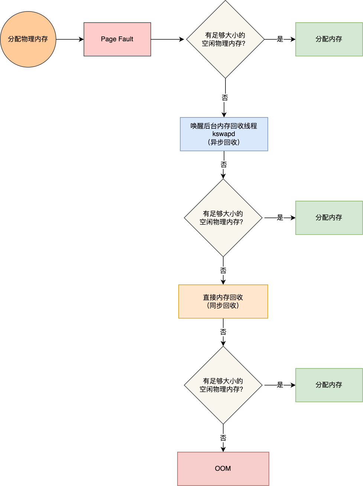

##### 可回收资源

文件页和匿名页的回收都是基于 LRU 算法。

###### 文件页回收

指内核缓存的磁盘数据和内核缓存的文件数据，即在内存释放之后，还能在磁盘文件中读取；

干净文件页可以直接释放（不影响性能），脏页需要重新写入磁盘中再回收（发生磁盘I/O，会影响性能）；

###### 匿名页回收

没有硬盘文件这样的载体，有可能还会被访问到，所以通过linux的Swap机制，将不尝访问的匿名页写到磁盘中，然后释放内存。（发生磁盘I/O，会影响性能）

匿名页回收的方式是通过 Linux 的 **Swap 机制**[here](#碎片及内存交换效率)

##### 解决回收的性能影响

###### 调整优先回收文件页/匿名页

` /proc/sys/vm/swappiness`参数可以说明优先回收文件页还是优先回收匿名页，文件页的回收操作对系统的影响相比匿名页的回收操作会少一点

###### 尽早触发 kswapd 内核线程异步回收内存

通过尽早的触发「后台内存回收」来避免应用程序进行直接内存回收。

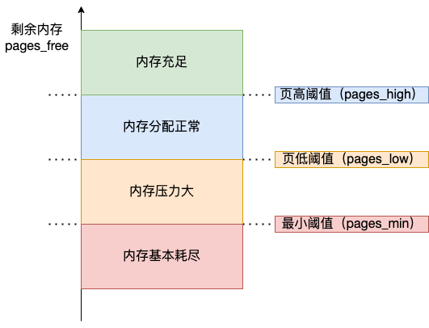

橙色部分： kswapd0 会执行内存回收，直到剩余内存大于高阈值（pages_high）为止；

红色部分：触发直接内存回收；

`/proc/sys/vm/min_free_kbytes`设置页低阈值（pages_low）；

###### NUMA 架构下的内存回收策略

NUMA 结构，即非一致存储访问结构，解决了SMP 架构共享总线等，导致的带宽压力大的问题。将多个 CPU 分组，每组 CPU 用 Node 来表示。

设置 `/proc/sys/vm/zone_reclaim_mode`为 0，这样在**回收本地内存之前，会在其他 Node 寻找空闲内存**，从而避免在系统还有很多空闲内存的情况下，因本地 Node 的本地内存不足，发生频繁直接内存回收导致性能下降的问题；

#### 在 4GB 物理内存的机器上申请 8G 内存

- 在 32 位操作系统，因为进程理论上最大能申请 3 GB 大小的虚拟内存，所以直接申请 8G 内存，会申请失败。
- 在 64位 位操作系统，因为进程理论上最大能申请 128 TB 大小的虚拟内存，即使物理内存只有 4GB，申请 8G 内存也是没问题，因为申请的内存是虚拟内存。如果这块虚拟内存被访问了，要看系统有没有 Swap 分区：
  - 如果没有 Swap 分区，因为物理空间不够，进程会被操作系统杀掉，原因是 OOM（内存溢出）；
  - 如果有 Swap 分区，即使物理内存只有 4GB，程序也能正常使用 8GB 的内存，进程可以正常运行；

总结就是：

- 如果申请的内存比进程本身的用户空间大，就会申请失败，否则能成功申请（要保证内存可以容下需要的表示虚拟内存的空间，比如连新添加的页表项都没地方放，那也是OOM，可以通过开启swap解决这个问题）；
- 访问的时候要看是否开启了swap分区，如果开启了有可能可以正常运行（因为swap也是有极限的），否则OOM。

#### LRU改善

##### LRU算法 

Least recently used

LRU 算法一般是用**「链表」**作为数据结构来实现的，链表头部的数据是最近使用的，而链表末尾的数据是最久没被使用的。

传统的 LRU 算法的**实现思路**是这样的：

- 当访问的页在内存里，就直接把该页对应的 LRU 链表节点移动到链表的头部。
- 当访问的页不在内存里，除了要把该页放入到 LRU 链表的头部，还要淘汰 LRU 链表末尾的页。

##### LRU缺陷

###### 预读失败

- 预读：操作系统出于空间局部性原理（靠近当前被访问数据的数据，在未来很大概率会被访问到），会在读取磁盘文件时预读其他的数据到系统的读缓存（Page Cache）中。如果预读数据命中，**可以减少 磁盘 I/O 次数，提高系统磁盘 I/O 吞吐量**。

- 预读失败：如果预读进来的页面没有被访问，就是预读失效。但是因为刚读进来的页面会占据LRU链表靠前的位置，这个时候有可能把热点数据淘汰掉，**大大降低了缓存命中率**。

- 避免预读失败的影响：

  **让预读页停留在内存里的时间要尽可能的短，让真正被访问的页才移动到 LRU 链表的头部，从而保证真正被读取的热数据留在内存里的时间尽可能长**。

  - linux通过设计活跃和非活跃的LRU链表：

    **active list** 活跃内存页链表，这里存放的是最近被访问过（活跃）的内存页；

    **inactive list** 不活跃内存页链表，这里存放的是很少被访问（非活跃）的内存页；

    预读页就只需要加入到 inactive list 区域的头部，当页被**真正访问**的时候，才将页插入 active list 的头部；如果预读的页一直没有被访问，就会从 inactive list **移除**。

    当预读页被插入active list时，active list淘汰的页会插到inactive list的头部。

  - mysql设计young区域和old的LRU区域；

###### 缓存污染

- 缓存污染：当我们在批量读取数据的时候，由于数据被访问了一次，这些大量数据都会被加入到「活跃 LRU 链表」里，然后之前缓存在活跃 LRU 链表（或者 young 区域）里的热点数据全部都被淘汰了，**如果这些大量的数据在很长一段时间都不会被访问的话，那么整个活跃 LRU 链表（或者 young 区域）就被污染了**。
- 影响：被淘汰的热数据又被再次访问的时候，由于缓存未命中，就会产生**大量的磁盘 I/O**，系统性能就会急剧下降。
- 解决：**提高进入到活跃 LRU 链表（或者 young 区域）的门槛**
  - Linux 操作系统：在内存页被访问**第二次**的时候，才将页从 inactive list 升级到 active list 里

#### Linux虚拟内存详解 <u>*这个有点深，没看完*</u>

>这里就只记录自己不清楚的地方，不按照原文梳理了。原文地址https://www.xiaolincoding.com/os/3_memory/linux_mem.html#_4-6-%E6%B7%B1%E5%85%A5%E7%90%86%E8%A7%A3-linux-%E8%99%9A%E6%8B%9F%E5%86%85%E5%AD%98%E7%AE%A1%E7%90%86

##### 64 位机器上进程虚拟内存空间分布

在用户空间和内核空间中有个canonical address 空洞。

用户空间前16位全为0，内核空间前6位全为1，可以快速判断访问地址是用户空间还是内核空间。访问canonical address 空洞就是非法访问。

##### 进程和线程

在代码定义中，线程就是共享资源的进程，task_struct


#### Linux物理内存详解 <u>*没看*</u>

#### 磁盘调度算法

磁盘有很多磁片，每个磁片分多个磁道，每个磁道分多个扇区。

磁盘调度算法的目的就是为了提高磁盘的访问性能，一般是通过优化磁盘的**访问请求顺序**来做到的。

给定一个磁盘请求队列，有几种调度方法：

##### 先来先服务（*First-Come，First-Served，FCFS*）

性能差，寻道时间长

##### 最短寻道时间优先（*Shortest Seek First，SSF*）

优先选择从当前磁头位置所需寻道时间最短的请求；

磁头在一小块区域来回移动，可能导致某些请求的**饥饿**

##### **扫描（*Scan*）算法**

磁头在一个方向上移动，访问所有未完成的请求，直到磁头到达该方向上的**最后的磁道**（最左边0或者最右边最大值），才调换方向。

每个磁道的响应频率存在差异， 中间部分相比其他部分响应的频率会比较多。

##### 循环扫描（*Circular Scan, CSCAN* ）

只有磁头朝某个特定方向移动时，才处理磁道访问请求，而返回时直接快速移动至最靠边缘的磁道（（最左边0或者最右边最大值）），也就是复位磁头，这个过程是很快的，并且**返回中途不处理任何请求**，该算法的特点，就是**磁道只响应一个方向上的请求**。

其实就是针对scan改进，希望每个磁道的响应频率比较平均。

##### LOOK

针对[scan](#**扫描（*Scan*）算法**)的改进，磁头在每个方向上仅仅移动到**<u>最远的请求位置</u>**，然后立即反向移动，而不需要移动到磁盘的最始端或最末端，**反向移动的途中会响应请求**。

##### C-LOOK

针对[c-scan](#循环扫描（*Circular Scan, CSCAN* ）)的优化，磁头在每个方向上仅仅移动到<u>最远的请求位置</u>，然后立即反向移动，而不需要移动到磁盘的最始端或最末端，**反向移动的途中不会响应请求**。

### 进程管理

#### 进程

##### 进程状态

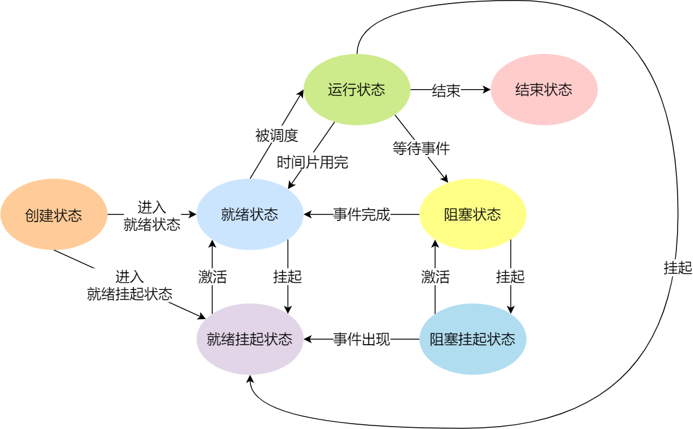

阻塞状态：指的是在等待某个事件的完成，这个等待的过程中进程是在占用着内存资源的

其中， 挂起状态描述进程**没有占用实际的物理内存**空间的情况

- 阻塞挂起状态：进程在外存（硬盘）并等待某个事件的出现

- 就绪挂起状态：进程在外存（硬盘），但只要进入内存，即刻立刻运行

导致进程挂起的原因不只是因为进程所使用的内存空间不在物理内存，还包括如下情况：

- 通过 sleep 让进程间歇性挂起，其工作原理是设置一个定时器，到期后唤醒进程。
- 用户希望挂起一个程序的执行，比如在 Linux 中用 `Ctrl+Z` 挂起进程

##### PCB

进程存在的唯一标识，包含

- 进程描述信息（进程标识符和用户标识符）
- 进程控制和管理信息（进程优先级、进程状态等）
- 资源分配信息（进程的虚拟地址空间信息，打开的文件和使用的I/O设备等）
- CPU相关信息（在进程被切换时，会保存cpu现场信息，以便重启时可以从断点开始）

通过链表或者索引表中，链表更常见，每种状态的进程在一个队列中。

##### 进程控制

创建和终止、阻塞和唤醒进程：

###### 创建进程

过程：申请PCB并填写描述控制等信息、给其分配资源、插入就绪队列

###### 终止进程

正常结束、异常结束、kill三种终止方式；

过程：终止进行状态的进程并将cpu回收、父进程终止后的子进程变为孤儿进程交由1号进程、进程全部资源归还os、pcb删除掉；

###### 阻塞进程

阻塞的进程需要别的进程来唤醒它，阻塞操作对应着唤醒操作。

过程：停止运行的进程并保存现场、进程进入阻塞状态、pcb进入阻塞队列；

###### 唤醒进程

过程：从阻塞状态变为就绪状态、pcb进入就绪队列等待被调度

##### 上下文切换

###### cpu上下文切换

CPU 寄存器和程序计数是 CPU 在运行任何任务前，所**必须依赖的环境**，这些环境就叫做 **CPU 上下文**；

CPU 上下文切换就是先把**前一个任务**的 CPU 上下文**保存**起来，然后加**载新任务的上下文**到这些寄存器和程序计数器，最后再跳转到程序计数器所指的新位置，运行新任务。

CPU 上下文切换分成：**进程上下文切换、线程上下文切换和中断上下文切换**；

###### 进程上下文切换

进程是由内核管理和调度的，所以进程的切换只能发生在**内核态**。所以，**进程的上下文切换不仅包含了虚拟内存、栈、全局变量等用户空间的资源，还包括了内核堆栈、寄存器等内核空间的资源。**

#### 线程

线程是cpu执行的最小单位，是进程中的一条执行流程。

同一个进程内多个线程之间可以**共享代码段、数据段、打开的文件等资源**，但每个线程各自都有一套独立的**寄存器和栈**，这样可以确保线程的控制流是相对独立的。

##### 线程与进程的比较

- 进程是资源分配的基本单位，线程是cpu调度的基本单位；
- 进程独享资源，线程除了寄存器和栈都是共享的；
- 线程具有相同的状态及状态转换关系
- 进程崩溃不影响其他，线程崩溃整个进程崩溃（c++）
- 线程开销更小：
  - 创建和销毁时间更短（因为占有资源少，分配和销毁的都少）
  - 线程切换快⭐
  - 线程传递信息快，不需要经过内核；

##### 线程上下文切换

所谓操作系统的任务调度，实际上的调度对象是线程。[调度类](#调度类)

这还得看线程是不是属于同一个进程：

- 当两个线程不是属于同一个进程，则切换的过程就跟进程上下文切换一样；
- 当两个线程是属于同一个进程，因为虚拟内存是共享的，所以在切换时，只需要**切换线程的私有数据、寄存器等不共享的数据**；

##### ⭐线程分类

###### 用户线程

是基于用户态的线程管理库来实现的，**线程控制块（TCB）** 也是在库里面来实现的，对于操作系统只能看到整个进程的 PCB。**用户线程的整个线程管理和调度，操作系统是不直接参与的，而是由用户级线程库函数来完成线程的管理，包括线程的创建、终止、同步和调度等。**用户级线程和内核线程是**多对一**的关系。

优点：

- 可用于不支持线程技术的操作系统
- 用户线程的切换无需用户态与内核态的切换，速度特别快

缺点：

- 一个线程发起系统调用阻塞，因为os不参与调度，整个进程中的线程就都没办法用；
- 一个线程占用cpu，没办法被抢占，因为用户态没有这个特权，而os有；
- 时间片是分配给进程的，这样摊下来，每个线程的运行时间很少；

###### 内核线程

内核线程是由**操作系统管理**的，线程对应的 **TCB** 自然是放在操作系统里的，这样线程的创建、终止和管理都是由**操作系统负责**。用户级线程和内核线程是**一对一**的关系。

优点：

- 一个进程中的内核线程系统调用阻塞，其他线程可以正常运行；
- 时间片分配给线程，运行时间更多；

缺点：

- PCB、TCB等，内核来维护上下文信息；
- 线程的控制要通过系统调用完成，开销大；

###### ⭐轻量级进程LWP

是一个**用户线程**，但是与普通用户线程不同的是，它是**由内核支持**的，并于**内核线程相关联**的。每一个轻量级进程都与**一个特定的内核线程**关联。一个进程可以包含一个或者多个LWP。

>为什么用户线程不能专门拥有中断(LWP诞生的背景)？———是因为内核并不认识这个线程，所以不能单独给他分配中断。那将他与内核线程相关联，内核就认识我们这个用户线程了。所以问题也就迎刃而解。https://zhuanlan.zhihu.com/p/410266069
>
>个人认为LWP更像是沟通用户线程和内核线程的**桥梁**；

用户线程和LWP有多种对应关系：

- 一对一：

  - 并行。LWP不会互相影响，一个阻塞，不关其他LWP的事；
  - 开销大；

- 多对一：

  - 和本身上述的用户线程差不多 [用户线程](#用户线程)

- 多对多：

  - 大部分的线程上下文发生在用户空间速度快，且多个线程又可以充分利用多核 CPU 的资源。

- 混合：

  结合一对一 模型和多对多模型，开发人员可以针对**不同的应用特点**调节**内核线程的数目**来达到物理并行性和逻辑并行性的最佳方案

##### 进程能创建的线程数

- 32 位系统，用户态的虚拟空间只有 3G，如果创建线程时分配的栈空间是 10M，那么一个进程最多只能创建 **300 个**左右的线程。
- 64 位系统，用户态的虚拟空间大到有 128T，理论上不会受虚拟内存大小的限制，而会**受系统的参数或性能限制**。

#### 调度

>线程是调度的基本单位，但是习惯说成是进程调度，这里的进程是指只有一个主线程的进程。

在进程的生命周期中，当进程状态发生变化的时候，会触发一次调度。操作系统需要考虑是否要让新的进程给 CPU 运行，或者是否让当前进程从 CPU 上退出来而换另一个进程运行。

调度算法可以分为**非抢占式调度算法**和**抢占式调度算法**。

##### 调度原则

- CPU利用率要高。比如进程阻塞就要调度新的进程。
- 吞吐量高。吞吐量指的是单位时间完成的进程数目。长作业降低吞吐量，短作业提高吞吐量。
- 周转时间短。指进程运行+阻塞时间+等待时间的总和
- 等待时间短。在就绪队列待的时间短。
- 响应时间短。交互程序要给予及时的回应。

##### 调度算法

###### **先来先服务（*First Come First Serve, FCFS*）**

###### **最短作业优先（*Shortest Job First, SJF*）调度算法**

###### **高响应比优先 （*Highest Response Ratio Next, HRRN*）调度算法**

​	响应比＝（等待时间＋运行时间）/运行时间

> 一个进程要求服务的时间是不可预知的，所以高响应比优先调度算法是「理想型」的调度算法，现实中是实现不了。

###### **时间片轮转（*Round Robin, RR*）调度算法**

​	时间片设为 `20ms~50ms` 通常是一个比较合理的折中值

###### 最高优先级（Highest Priority First，HPF）调度

- 进程的优先级分为静态优先级（创建的时候确认）和动态优先级（随着等待时间推移优先级升高）
- 优先级高的先运行，分为抢占式和非抢占式。
  - 抢占式：直接停止当前任务运行优先级高的
  - 非抢占式：运行完当前任务，然后在就绪队列挑优先级最高的运行

###### 多级反馈队列（Multilevel Feedback Queue）调度

- 多个就绪队列，优先级从高到低，优先级高的时间片短；（**多级**）
- 先执行优先级高的就绪队列，直到该队列没有可执行程序，再执行下一级就绪队列。
- 每个就绪队列按照先来先服务的原则执行；
- 在执行某个队列的任务时，如果有新的任务来到了更高的优先级，立马停止当前任务（并将其移入到原队列*<u>末尾</u>*），执行高优先级的任务。（**反馈**）

#### 进程通信

>介绍的是linux内核的通信方式

##### 1、管道

所谓的管道，就是**内核里面的一串缓存**；进程写入的数据都是缓存在内核中，另一个进程读取数据时候自然也是从内核中获取，同时通信数据都遵循**先进先出**原则；

**管道传输数据是单向的**，如果想实现双向通信，需要建立双管道才可以；

管道这种通信方式**效率低**，不适合进程间频繁地交换数据。但是简单，同时很容易得知管道里的数据已经被另一个进程读取了；

管道又分为匿名管道和命名管道：

###### 匿名管道

管道没有名字，用完了就销毁；

通信范围是**存在父子关系的进程**。因为管道没有实体（管道文件），只能通过 fork 来复制父进程 fd 文件描述符，来达到通信的目的；

######  命名管道

也被叫做 `FIFO`，因为数据是先进先出的传输方式；

**不相关的进程间也能相互通信**。因为命令管道，提前创建了一个类型为管道的**设备文件**，在进程里只要使用这个设备文件，就可以相互通信。

##### 2、消息队列

消息队列是保存在**内核中的消息链表**，生命周期随内核，会一直存在；

通信过程：进程写入数据到内核中的消息队列（用户态拷贝数据到内核态），另一进程读取内核中的消息数据（内核态拷贝数据到用户态）**，存在用户态与内核态之间的数据拷贝开销**；

消息体有长度限制，消息队列**不适合比较大数据**的传输。

##### 3、共享内存

共享内存的机制，就是**拿出一块虚拟地址空间来，映射到相同的物理内存**中。相当于是两个进程都拿出一段用户空间的虚拟地址，映射到同一块内存当中，不用切换，直接读取即可。

##### 4、信号量

信号量其实是一个整型的**计数器**，主要用于实现进程间的**互斥与同步**，而不是用于缓存进程间通信的数据。

###### PV操作

P：减一，表示占用。

V：加一，表示释放。

开始前p操作，如果信号量**<0**，说明没有资源能用，进入阻塞队列，否则执行；

结束后v操作，如果信号量**<=0**，说明有任务等待，从阻塞队列取出任务运行，否则没有等到的任务；

###### 同步&互斥

> 这里的任务可以是进程、也可以是线程

- 互斥：互斥的资源可以成为临界区，一个任务在临界区执行时，其他任务应该被阻止进入临界区

  共享内存在任何时刻只有一个进程在访问，信号初始化为 `1`，就代表着是**互斥信号量**；

- 同步：并发任务在一些关键点上可能需要**互相等待与互通消息**，称为同步。

  生产和消费数据，初始信号量为0；

##### 5、信号

对于异常情况下的工作模式，就需要用「信号」的方式来通知进程。信号是进程间通信机制中**唯一的异步通信机制**，因为可以在任何时候发送信号给某一进程。

用户进程对信号的处理方式：

​	1.执行默认操作

​	2.捕捉信号。我们可以为信号定义一个**信号处理函数**。当信号发生时，我们就执行相应的信号处理函数。

​	3.忽略信号，不做任何处理。

##### 6、Socket

要与**不同主机的进程间通信**，那么就需要 Socket 通信了（还可以用于本地主机进程间通信）

⭐三种常见的通信方式：

- 基于 TCP 协议

- 基于 UDP 协议的通信方式

- 本地进程间通信方式

#### 线程通信

线程共享资源，所以通信不难，主要是线程的资源竞争，即同步互斥问题。

##### 互斥同步

互斥同步的定义在介绍进程的通信方式--[信号量](#同步&互斥)已经说过。

- 互斥实现：锁、信号量

- 同步实现：信号量

> 这里的互斥同步实现可以用在进程/线程上，可能有些我改成了任务，有些还是写的线程，总之是怎么个意思。

###### 锁

在进入临界区之前加锁，完成访问后释放锁。根据锁的实现不同，可以分为「忙等待锁」和「无忙等待锁」

- 「忙等待锁」，也被称为**自旋锁（*spin lock*）**。指任务当获取不到锁时，就会一直 while 循环**等待**，不做任何事情。
- 「无忙等待锁」指的是当没获取到锁的时候，就把当前任务放入到**锁的等待队列**，然后执行调度程序，把 **CPU 让给其他任务**执行。

###### 信号量

这个就参考进程通信里面的介绍[4、信号量](#4、信号量)

>注意！加锁、PV操作都是原子操作，就是要么全部执行，要么不执行。

###### 生产者消费者问题

生产者生产，供消费者使用；但任何时刻，**只能有一个**生产者或消费者可以访问缓冲区。即缓冲区是互斥的，但是生产者和消费者需要对资源进行同步。

解决该问题需要三个信号量：

- 互斥信号量。保证临界区安全。mutex
- 同步信号量
  - 缓冲区空位信号量。生产者生产之前需要询问是否有空位，初始化n。empty
  - 缓冲区数据信号量。消费者取数据前询问是否有数据，初始为0。 full

执行时，**同步信号量在先**，互斥信号量在后。

```c++
生产者举例：
	P(empty);
	P(mutex);
	执行；
	V(mutex);
	V(full);
如果生产者申请了互斥信号量之后，再申请empty发现已经没有空位置了，就会阻塞；这时，消费者想消费但是没办法获取锁，直接死锁住了。
```

##### 经典同步问题

###### 哲学家就餐问题

n个哲学家，n个叉子，每个哲学家需要同时用左右两个叉子才能进餐。有多种方案，可行不可行的；

- 如果简单地只通过信号量的方式，有可能造成死锁，比如每位哲学家都拿了左边的叉子，形成**死锁**。
- 如果为避免死锁，添加一个互斥信号量，就会造成只有**一个人可以进餐**。
- 如果偶数的人先申请右侧叉，奇数的人先申请左边的叉子，可以避免死锁，也可以**俩人同时用餐**。
- ⭐如果设置信号量数组和一个互斥信号量，不会出现死锁，也可以两人同时进餐
  - 分别用思考、饥饿和进食三种状态形容哲学家；
  - 在左右邻居都没在进食时，获取到叉子就餐，就餐后归还叉子，依次唤醒左边和右边的哲学家就餐。

###### 读者-写者问题

https://www.xiaolincoding.com/os/4_process/multithread_sync.html#%E8%AF%BB%E8%80%85-%E5%86%99%E8%80%85%E9%97%AE%E9%A2%98

允许共同读，但是不能同时读写，不能同时写；给定三个方案：

- 读者优先：有读者在读，写者来了会阻塞，并且写着阻塞的时候，新来的读者仍然可以接着读；
- 写者优先：有写者到来，就得让剩下的读者都阻塞，不能再进入读者队列，而写者到来则可以全部进入写者队列，因此保证了写者优先。
- 公平读写：大概意思就是读者和写者都要在同一个等待队列中，写者写的时候，后来读者和写者都阻塞同一个互斥变量，谁先来的就谁先获取。

#### 死锁

死锁问题的产生是由两个或者以上线程并行执行的时候，争夺资源而互相等待造成的。

死锁大概是因为 **并发进程资源竞争** 和 **进程推进顺序** 不当造成的

##### 条件

- 资源互斥
- 持有并等待
- 不可抢占
- 循环等待

##### 死锁避免

避免死锁问题，就是要破坏其中一个条件即可，最常用的方法就是使用**资源有序分配法**来破坏环路等待条件。

资源有序分配法就是资源按照相同的顺序被请求。例如进程AB都想要资源c和d，那么A和B都要先申请c，再申请d。

##### 死锁解除

- 剥夺资源
- 进程回滚
- 撤销进程
- 关机

#### 锁的介绍/区分

加锁的目的就是保证共享资源在任意时间里，只有一个线程访问，这样就可以避免多线程导致共享数据错乱的问题。

##### 互斥锁 && 自旋锁

自旋锁与互斥锁使用层面比较相似，但实现层面上不同：当加锁失败时，互斥锁用「**线程切换**」来应对，自旋锁则用「**忙等待**」来应对；

它俩是锁的**最基本**处理方式，更高级的锁都会选择其中一个来实现；

###### 互斥锁

**互斥锁**加锁失败后，线程会**释放 CPU** ，给其他线程。这个过程，是由操作系统内核实现的，等锁释放后，内核在适当的时机唤醒该线程。

这个期间会涉及到两次上下文切换，所以如果能确定**<u>被锁住的代码执行时间很短</u>**，就不应该用互斥锁，而**应该选用自旋锁**，否则使用互斥锁。

###### 自旋锁

即忙等待锁。

在**「用户态」**完成加锁和解锁操作，不会主动产生线程上下文切换，所以相比互斥锁来说，会快一些，开销也小一些。

> 除非是使用抢占式调度，否则自旋锁在单 CPU 上无法使用，因为一个**自旋的线程永远不会放弃 CPU**。

##### 读写锁

这个分 **读优先锁、写优先锁和公平读写锁**，和[读者-写者问题](#读者-写者问题)差不多。

读优先锁：读者在读，写者阻塞的时候，新来的读者还能读，这样就有可能出现一直有读者在读，写者一直阻塞的饥饿状态；

写优先锁：读者在读，写者阻塞，当有新的读者和写者时，写者优先阻塞；

公平读写锁：用队列把**获取锁的线程排队**，不管是写线程还是读线程都按照**先进先出**的原则加锁即可，这样读线程仍然可以并发，也不会出现「饥饿」的现象。

##### 悲观锁乐观锁

互斥锁、自旋锁、读写锁，都是属于悲观锁；

悲观锁认为 多线程**同时修改**共享资源的**概率比较高**，于是很容易出现冲突，所以访问共享资源前，**先上锁**。

而乐观锁 假定**冲突的概率很低**，所以它**先修改**完共享资源，**再验证**这段时间内有没有发生冲突。如果没有其他线程在修改资源，那么操作完成，如果发现**有其他线程已经修改**过这个资源，就**放弃本次操作**。

乐观锁没有加锁操作，称为 *无锁编程*，只有在冲突概率非常低，且加锁成本非常高的场景时，才考虑使用乐观锁。

##### CAS

[参考链接](https://zhuanlan.zhihu.com/p/591589286)

CAS是英文单词Compare And Swap的缩写，也就是**比较和替换**，这也正是它的核心。

CAS机制中用到了三个基本操作数，**内存地址V，旧预期值A，新预期值B**

当我们需要对一个变量进行修改时，会对内存地址V和旧预期值进行比较，如果两者相同，则将旧预期值A替换成新预期值B。而如果不同，则将V中的值作为旧预期值，继续重复以上操作，即自旋。

**CAS是乐观锁**，它乐观地认为程序中的并发情况不那么严重，所以让线程不断去尝试更新。

### 文件系统

#### 文件系统的组成

Linux 文件系统会为每个文件分配两个数据结构：**索引节点（index node）和目录项（directory entry）**，它们主要用来记录文件的元信息和目录层次结构。

由于索引节点唯一标识一个文件，而目录项记录着文件的名字，所以**目录项和索引节点的关系是多对一**，也就是说，一个文件可以有多个别名。

索引节点是存储在硬盘上的数据，那么为了加速文件的访问，通常会把索引节点加载到内存中。

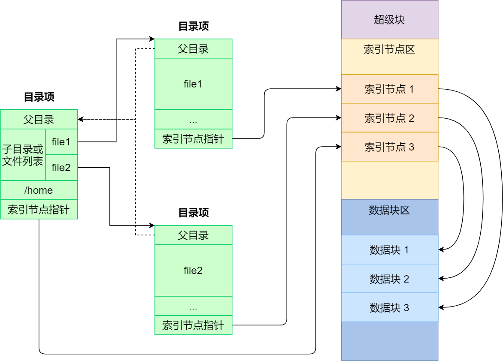

磁盘进行格式化的时候，会被分成三个存储区域，分别是超级块（用来存储文件系统的详细信息）、索引节点区（用来存储索引节点）和数据块区（用来存储文件或目录数据）。它们加载进内存的时机是不同的，超级块当文件系统挂载时进入内存，索引节点区是当文件被访问时进入内存。

#### 虚拟文件系统

文件系统的种类众多，而操作系统希望对用户提供一个统一的接口，于是在用户层与文件系统层引入了中间层，这个中间层就称为虚拟文件系统（Virtual File System，VFS）。

#### 文件使用

文件打开的过程：

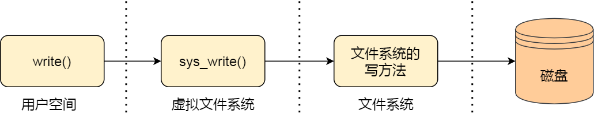

操作系统为每个进程维护一个**打开文件表**，文件表里的每一项代表「**文件描述符**」。

用户和操作系统对文件的读写操作是有差异的，用户习惯以字节的方式读写文件，而操作系统则是以数据块来读写文件，那**屏蔽掉这种差异**的工作就是**文件系统**了。**文件系统的基本操作单位是数据块**。

#### 文件存储

##### 连续空间存放方式

**文件存放在磁盘「连续的」物理空间中**。

文件的数据都是紧密相连，**读写效率很高**，但是有「**磁盘空间碎片**」和「**文件长度不易扩展**」的缺陷。

##### 非连续空间存放方式

###### 「链表方式」

链表的方式存放是**离散的，不用连续的**，于是就可以**消除磁盘碎片**，可大大提高磁盘空间的利用率，同时**文件的长度可以动态扩展**。根据实现的方式的不同，链表可分为「**隐式链表**」和「**显式链接**」两种形式。

- 隐式链表：实现的方式是文件头要包含**「第一块」和「最后一块」**的位置，并且每个数据块里面留出一个指**针空间**，用来存放下一个数据块的位置。

  缺点在于无法直接访问数据块，**只能通过指针顺序访问文件**，以及数据块指针消耗了一定的存储空间。隐式链接分配的**稳定性较差**，系统在运行过程中由于软件或者硬件错误导致链表中的指针丢失或损坏，会导致文件数据的丢失。

- 显式链表：指**把用于链接文件各数据块的指针，显式地存放在内存的一张链接表中**，该表在整个磁盘仅设置一张，**每个表项中存放链接指针，指向下一个数据块号**。

  整个表都存放在内存中的关系，它的主要的缺点是**不适用于大磁盘**

###### 「索引方式」

索引的实现是为每个文件创建一个「**索引数据块**」，里面存放的是**指向文件数据块的指针列表**。支持顺序读写和随机读写，缺陷之一就是存储索引带来的开销。

###### 「索引+链表」

「**链式索引块**」，它的实现方式是**在索引数据块留出一个存放下一个索引数据块的指针**，于是当一个索引数据块的索引信息用完了，就可以通过指针的方式，找到下一个索引数据块的信息。

###### 「索引+索引」

这种组合称为「**多级索引块**」，实现方式是**通过一个索引块来存放多个索引数据块**，一层套一层索引。

#### 空闲空间管理

##### 空闲表法

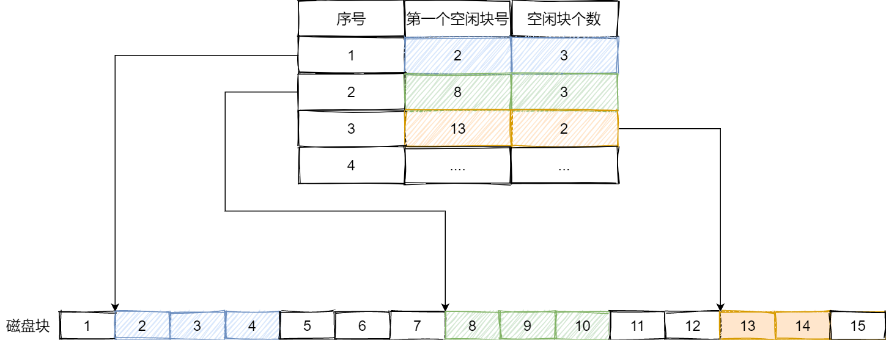

当请求分配磁盘空间时，系统**依次扫描**空闲表里的内容，直到找到一个合适的空闲区域为止。当用户撤销一个文件时，系统**回收**文件空间。这时，也需**顺序扫描**空闲表，寻找一个空闲表条目并将释放空间的第一个物理块号及它占用的块数填到这个条目中。

##### 空闲链表法

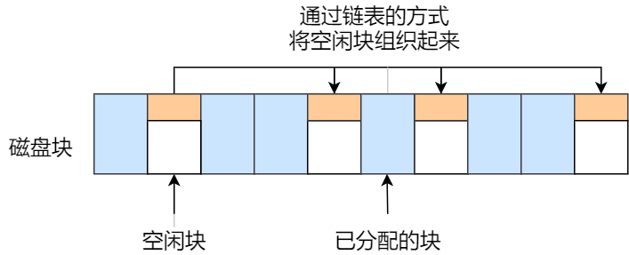

当创建文件需要一块或几块时，就从链头上依次取下一块或几块。反之，当回收空间时，把这些空闲块依次接到链头上。

##### 位图法

位图是利用二进制的一位来表示**<u>磁盘中一个盘块</u>**的使用情况，磁盘上所有的盘块都有一个二进制位与之对应。当值为 0 时，表示对应的盘块空闲，值为 1 时，表示对应的盘块已分配。

在 **Linux 文件系统**就采用了位图的方式来管理空闲空间。

#### ⭐文件系统的结构

前面提到 Linux 是用位图的方式管理空闲空间，用户在创建一个新文件时，Linux 内核会通过 inode 的位图找到空闲可用的 inode，并进行分配。要存储数据时，会通过块的位图找到空闲的块，并分配。

即在 Linux 文件系统，采用「一个块的位图 + 一系列的块」，外加「一个块的 inode 的位图 + 一系列的 inode 的结构」，能表示的最大空间也就 128M，因此 Linux 文件系统把这个结构称为一个**块组**，那么有 N 多的块组，就能够表示 N 大的文件。

下图给出了 Linux Ext2 整个文件系统的结构和块组的内容，**文件系统都由大量块组组成**，在硬盘上相继排布：

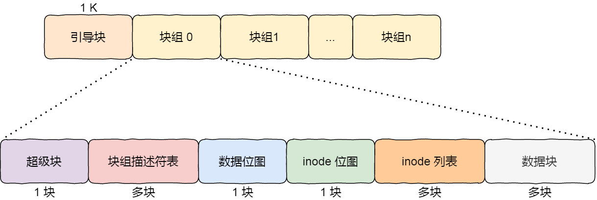


- *超级块*，包含的是文件系统的重要信息，比如 inode 总个数、块总个数、每个块组的 inode 个数、每个块组的块个数等等。
- *块组描述符*，包含文件系统中各个块组的状态，比如块组中空闲块和 inode 的数目等，每个块组都包含了文件系统中「所有块组的组描述符信息」。
- *数据位图和 inode 位图*， 用于表示对应的数据块或 inode 是空闲的，还是被使用中。
- *inode 列表*，包含了块组中所有的 inode，inode 用于保存文件系统中与各个文件和目录相关的所有元数据。
- *数据块*，包含文件的有用数据。

#### 目录的存储

普通文件的块里面保存的是文件数据，而**目录文件的块里面保存的是目录里面一项一项的文件信息**。

保存目录的格式从列表改成**哈希表**，对文件名进行哈希计算，把哈希值保存起来，如果我们要查找一个目录下面的文件名，可以通过名称取哈希。如果哈希能够匹配上，就说明这个文件的信息在相应的块里面。**查找迅速，插入和删除简单。**

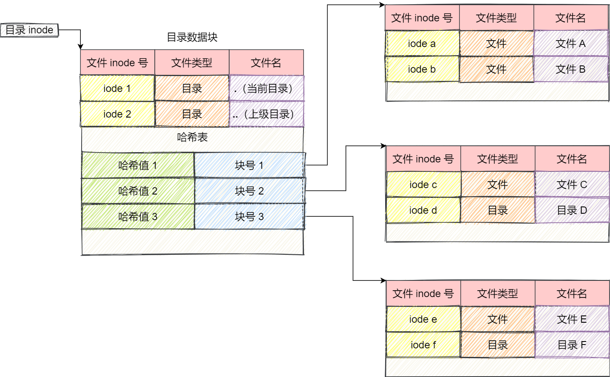

#### 软链接和硬链接

##### 软链接

相当于重建一个文件，重建的这个文件内容是指向文件的路径；

可以跨文件系统；

当源文件被删除，软链接还存在，只不过找不到对应的文件而已；

##### 硬链接

多个目录项中的「索引节点」指向一个文件；

不可以跨文件系统；

所有的硬链接和源文件都被删掉，这个文件才算是被删掉；

#### 文件I/O

分类有三种：

##### 是否利用标准库缓冲

- 缓冲 I/O，利用的是标准库的缓存实现文件的加速访问，而标准库再通过系统调用访问文件。
- 非缓冲 I/O，直接通过系统调用访问文件，不经过标准库缓存

举例：c++输出

##### **是否利用操作系统的缓存**

为了减少磁盘 I/O 次数，在系统调用后，会把用户数据**拷贝到内核中缓存起来**，这个内核缓存空间也就是「页缓存」，只有当缓存**满足**某些**条件**的时候，才**发起磁盘 I/O 的请求**。

- 直接 I/O，不会发生内核缓存和用户程序之间数据复制，而是直接经过文件系统访问磁盘。
- 非直接 I/O，读操作时，数据从内核缓存中拷贝给用户程序，写操作时，数据从用户程序拷贝给内核缓存，再由内核决定什么时候写入数据到磁盘。

##### 是否异步

I/O 是分为两个过程的：

1. 内核数据准备的过程
2. 数据从内核空间拷贝到用户进程缓冲区的过程

###### 同步I/O

**阻塞 I/O** 会阻塞在「过程 1 」和「过程 2」，而**非阻塞 I/O** 和**基于非阻塞 I/O 的多路复用**只会阻塞在「过程 2」，所以这三个都可以认为是同步 I/O。

非阻塞 I/O在数据未准备好的时候会返回，并且定期去轮询内核是否准备好数据，而基于非阻塞 I/O 的多路复用在数据未准备好的时候会返回，内核准备好数据后会通知线程数据可读了。

###### 异步I/O

异步「过程 1 」和「过程 2 」都不会阻塞。

当我们发起异步读取之后，就**立即返回**，内核**自动**将数据从内核空间拷贝到应用程序空间（这个拷贝过程同样是**异步**的）内核自动完成的，和前面的同步操作不一样，**应用程序并不需要主动发起拷贝动作**。

#### page cache

进程写文件（使用缓冲 IO）过程中，写一半的时候，进程发生了崩溃，已写入的数据不会丢失。page cache，它是文件系统中用于缓存文件数据的缓冲。所以即使进程崩溃了，文件数据还是保**留在内核的 page cache**，读数据的时候，也是从内核的 page cache 读取，因此还是依然读的进程崩溃前写入的数据。内核会找个合适的时机，将 page cache 中的数据持久化到磁盘。

但是如果 page cache 里的文件数据，在持久化到磁盘化到磁盘之前，**系统发生了崩溃**，那这部分数据就会丢失了。

##### page && page cache

page 是内存管理分配的基本单位， Page Cache 由多个 page 构成。page 在操作系统中通常为 4KB 大小（32bits/64bits），而 Page Cache 的大小则为 4KB 的整数倍。

前面 [内存回收](#可回收资源) 提到过文件页和匿名页，page cache中page指的是文件页。

> Direct I/O 技术的磁盘文件就不会进入 Page Cache 中。

操作系统为基于 Page Cache 的读缓存机制提供**预读机制**。

##### Page Cache 与文件持久化的一致性&可靠性

只要有缓存，就会涉及到一致性问题。

当前 Linux 下以两种方式实现文件一致性：

1. **Write Through（写穿）**：向用户层提供特定接口，应用程序可主动调用接口来保证文件一致性；
2. **Write back（写回）**：系统中存在定期任务（表现形式为内核线程），周期性地同步文件系统中文件脏数据块，这是默认的 Linux 一致性方案；

Write Through 与 Write back 在持久化的可靠性上有所不同：

- Write Through **以牺牲系统 I/O 吞吐量作为代价**，向上层应用确保一旦写入，数据就已经落盘，不会丢失；
- Write back 在系统发生宕机的情况下无法确保数据已经落盘，因此存在数据丢失的问题。

##### PageCache优劣势

优势：加快数据访问（内存比磁盘快）；减少 I/O 次数，提高系统磁盘 I/O 吞吐量（预读能力和局部性原理）；

劣势：需要占用额外物理内存空间；对应用层并没有提供很好的管理 API，几乎是透明管理；比直接I/O多一次读和写

### 设备管理

#### **设备控制器**

 CPU 是通过设备控制器来和设备打交道的。设备控制器统一管理输入输出设备，不同控制器都很清楚的知道对应设备的用法和功能。

设备控制器里有芯片，可以执行自己的逻辑，有自己的寄存器，用来与 CPU 进行通信。

##### 控制器是有三类寄存器

###### 状态寄存器（Status Register）

告诉 CPU ，现在已经在工作或工作已经完成；

状态寄存标记成已完成，CPU 才能发送下一个字符和命令。

###### 命令寄存器（Command Register）

CPU 发送命令，告诉 I/O 设备要进行输入/输出操作

###### 数据寄存器（Data Register）

CPU 向 I/O 设备写入需要传输的数据

##### 设备分类

###### 块设备

把数据存储在固定大小的块中，如硬盘、USB。

块设备通常传输的数据量会非常大，控制器设立了一个可读写的**数据缓冲区**。在cpu写入或者cpu读取数据时，等数据缓冲区的数据达到一定数量，才会发给设备或者存入内存。

###### 字符设备

以字符为单位发送或接收一个字符流，字符设备是不可寻址的，也没有任何寻道操作，**鼠标**是常见的字符设备。

####  I/O 控制方式

设备控制器读完设备的数据，要怎么通知 CPU 呢？

##### 1、CPU轮询

占用cpu时间

##### 2、中断

中断的方式对于频繁读写数据的磁盘，并不友好，这样 CPU 容易经常被打断，会占用 CPU 大量的时间。

##### 3、DMA

直接内存访问（\*Direct Memory Access\*） 技术。

要实现 DMA 功能要有 **「DMA 控制器」硬件的支持**。

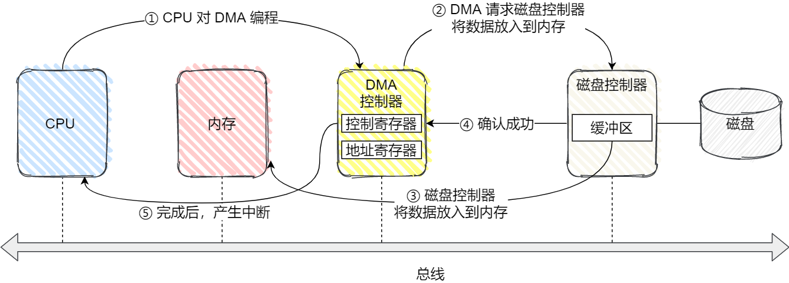

**CPU 不再参与「将数据从磁盘控制器缓冲区搬运到内核空间」的工作，这部分工作全程由 DMA 完成**。但是 CPU 在这个过程中也是必不可少的，因为传输什么数据，从哪里传输到哪里，都需要 CPU 来告诉 DMA 控制器。

由于 I/O 设备越来越多，数据传输的需求也不尽相同，所以**每个 I/O 设备里面都有自己的 DMA 控制器**。

#### 设备驱动程序

为了屏蔽「设备控制器」的差异，引入了**设备驱动程序**。

**设备控制器**不属于操作系统范畴，属于**硬件**，而**设备驱动程序属于操作系统的一部分**，操作系统的内核代码可以像本地调用代码一样使用设备驱动程序的接口，而设备驱动程序是面向设备控制器的代码，它发出操控设备控制器的指令后，才可以操作设备控制器。

**设备驱动程序会提供统一的接口给操作系统**，这样不同的设备驱动程序，就可以以相同的方式接入操作系统。

设备完成了事情，则会发送中断来通知操作系统。那操作系统使用**设备驱动程序来及时响应控制器发来的中断请求**，并根据这个中断的类型调用响应的**中断处理程序**进行处理。

#### 通用块层

为了减少**不同块设备的差异**带来的影响，Linux 通过一个**统一的通用块层**，来管理不同的块设备。通用块层是处于文件系统和磁盘驱动中间的一个**块设备抽象层**，它主要有两个功能：

第一个功能，向上为文件系统和应用程序，**提供访问块设备的标准接口**，向下把各种不同的磁盘设备抽象为统一的块设备，并**在内核层面提供一个框架来管理这些设备的驱动程序**；
第二个功能，通用层还会给文件系统和应用程序发来的 I/O 请求排队，接着会对队列重新排序、请求合并等方式，也就是 **I/O 调度**，主要目的是为了提高磁盘读写的效率。

Linux 内存支持 5 种 I/O 调度算法，分别是：

- 没有调度算法：不对文件系统和应用程序的 I/O 做任何处理，这种算法常用在**虚拟机 I/O** 中，此时磁盘 I/O 调度算法交由物理机系统负责。
- 先入先出调度算法
- 完全公平调度算法：大部分系统都把这个算法作为**默认的 I/O 调度器**，为每个进程维护了一个 I/O 调度队列，并按照**时间片**来均匀分布每个进程的 I/O 请求。
- 优先级调度：优先级高的 I/O 请求先发生， 它适用于**运行大量进程的系统**，像是桌面环境、多媒体应用等。
- 最终期限调度算法：分别为**读、写请求创建不同的 I/O 队列**，这样可以提高机械磁盘的吞吐量，并确保**达到最终期限的请求被优先处理**，适用于在 **I/O 压力比较大**的场景，比如数据库等。

#### Linux的 I/O 软件分层

由上到下可以分为三个层次，分别是文件系统层、通用块层、设备层。

- 文件系统层，包括**虚拟文件系统**和其他文件系统的具体实现，它向上为应用程序统一提供了标准的文件访问接口，向下会通过通用块层来存储和管理磁盘数据。

- 通用块层，包括**块设备的 I/O 队列和 I/O 调度器**，它会对文件系统的 I/O 请求进行排队，再通过 I/O 调度器，选择一个 I/O 发给下一层的设备层。
- 设备层，包括硬件设备、设备控制器和驱动程序，负责最终**物理设备的 I/O 操作**

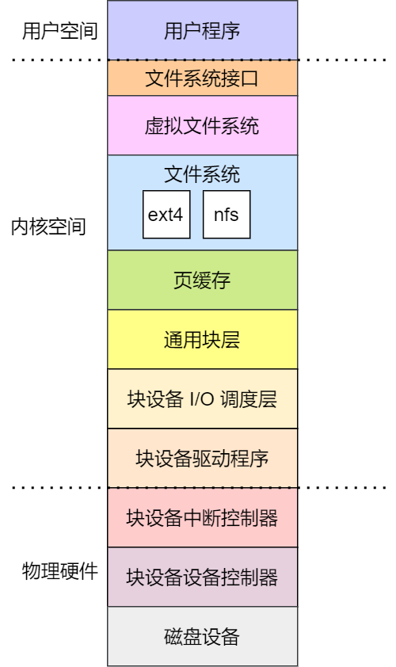

#### 键盘敲入字母

1. 当用户输入了键盘字符，**键盘控制器**就会产生扫描码数据，并将其缓冲在键盘控制器的**寄存器**中，紧接着键盘控制器通过总线给 CPU 发送**中断请求**。
2. CPU 收到中断请求后，操作系统会**保存被中断进程的 CPU 上下文**，然后调用键盘的**中断处理程序**。
3. 键盘的中断处理程序是在**键盘驱动程序**初始化时注册的，那键盘**中断处理函数**的功能就是从键盘控制器的寄存器的缓冲区**读取**扫描码，再根据扫描码找到用户在键盘输入的字符，如果输入的字符是**显示**字符，那就会把扫描码翻译成对应显示字符的 ASCII 码。
4. 把 ASCII 码放到**「读缓冲区队列」**
5. 把显示字符显示在屏幕。**显示设备的驱动程序**会定时从「读缓冲区队列」读取数据放到「写缓冲区队列」，最后把「写缓冲区队列」的数据一个一个写入到**显示设备的控制器的寄存器中的数据缓冲区**，最后将这些数据显示在屏幕里。
6. 显示出结果后，**恢复被中断进程的上下文**。

### 网络系统

#### 文件传输

##### 传统的文件传输

调用read和write函数，发生了4次数据拷贝和4次用户态和内核态切换：

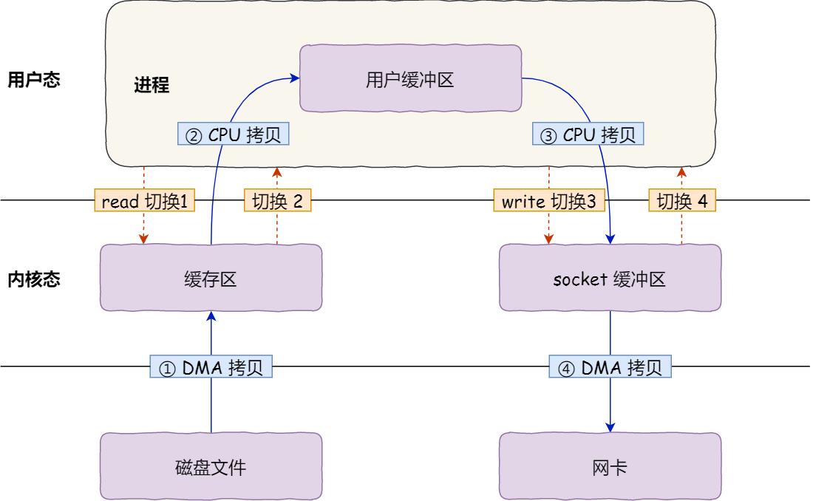

要想提高文件传输的性能，就需要**减少「用户态与内核态的上下文切换」和「内存拷贝」的次数**

##### 优化文件传输性能

用户空间没有权限操作磁盘或网卡，内核的权限最高，这些操作设备的过程都需要交由操作系统内核来完成。**要想减少上下文切换到次数，就要减少系统调用的次数**。

因为文件传输的应用场景中，在用户空间我们并不会对数据「再加工」，所以数据实际上可以不用搬运到用户空间，因此**用户的缓冲区是没有必要存在的**。

有以下几个优化方案：

###### 1、mmap + write

用 `mmap()` **替换 `read()` 系统调用函数**。`read()` 系统调用的过程中会把内核缓冲区的数据拷贝到用户的缓冲区里，`mmap()` 系统调用函数会直接把内核缓冲区里的数据「**映射**」到用户空间。（这里的映射是指 DMA 把磁盘的数据拷贝到内核的缓冲区里，应用进程跟操作系统内核**「共享」这个缓冲区**；）

4次用户态内核态上下文切换，减少了一次数据拷贝。但是仍然需要cpu拷贝内核缓冲区的数据到socket缓冲区。


###### 2、sendfile

在 Linux 内核版本 2.1 中，提供了一个专门发送文件的系统调用函数 `sendfile()`，替换`read()` 和 `write()` 这两个系统调用，**少一次系统调用**，减少两次上下文切换，这样也就可以直接把内核缓冲区里的数据拷贝到 socket 缓冲区里，不再拷贝到用户态。

两次上下文切换，3次数据拷贝。

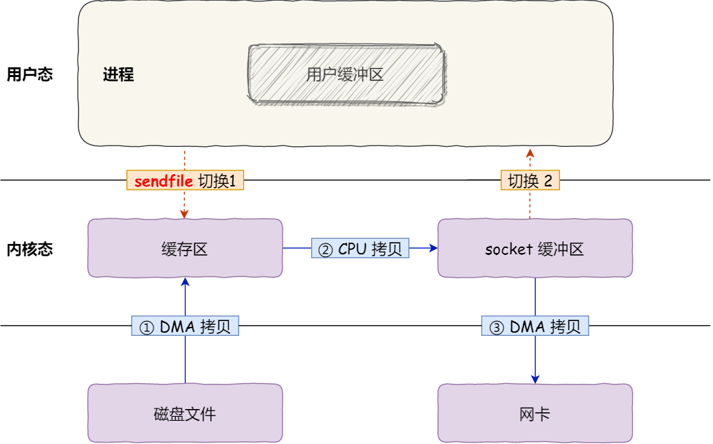

###### 3、零拷贝

是在sendfile基础上改进的。从 Linux 内核 `2.4` 版本开始起，对于**网卡支持 SG-DMA 技术**的情况下， `sendfile()` 在完成DMA拷贝之后，只需要**将缓冲区描述符和数据长度传到 socket 缓冲区**，然后网卡的 SG-DMA 控制器就可以直接将内核缓存中的数据拷贝到网卡的缓冲区里。

零拷贝就是指**没有在内存层面去拷贝数据**，也就是说全程没有通过 CPU 来搬运数据，**所有的数据都是通过 DMA 来进行传输**的。

两次上下文切换，两次数据拷贝。


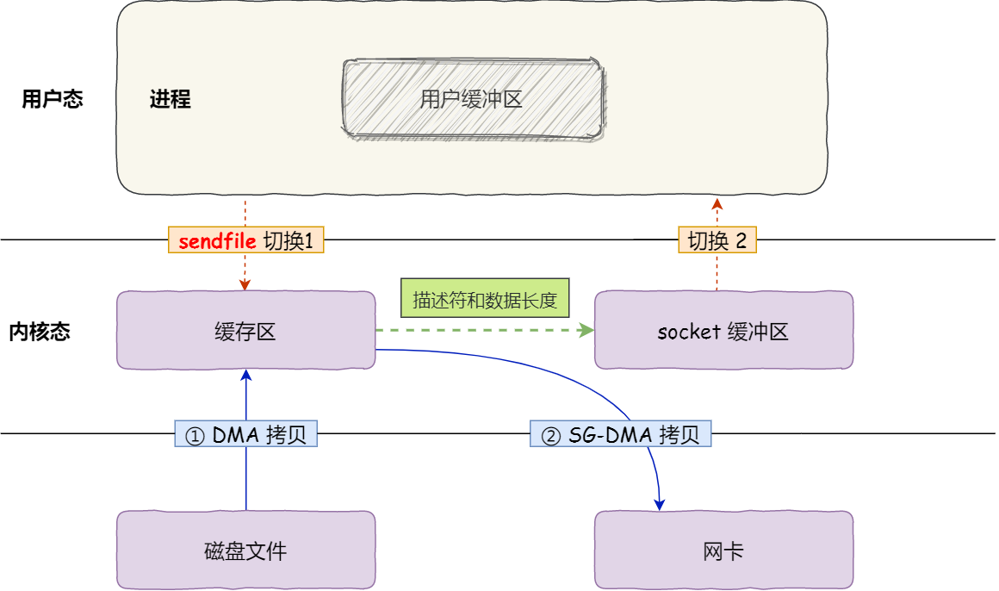

##### 磁盘高速缓存（PageCache）

零拷贝使用了 PageCache 技术，上面提到的「内核缓冲区」实际上是**磁盘高速缓存（PageCache）**。因为读内存比读磁盘要快得多。

PageCache 的**优点**主要是 缓存最近被访问的数据 和 预读功能；

但是，在传输大文件（GB 级别的文件）的时候， PageCache 空间很快被这些大文件占满，这样就会带来 2 个问题：

- PageCache 由于长时间被大文件占据，其他**「热点」的小文件可能就无法充分使用到 PageCache**，磁盘读写的性能下降；
- PageCache 中的大文件数据，由于没有享受到缓存带来的好处，但却耗费 DMA 多拷贝到 PageCache 一次；

所以针对大文件的传输，不应该使用 PageCache（也就是说不应该使用零拷贝技术）。

##### 大文件传输

针对大文件的传输的方式，应该使用**「异步 I/O + 直接 I/O」来替代零拷贝技术**。


期间，不需要将磁盘控制缓冲区 先拷贝到page cache 然后再拷贝到用户缓冲区，而是**直接从磁盘控制器缓冲区拷贝到用户缓冲区**。

####  I/O 多路复用

目的是想要服务器能够服务更多的用户。

- 首先，服务端单机最大 TCP 连接数约为 2 的 48 次方，但是**服务器肯定承载不了**那么大的连接数，因为进程的***文件描述符***是有数量限制的，而且TCP连接都会占用一定的***内存***。

- 其次，采用<u>**多进程模型**</u>。父进程负责监听，当accept返回一个建立连接的socket时，就fork建立一个对应的子进程用来服务客户。当客户端数量很高，***进程占用的资源很大并且进程的上下文切换***也很消耗性能。

- 然后，基于改进进程上下文切换消耗，考虑<u>**多线程模型**</u>。将「已连接 Socket」的文件描述符传递给线程函数，接着在线程里和客户端进行通信，从而达到并发处理的目的。同时使用**线程池**的方式来避免线程的频繁创建和销毁。

- 考虑只使用一个进程来维护多个 Socket —— **I/O 多路复用**技术。

​	一个进程虽然**任一时刻只能处理一个请求**，但是处理每个请求的事件时，耗时控制在 1 毫秒以内，这样 1 秒内就可以处理上千个请求，把**时间拉长来看，多个请求复用了一个进程**，这就是多路复用，这种思想很类似一个 CPU 并发多个进程，所以也叫做**时分多路复用**。

##### select/poll/epoll 

select/poll/epoll 都是内核提供给用户态的多路复用系统调用，**进程可以通过一个系统调用函数从内核中获取多个事件**。具体来讲，在获取事件时，先把我们要关心的连接传给内核，再由内核检测：

- 如果没有事件发生，线程只需阻塞在这个系统调用，而无需像前面的线程池方案那样轮询调用 read 操作来判断是否有数据。
- 如果有事件发生，内核会返回产生了事件的连接，线程就会从阻塞状态返回，然后在用户态中再处理这些连接对应的业务即可。

###### select

select 实现多路复用的方式是，将已连接的 Socket 都放到一个**文件描述符集合**，然后调用 select 函数将文件描述符集合**拷贝**到内核里，让内核来检查是否有网络事件产生，检查的方式很粗暴，就是通过**遍历**文件描述符集合的方式，当检查到有事件产生后，将此 Socket 标记为可读或可写， 接着再把整个文件描述符集合**拷贝**回用户态里，然后用户态还需要再通过**遍历**的方法找到可读或可写的 Socket，然后再对其处理。

所以elect 需要进行 **2 次「遍历」文件描述符集合**，一次是在内核态里，一个次是在用户态里 ，而且还会发生 **2 次「拷贝」文件描述符集合**，先从用户空间传入内核空间，由内核修改后，再传出到用户空间中。

select 使用固定长度的 **BitsMap**，表示文件描述符集合，而且所支持的文件描述符的个数是有限制的。

###### poll 

poll 不再用 BitsMap 来存储所关注的文件描述符，取而代之用**动态数组**，以链表形式来组织，突破了 select 的文件描述符个数限制，当然还会受到系统文件描述符限制。

但是 poll 和 select 并没有太大的本质区别，**都是使用「线性结构」存储进程关注的 Socket 集合，因此都需要遍历文件描述符集合来找到可读或可写的 Socket，时间复杂度为 O(n)，而且也需要在用户态与内核态之间拷贝文件描述符集合**，这种方式随着并发数上来，性能的损耗会呈指数级增长。

###### epoll

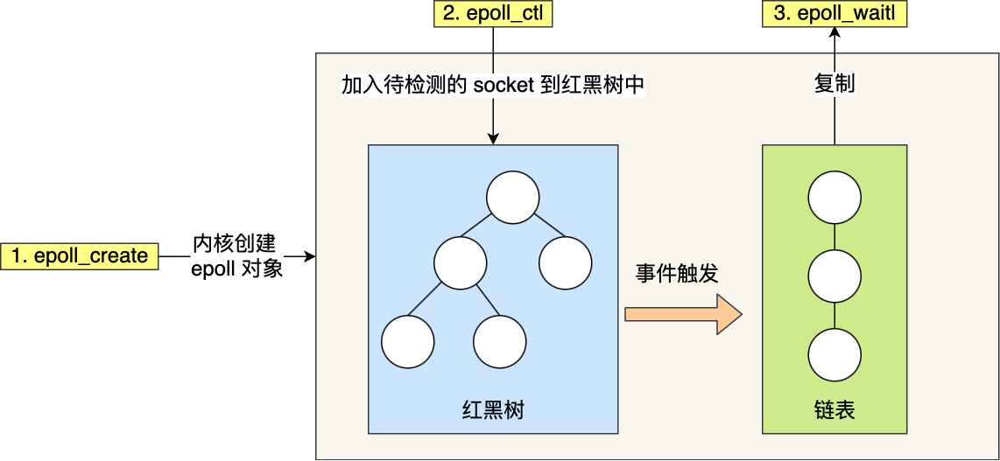

epoll 通过两个方面，很好解决了 select/poll 的问题。

*第一点*，epoll 在内核里使用**红黑树来跟踪进程所有待检测的文件描述字**，把需要监控的 socket 通过 `epoll_ctl()` 函数加入内核中的红黑树里，红黑树是个高效的数据结构，增删改一般时间复杂度是 `O(logn)`。而 select/poll 内核里没有类似 epoll 红黑树这种保存所有待检测的 socket 的数据结构，所以 select/poll 每次操作时都传入整个 socket 集合给内核，而 epoll 因为在内核维护了红黑树，可以保存所有待检测的 socket ，所以只需要传入一个待检测的 socket，减少了内核和用户空间大量的数据拷贝和内存分配。

*第二点*， epoll 使用**事件驱动**的机制，内核里**维护了一个链表来记录就绪事件**，当某个 socket 有事件发生时，通过**回调函数**内核会将其加入到这个就绪事件列表中，当用户调用 `epoll_wait()` 函数时，只会返回有事件发生的文件描述符的个数，不需要像 select/poll 那样轮询扫描整个 socket 集合，大大提高了检测的效率。

#### Reactor

大佬们基于面向对象的思想，对 I/O 多路复用作了一层封装，让使用者不用考虑底层网络 API 的细节，只需要关注应用代码的编写，叫做**Reactor 模式**。

Reactor 模式主要由 Reactor 和处理资源池这两个核心部分组成：

- Reactor 负责**监听和分发**事件，事件类型包含连接事件、读写事件；
- 处理资源池负责**处理**事件，如 read -> 业务逻辑 -> send；

Reactor 模式是灵活多变的，可以应对不同的业务场景，灵活在于：

- Reactor 的数量可以只有一个，也可以有多个；
- 处理资源池可以是单个进程 / 线程，也可以是多个进程 /线程；

多个方案如下：

##### 单 Reactor 单进程 / 线程

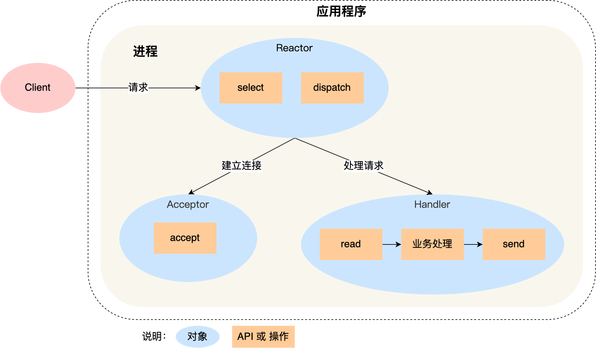

缺点：一个进程**无法充分利用 多核 CPU 的性能**；Handler 对象在业务处理时，整个进程是无法处理其他连接的事件的，**如果业务处理耗时比较长，那么就造成响应的延迟**；

所以，单 Reactor 单进程的方案**不适用计算机密集型的场景，只适用于业务处理非常快速的场景**。

##### 单 Reactor 多线程 / 多进程

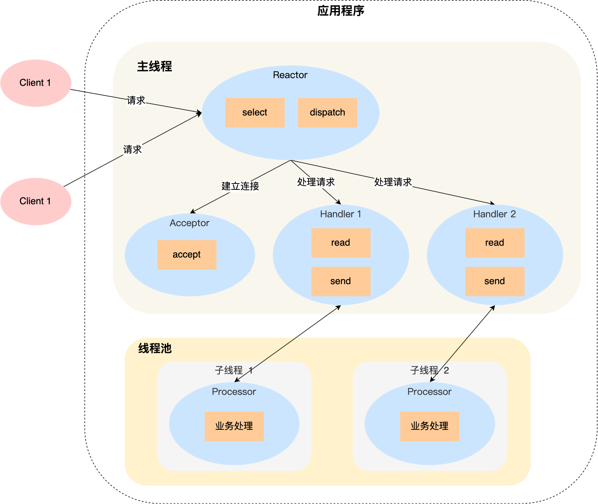

单 Reator 多线程的方案优势在于**能够充分利用多核 CPU 的能**，那既然引入多线程，那么自然就带来了**多线程竞争资源**的问题。

「单 Reactor」的模式还有个问题，**因为一个 Reactor 对象承担所有事件的监听和响应，而且只在主线程中运行，在面对瞬间高并发的场景时，容易成为性能的瓶颈的地方**。

##### 多 Reactor 多进程 / 线程

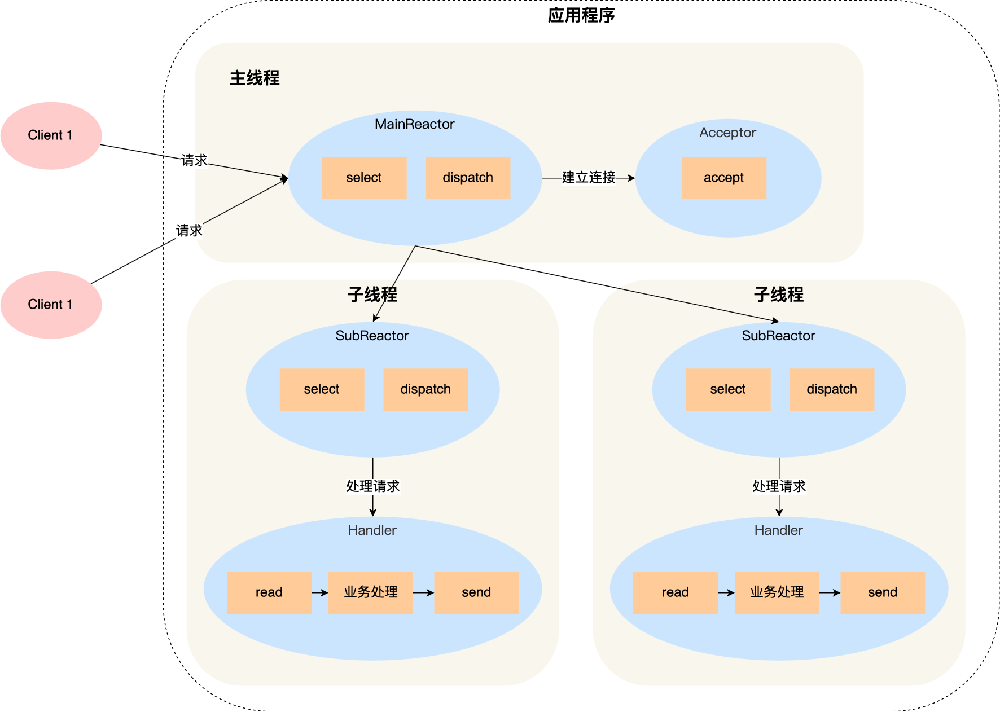

- 主线程和子线程分工明确，**主线程只负责接收新连接，子线程负责完成后续的业务处理**。
- 主线程和子线程的交互很简单，主线程只需要把新连接传给子线程，子线程无须返回数据，直接就可以在**子线程将处理结果发送给客户端。**


#### Proactor 

Proactor 采用了异步 I/O 技术，所以被称为异步网络模型。

Reactor 是非阻塞同步网络模式，感知的是就绪可读写事件。Proactor 是异步网络模式， 感知的是已完成的读写事件。Reactor 可以理解为**「来了事件操作系统通知应用进程，让应用进程来处理」**，而 Proactor 可以理解为**「来了事件操作系统来处理，处理完再通知应用进程」**。

#### 一致性哈希

负载均衡问题：服务器集群如何分配客户端的请求；

加权轮询算法：让硬件配置更好的节点承担更多的请求；加权轮询算法使用前提是每个节点存储的数据都是相同，不适用分布式系统；

哈希算法：取模运算，确定选中节点；但是当集群节点数发生变化，会导致**大部分映射关系改变**，需要我们进行**迁移数据**，最坏情况下所有数据都需要迁移，所以它的**数据迁移规模是 O(M)**，这样数据的迁移成本太高了。

一致性哈希算法：哈希算法是对节点的数量进行取模运算，而**一致哈希算法是对 2^32 进行取模运算，是一个固定的值**。

- 具体做法：**一致性哈希是指将「存储节点」和「数据」都映射到一个首尾相连的哈希环上**，映射的结果值往**顺时针的方向的找到第一个节点**，就是存储该数据的节点；

  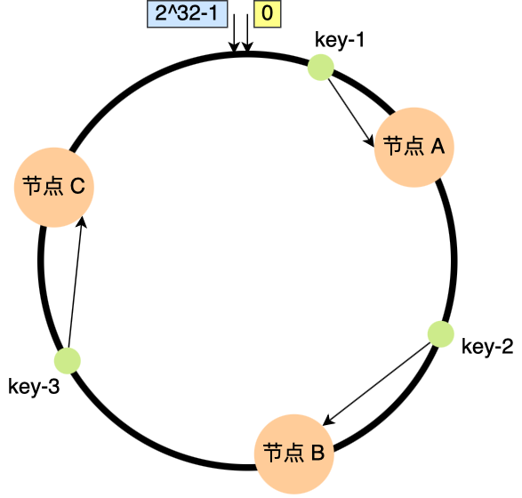

- 增加一个节点或者减少一个节点：**仅影响该节点在哈希环上顺时针相邻的后继节点，其它数据也不会受到影响**；

- 但是**一致性哈希算法并不保证节点能够在哈希环上分布均匀**，这样就会带来一个问题，会有大量的请求集中在一个节点上；

- 解决方法：通过虚拟节点提高均衡度

  - 具体做法是，**不再将真实节点映射到哈希环上，而是将虚拟节点映射到哈希环上，并将虚拟节点映射到实际节点，所以这里有「两层」映射关系。**（举例：顺序就是A1 B1 C1 A2 B2 C2这样）
  - 节点数量多了后，节点在哈希环上的**分布就相对均匀**；当节点变化时，会有不同的节点共同分担系统的变化，因此**稳定性更高**；

### Linux命令

简单的命令操作：程序员快速入门Linux.docx ["G:\东南大学\LC\秋招\面经\c++\程序员快速入门Linux.docx"]()

https://juejin.cn/post/7069591460730896414

##### 查看网络性能指标


### 本科ppt记录

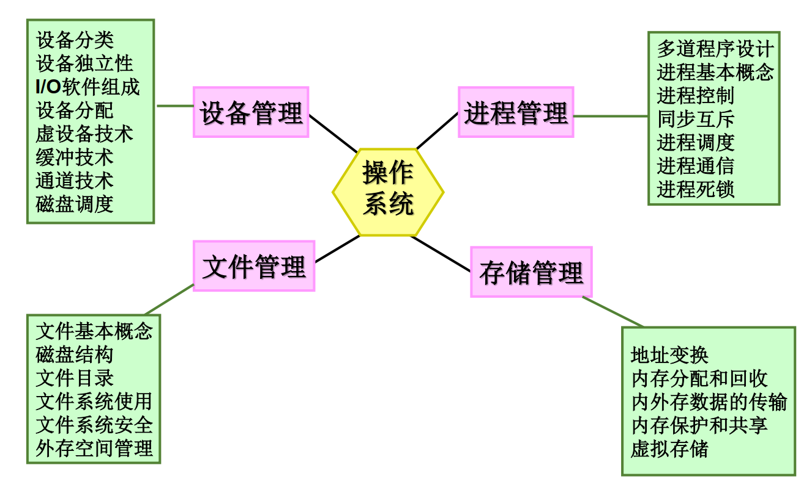

#### 进程管理

进程定义、特征：并发执行的程序在执行过程中分配和管理资源的基本单位  

进程调度（上下文切换 PCB等）

进程控制（创建 终止 涉及父子进程）

进程通信：低级通信（锁 信号量 软中断）和高级通信（共享内存、管道、消息通信）

#### 进程同步

关于 信号量、死锁

#### cpu调度

进程的调度方法

#### 内存

内存管理的内容

内存分配：连续分配、分段、分页

虚拟内存：请求调页、页面置换（FIFO、LRU）

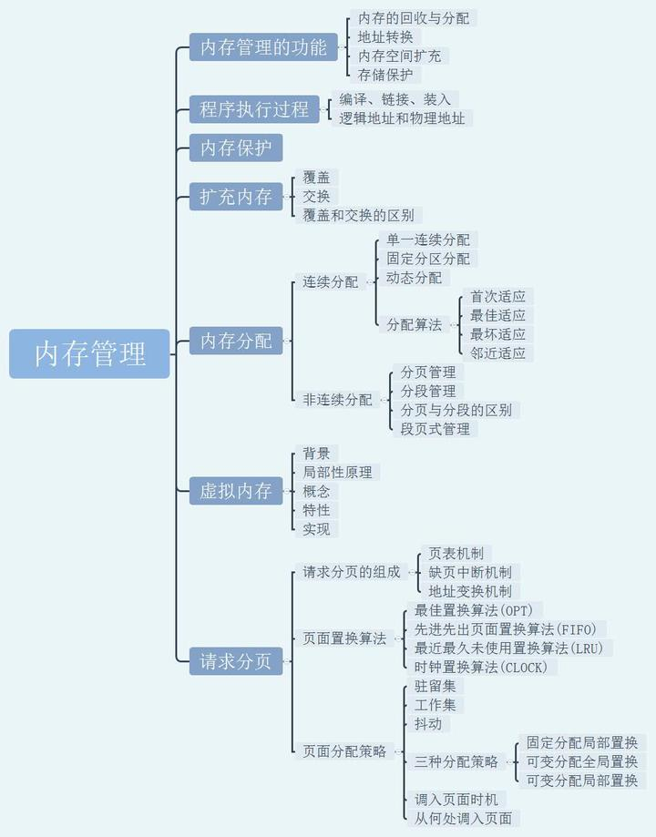


### 面试题目

##### 操作系统保护模式和实模式

实模式：

将整个物理内存看成分段的区域，程序代码和数据位于不同区域，**系统程序和⽤户程序并没有区别对待，⽽且每⼀个指针都是指向实际的物理地址**。这样⼀来，⽤户程序的⼀个指针如果指向了系统程序区域或其他⽤户程序区域，并修改了内容，那么对于这个被修改的系统程序或⽤户程序，其后果就很可能是灾难性的。再者，随着软件的发展， **1M的寻址空间**已经远远不能满⾜实际的需求了。最后，对**处理器多任务**⽀持需求也⽇益紧迫，所有这些都促使新技术的出现。

保护模式：

为了克服实模式下的内存⾮法访问问题，并满⾜⻜速发展的内存寻址和多任务需求，处理器⼚商开发出保护模式。在保护模式中，除了**内存寻址空间⼤⼤提⾼**；提供了硬件对**多任务**的⽀持； **物理内存地址也不能直接被程序访问**，程序内部的地址(虚拟地址)要由操作系统转化为物理地址去访问，程序对此⼀⽆所知。⾄此，进程(程序的运⾏态)有了严格的边界，任何其他进程根本没有办法访问不属于⾃⼰的物理内存区域，甚⾄在⾃⼰的虚拟地址范围内也不是可以任意访问的，因为有⼀些虚拟区域已经被放进⼀些公共系统运⾏库。这些区域也不能随便修改，若修改就会有出现linux中的段错误，或Windows中的⾮法内存访问对话框。

##### 场景题目

###### 设计⼀个线程池

[c++11实现线程池](https://zhuanlan.zhihu.com/p/367309864)

**C++11**加入了线程库，从此告别了标准库不支持并发的历史。然而C++对于多线程的支持还是比较低级，稍微高级一点的用法都需要自己去实现，比如线程池、信号量等。线程池（thread pool）这个东西，一般在面试时的回答都是：“管理一个任务队列，一个线程队列，然后每次去一个任务分配给一个线程去做，循环往复。”

线程池一般是要复用线程，所以如果是取一个task分配给某一个thread，执行完之后再重新分配，在语言层面这是基本不能实现的：C++的thread都是执行一个固定的task函数，执行完之后线程也就结束了。所以该如何实现task和thread的分配呢？**让每一个thread创建后，就去执行调度函数：循环获取task，然后执行。**这个循环该什么时候停止呢？很简单，**当线程池停止使用时**，循环停止。这样一来，就保证了thread函数的唯一性，而且复用线程执行task。

总结一下，我们的线程池的主要组成部分有二：

- 任务队列（Task Queue）
- 线程池（Thread Pool）

线程池与任务队列之间的匹配操作，是典型的*生产者-消费者*模型，本模型使用了两个工具：**一个mutex + 一个条件变量**。mutex就是锁，保证任务的添加和移除（获取）的互斥性；一个条件变量保证多个线程获取task的同步性：当任务队列为空时，线程应该等待（阻塞）。

**任务队列：**

- 建立任务类，每个任务作为一个对象
- 建立queue来存储任务，为了避免多线程操作任务队列出现的问题，使用mutex来保证任务的添加和移除（获取）的互斥性。

**线程池**

- 实现提交函数。线程池最重要的方法就是负责向任务队列添加任务。我们的提交函数应该做到以下两点：

  - 接收任何参数的任何函数。（普通函数，Lambda，成员函数……）
  - 立即返回“东西”，避免阻塞主线程。这里返回的“东西”或者说“对象”应该包含任务结束的结果。

- 内置工作线程类。本文在线程池中设立私有成员类*ThreadWoker*作为内置线程工作类，执行真正的工作。

  我们使用了一个while循环，在线程池处于工作时循环从任务队列中提取任务。并利用条件变量，在任务队列为空时阻塞当前线程，等待上文中的提交函数添加任务后发出的通知。在任务队列不为空时，我们将任务队列中的任务取出，并放在事先声明的基础函数类*func*中。成功取出后便立即执行该任务。


###### LRU 缓存设计

##### 其他

###### 网络字节序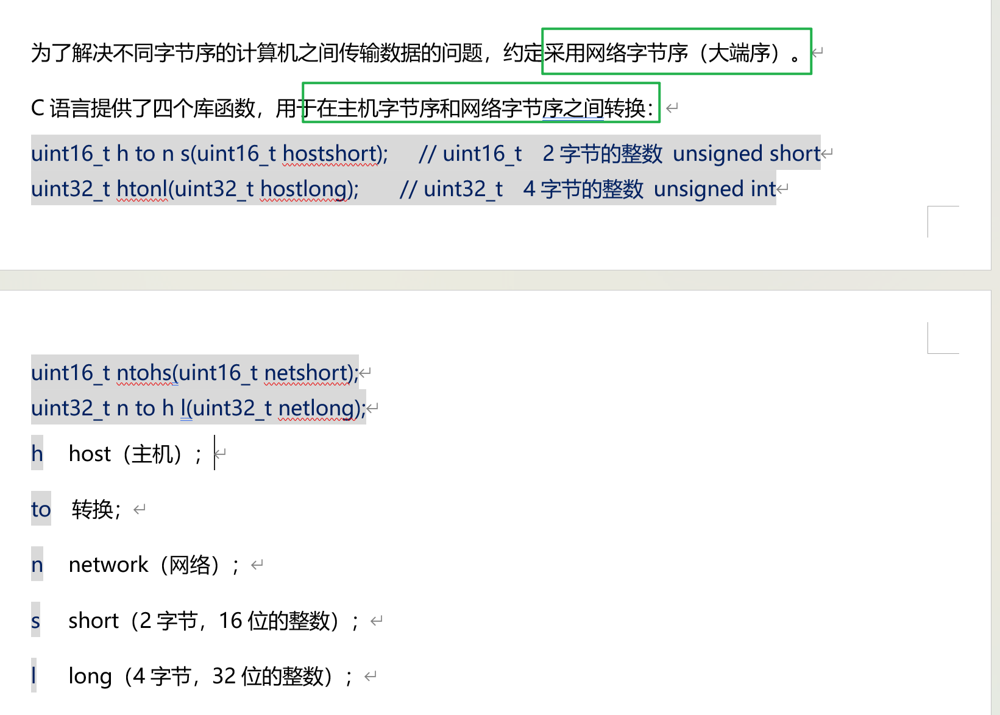
